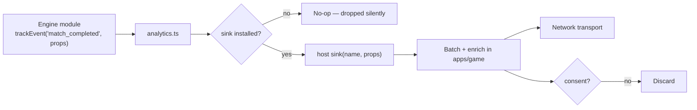

# Creator Football — Analytics

Grounded in the Workstream D contract:

```ts
// packages/engine/src/analytics/analytics.ts  — CONTRACTED
export const ANALYTICS_EVENTS: readonly string[];
export function trackEvent(name: string, props?: Record<string, unknown>): void;
export function setAnalyticsSink(sink: (name: string, props: Record<string, unknown>) => void): void;
```

---

## 1. The pluggable-sink design

The engine must never import network code. `analytics.ts` therefore does exactly two things:
it validates and normalises an event, and it hands it to whatever sink the host installed.



### 1.1 Rules

| # | Rule | Why |
|---|---|---|
| A1 | **The default sink is a no-op.** With nothing installed, `trackEvent` does nothing | The engine runs in Node, in tests and in the audit harness with no network, no consent question and no side effects |
| A2 | **The sink is synchronous from the engine's point of view.** Batching, retry and transport are the host's problem | Keeps the engine deterministic; an `await` in a simulation loop would be a determinism bug |
| A3 | **A throwing sink must never break the game.** `trackEvent` swallows sink exceptions | Same reasoning as `haptics.fire()` — telemetry is never worth a crash |
| A4 | **The engine never enriches.** No device id, no session id, no timestamp, no user id, no locale | Those are host concerns. An engine that knew the device id would not be pure |
| A5 | **Event names are a closed set.** `ANALYTICS_EVENTS` is the allowlist; an unlisted name is a development-time error | Prevents the "1,400 events, 40 of them used" drift every analytics implementation suffers |
| A6 | **Properties are primitives only** — string, number, boolean. No nested objects, no arrays of objects | Keeps the wire format flat, keeps every warehouse happy, and forces the naming to do the work |
| A7 | **Never a real-world identity in a property.** Content is fictional; if a licensed pack lands, only ids and `identityKind` are sent, never names | `LICENSING_ARCHITECTURE.md` §6.5 — competitor terms and licensed names must not reach an analytics event |
| A8 | **Consent is enforced at the host.** The sink is installed only after consent, and uninstalled on withdrawal | Makes "delete my data" a client-side switch, not an engine change |

### 1.2 Standard properties

Attached by the **host**, on every event:

| Property | Source |
|---|---|
| `session_id`, `session_index`, `app_version`, `engine_version`, `platform`, `device_class`, `locale`, `region` | Host |
| `save_id`, `season`, `week`, `cycle`, `phase` | From `GameState.clock` at emit time |
| `club_id`, `manager_archetype`, `difficulty` | From `GameState` |

Everything below lists only the **event-specific** properties.

---

## 2. Event taxonomy

Names are `snake_case`, `object_verb` ordered.

### 2.1 Lifecycle

| Event | Properties |
|---|---|
| `app_opened` | `cold_start: boolean`, `time_to_interactive_ms` |
| `app_backgrounded` | `session_length_s`, `screens_viewed` |
| `game_started` | `manager_archetype`, `manager_is_custom: boolean`, `club_id`, `club_strength`, `club_philosophy` |
| `game_loaded` | `season`, `cycle`, `recovered_from_backup: boolean`, `load_ms` |
| `game_deleted` | `season`, `cycle`, `reason` |
| `save_failed` | `stage: 'validate' \| 'serialise' \| 'write'`, `detail` |
| `save_recovered` | `from: 'backup'`, `cycles_lost` |

### 2.2 Onboarding — instrumented per beat (see §3.1)

| Event | Properties |
|---|---|
| `onboarding_started` | — |
| `onboarding_step_viewed` | `step: string`, `step_index: number` |
| `onboarding_step_completed` | `step`, `step_index`, `duration_s` |
| `onboarding_manager_selected` | `archetype`, `is_custom`, `time_to_select_s` |
| `onboarding_club_selected` | `club_id`, `strength_band: 'favourite' \| 'mid' \| 'underdog'`, `time_to_select_s` |
| `onboarding_formation_selected` | `formation_id`, `used_auto: boolean` |
| `onboarding_completed` | `total_duration_s`, `matches_played: 1` |
| `onboarding_abandoned` | `last_step`, `step_index`, `duration_s` |

### 2.3 Match

| Event | Properties |
|---|---|
| `match_started` | `match_id`, `opponent_id`, `importance`, `is_derby`, `rivalry_intensity`, `special_rules_enabled: number`, `presentation`, `match_speed` |
| `match_decision_shown` | `match_id`, `trigger`, `minute`, `option_count`, `momentum` |
| `match_decision_made` | `match_id`, `trigger`, `option_id`, `risk`, `minute`, `response_time_ms` |
| `match_decision_default_applied` | `match_id`, `trigger`, `minute` — **the key disengagement signal** |
| `match_substitution_made` | `match_id`, `minute`, `out_overall`, `in_overall`, `reason: 'fatigue' \| 'injury' \| 'tactical'` |
| `match_tactical_change` | `match_id`, `minute`, `field`, `from`, `to` |
| `match_rule_card_played` | `match_id`, `rule_id`, `minute` |
| `match_skipped` | `match_id`, `minute_skipped_at`, `via: 'finish' \| 'instant'` |
| `match_completed` | `match_id`, `result: 'W'\|'D'\|'L'`, `home_score`, `away_score`, `xg_for`, `xg_against`, `possession`, `shots_for`, `shots_against`, `decisions_made`, `duration_watched_s`, `motm_is_ours: boolean` |
| `match_key_moment_viewed` | `match_id`, `event_type`, `skipped: boolean` |

### 2.4 Squad, transfers, scouting

| Event | Properties |
|---|---|
| `squad_screen_viewed` | `squad_size`, `avg_overall`, `injured_count` |
| `lineup_changed` | `used_auto: boolean`, `changes: number`, `out_of_position_count` |
| `formation_changed` | `from`, `to` |
| `tactics_changed` | `field`, `from`, `to` |
| `transfer_search_run` | `filter_count`, `results` |
| `transfer_negotiation_opened` | `player_id`, `player_overall`, `asking_price`, `our_balance`, `suitors` |
| `transfer_offer_submitted` | `player_id`, `fee`, `wage`, `years`, `role`, `offer_ratio` (fee ÷ asking) |
| `transfer_counter_received` | `player_id`, `stage`, `their_fee`, `club_patience`, `player_patience` |
| `transfer_completed` | `player_id`, `fee`, `wage`, `rounds`, `duration_cycles`, `overall`, `age` |
| `transfer_failed` | `player_id`, `reason: 'patience' \| 'hijacked' \| 'lost_interest' \| 'deadline' \| 'abandoned'`, `rounds` |
| `player_sold` | `player_id`, `fee`, `overall`, `age`, `profit` |
| `scout_assigned` | `player_id`, `depth`, `cost`, `confidence_before` |
| `scout_report_ready` | `player_id`, `depth`, `confidence_after`, `cycles_taken` |

### 2.5 Club management

| Event | Properties |
|---|---|
| `training_program_changed` | `from`, `to`, `intensity` |
| `player_developed` | `player_id`, `attribute`, `delta`, `age`, `minutes_share` |
| `facility_upgraded` | `facility_id`, `to_level`, `cost`, `balance_after`, `cycles_required` |
| `sponsor_signed` | `sponsor_id`, `slot`, `value_per_cycle`, `tier`, `club_reputation` |
| `sponsor_lost` | `sponsor_id`, `reason` |
| `creator_signed` | `creator_id`, `tier`, `followers`, `roles`, `cost` |
| `creator_lost` | `creator_id`, `reason: 'expired' \| 'poached' \| 'released'` |
| `ticket_price_changed` | `from`, `to`, `sentiment_before` |

### 2.6 Progression and economy

| Event | Properties |
|---|---|
| `objective_offered` | `objective_id`, `source`, `importance`, `target` |
| `objective_completed` | `objective_id`, `source`, `cycles_taken` |
| `objective_failed` | `objective_id`, `source`, `progress_ratio` |
| `objective_claimed` | `objective_id`, `reward_kinds`, `reward_cash`, `reward_premium` |
| `season_completed` | `season`, `position`, `points`, `won`, `drawn`, `lost`, `gf`, `ga`, `net_spend`, `end_reputation`, `end_sentiment`, `trophies` |
| `trophy_won` | `competition`, `season` |
| `record_broken` | `record`, `value` |
| `balance_low` | `balance`, `wage_bill`, `cycles_of_runway` |
| `store_viewed` | `offers_shown`, `featured_sku`, `rotation_week` |
| `store_offer_viewed` | `sku`, `treatment`, `price_minor`, `discount_percent` |
| `purchase_started` | `sku`, `price_minor`, `currency` |
| `purchase_completed` | `sku`, `price_minor`, `currency`, `is_first_purchase: boolean` |
| `purchase_failed` | `sku`, `stage`, `reason` |
| `purchase_restored` | `sku_count` |

### 2.7 Meta, quality and performance

| Event | Properties |
|---|---|
| `setting_changed` | `key`, `from`, `to` |
| `screen_viewed` | `screen`, `entry: 'nav' \| 'deep_link' \| 'back' \| 'flow'` |
| `feed_scrolled` | `surface: 'social' \| 'media'`, `items_seen`, `dwell_s` |
| `perf_frame_drop` | `screen`, `p95_frame_ms`, `dropped_frames`, `duration_s`, `glass_surfaces_visible` |
| `perf_slow_operation` | `operation`, `duration_ms` |
| `invariant_violated` | `code`, `message_hash` — **fires on every collected violation in production** |
| `error_occurred` | `where`, `code`, `fatal: boolean` |

---

## 3. Funnels

### 3.1 Onboarding

Twelve steps, matching the beat sheet in `PRODUCT_REQUIREMENTS.md` §5. Each is an
`onboarding_step_viewed` / `onboarding_step_completed` pair.

| Step | Beat | Target completion | Alarm |
|---|---|---|---|
| 1 | Cold open | 97% | < 92% |
| 2 | Manager select | 95% | < 88% |
| 3 | Name and face | 94% | < 86% |
| 4 | Club select | 92% | < 84% |
| 5 | Squad — three cards | 91% | < 84% |
| 6 | Formation choice | 89% | < 80% |
| 7 | **Match started** | 88% | < 80% |
| 8 | **Match completed** | 82% | < 72% |
| 9 | Key moment | 80% | < 70% |
| 10 | Feed reaction | 78% | < 68% |
| 11 | First objective | 75% | < 65% |
| 12 | League table (`onboarding_completed`) | **70%** | < 60% |

Steps 7→8 is the single most important transition in the product. A drop there means the
match is not working, and no amount of upstream polish will compensate.

Diagnostics to segment by: device class (a slow first match is a performance problem, not a
design one), `strength_band` of the club chosen, and `manager_archetype`.

### 3.2 First match

| Stage | Event | Target |
|---|---|---|
| Match entered | `match_started` | 100% of the funnel |
| First decision shown | `match_decision_shown` | ≥ 97% |
| First decision made (not defaulted) | `match_decision_made` | ≥ 85% |
| Second decision made | `match_decision_made` #2 | ≥ 80% |
| Watched to full time | `match_completed` with `duration_watched_s` ≥ 80% of match | ≥ 75% |
| Key moment viewed, not skipped | `match_key_moment_viewed` with `skipped: false` | ≥ 70% |

`match_decision_default_applied` is the counter-metric. Above 15% on the first match means
the prompt is arriving when the player is not looking, or the timeout is too short.

### 3.3 First transfer

| Stage | Event | Target (within 3 sessions) |
|---|---|---|
| Market viewed | `transfer_search_run` | ≥ 80% |
| Negotiation opened | `transfer_negotiation_opened` | ≥ 70% |
| Offer submitted | `transfer_offer_submitted` | ≥ 65% |
| Counter received | `transfer_counter_received` | ≥ 60% |
| **Completed** | `transfer_completed` | ≥ 55% |
| Failed | `transfer_failed` | ≤ 25%, and **no single `reason` above 10%** |

The failure-reason mix is the health signal, not the failure rate. Failure is *designed*
(`GAME_SYSTEMS.md` §11.2) — but if `hijacked` alone is 20%, the hijack constants are too
aggressive; if `abandoned` dominates, the negotiation UI is too confusing.

Instrument `offer_ratio` (fee ÷ asking price) on the first offer. A population clustered
below `CLUB_INSULT_RATIO` (0.55) means the game has failed to communicate what a player is
worth — a scouting/UI problem, not a balance one.

### 3.4 First purchase

| Stage | Event | Target |
|---|---|---|
| Store viewed | `store_viewed` | ≥ 40% by D7 |
| Offer viewed | `store_offer_viewed` | ≥ 30% |
| Purchase started | `purchase_started` | ≥ 8% |
| **Purchase completed** | `purchase_completed` with `is_first_purchase` | ≥ 6% |
| Purchase failed | `purchase_failed` | ≤ 1.5% |

Counter-metric: **churn within 48h of `store_viewed`.** If viewing the store correlates with
leaving, the store is doing damage regardless of what it earns. Given the anti-pay-to-win
stance, this is the metric that decides whether the store stays in its current form.

---

## 4. Retention and churn

### 4.1 Retention

| Metric | Definition | Target | Warning |
|---|---|---|---|
| D1 | Returned within 24-48h | 45% | < 35% |
| D7 | Returned on day 7 ± 1 | 22% | < 15% |
| D30 | Returned on day 30 ± 3 | 10% | < 6% |
| Season-1 completion | `season_completed` with `season: 1` | 55% | < 40% |
| Season-2 start | Any `match_started` in season 2 | 45% | < 32% |
| Median seasons by D30 | max `season` reached | ≥ 2.5 | < 1.5 |

### 4.2 Engagement quality

| Metric | Definition | Target |
|---|---|---|
| Match-watch rate | 1 − (`match_skipped` ÷ `match_started`) | > 65% at D1, > 45% at D30 |
| Decision engagement | `match_decision_made` ÷ `match_decision_shown` | > 85% |
| Systems touched per session | Distinct non-match screens | ≥ 2.5 |
| Cycles per session | `CYCLE_ADVANCED` per session | 1.0-1.6 |
| Feed dwell | `feed_scrolled.dwell_s` per session | ≥ 25s |

### 4.3 Churn indicators

Ranked by expected predictive power. Each maps to a hypothesis and an intervention.

| # | Signal | Hypothesis | Intervention |
|---|---|---|---|
| C1 | `match_skipped` rate rising session over session | The match has stopped being interesting | Match variety, decision quality, presentation |
| C2 | `match_decision_default_applied` rising | Player is disengaged *during* the match | Prompt timing and timeout; is the prompt legible mid-action? |
| C3 | Three consecutive `MATCH_LOST` with no `objective_completed` | Failure with no counter-signal — the most classic churn shape in a management game | Objective rolling must guarantee a reachable near-term win |
| C4 | `balance_low` with `cycles_of_runway < 2` | Economic death spiral; the player sees no way out | Board grant, forced-sale prompt, explicit "here is how to fix this" |
| C5 | `transfer_failed` twice with no `transfer_completed` | The transfer system reads as arbitrary | Surface *why* it failed; make counters legible |
| C6 | Session length falling while frequency holds | Loop is thinning — the player is doing the minimum | Objective and rivalry cadence |
| C7 | `perf_frame_drop` on the match screen | Performance, not design | Reduced effects, canvas pitch |
| C8 | No screen other than home and match in a session | The systems layer is not pulling | Home-screen prompts pointing at one specific action |
| C9 | Long gap after `season_completed` | The season reset did not create a new hook | Pre-season beat: objectives, budget, one signing target |
| C10 | `store_viewed` followed by churn | The store is damaging trust | Reduce prominence; review offer mix |
| C11 | `invariant_violated` on a save | The game is quietly broken for this player | Alert; treat as a P0 bug |
| C12 | `save_recovered` or `save_failed` | Data loss — the highest-severity trust event | Alert immediately |

### 4.4 Alerting

| Severity | Triggers | Response |
|---|---|---|
| **P0** | `save_failed`, `save_recovered`, `invariant_violated` above baseline, crash-free < 99.5% | Immediate |
| **P1** | Any onboarding step below its alarm threshold; D1 below alarm; `purchase_failed` > 1.5% | Same day |
| **P2** | Match-watch rate trending down; a single `transfer_failed` reason above 10%; feed dwell falling | Weekly review |

---

## 5. What we deliberately do not track

| Not tracked | Why |
|---|---|
| Real-world identity of any kind | Nothing to link to; content is fictional. A licensed pack sends ids and `identityKind`, never names |
| Precise location | `region` is sufficient for licensing and pricing |
| Contact details, social handles, device identifiers beyond an anonymous install id | No feature needs them |
| Free-text the player typed (manager name, custom club name) | It is a name a person chose. It has no analytic value and is a privacy liability |
| Anything before consent | The sink is not installed until consent is given (rule A8) |
| Full event payloads from the domain journal | The journal is a simulation artefact, not a telemetry stream. Only curated, named analytics events leave the device |
