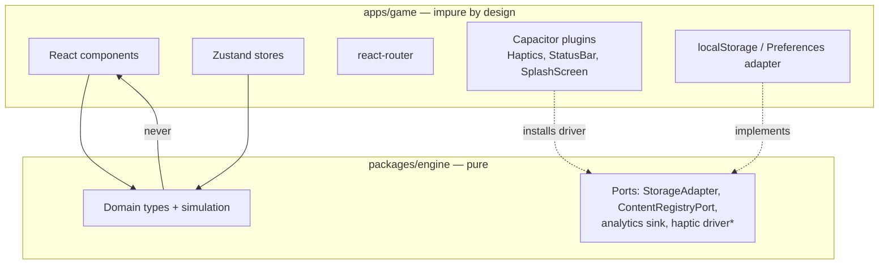
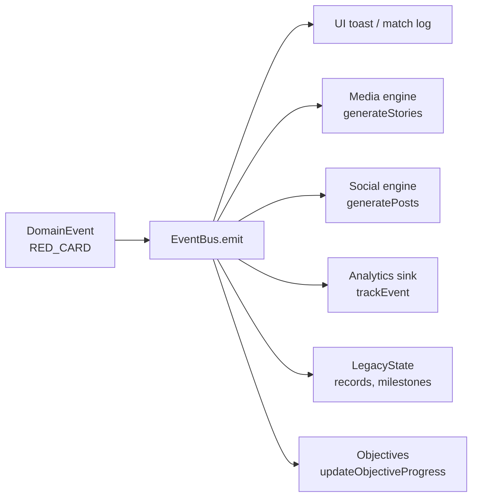
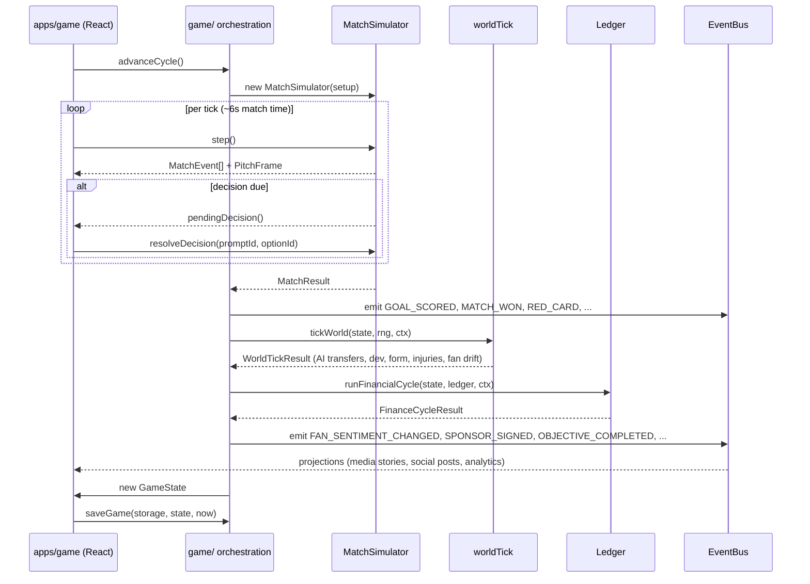
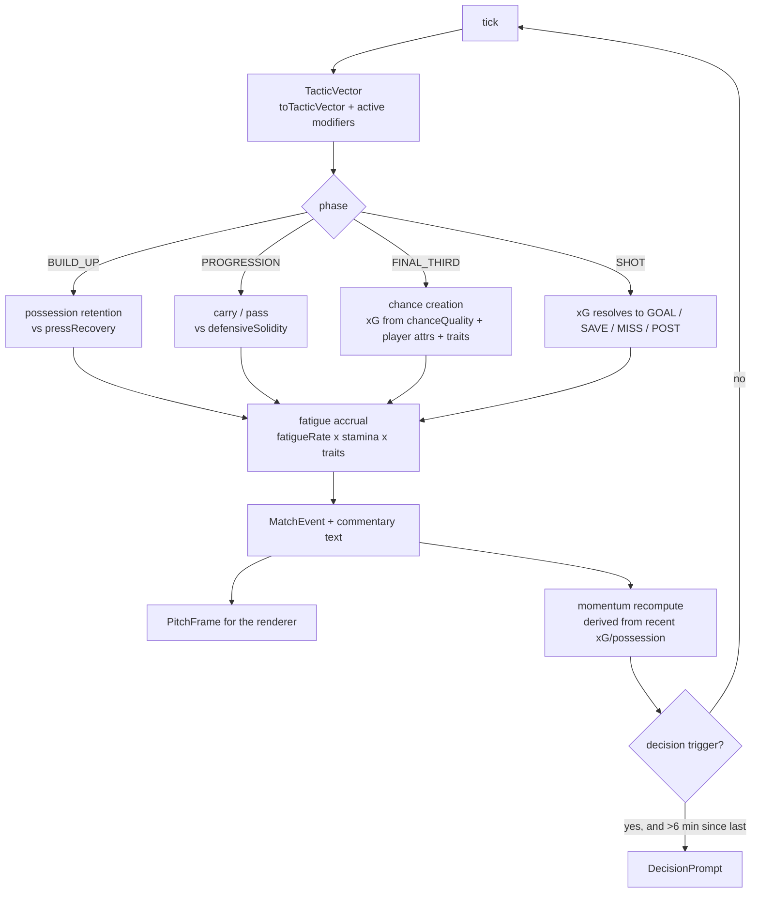

# Creator Football — Architecture

**Scope:** the technical architecture as it exists in this repository, plus the extension
points it was shaped to allow. Where something is contracted but unbuilt it is marked
`CONTRACTED`; where it is designed only here it is marked `SPEC`.

Authority order: `docs/INTEGRATION_CONTRACT.md` > the code > this document.

---

## 1. Monorepo layout

```
Creatorfootball/
├── package.json              # workspace root; pnpm 10, Node >= 20, ESM everywhere
├── pnpm-workspace.yaml       # packages/*, apps/*, tools/*
├── tsconfig.base.json        # strict + noUncheckedIndexedAccess, ES2022, Bundler resolution
├── packages/
│   └── engine/               # @cf/engine — PURE TypeScript. No DOM, no React, no Node.
│       └── src/
│           ├── core/         # BUILT  rng, math, events, ids, clock, invariant, result, brand
│           ├── players/      # BUILT  positions, attributes, mental, traits, player
│           ├── creators/     # BUILT  creator, manager
│           ├── clubs/        # BUILT  club
│           ├── contracts/    # BUILT  contract, negotiation, wages
│           ├── tactics/      # BUILT  tactics, vector, formations
│           ├── matches/      # BUILT  types + simulator, model, momentum, positioning,
│           │                 #        ratings, commentary, decisionEngine, specialRuleEngine
│           ├── league/       # BUILT  types, fixtures, standings
│           ├── economy/      # BUILT  ledger, cycle, audit, balance
│           ├── licensing/    # BUILT  identity
│           ├── content/      # BUILT  schema, loader, validate, base pack, generators
│           ├── game/         # BUILT  state, selectors (+ orchestration CONTRACTED)
│           ├── persistence/  # BUILT  save, storage
│           ├── simulation/   # BUILT  ports, templating, aiClub, worldTick, cascade, emergent
│           ├── transfers/    # BUILT  balance, valuation, market, negotiation, scouting
│           ├── training/  facilities/  fans/  sponsors/          # BUILT
│           ├── media/  social/  rivalries/  progression/  objectives/  analytics/  # BUILT
│           └── index.ts      # the single public surface of the engine
├── apps/
│   └── game/                 # @cf/game — React 19 + Vite 7 + Tailwind 4 + Capacitor
│       └── src/
│           ├── design/       # BUILT  tokens, motion, haptics, seed, glass primitives,
│           │                 #        domain cards, hero moments, layout, feedback, Gallery
│           ├── platform/     # BUILT  storage adapter, capability detection
│           ├── state/        # BUILT  zustand stores (match, ui)
│           └── app/          # routes + a placeholder App; SCREENS NOT BUILT
└── tools/
    └── sim/                  # @cf/sim — package exists; audit entry points MISSING (§12)
```

### 1.1 Why a monorepo, and why exactly these boundaries

| Boundary | Reason |
|---|---|
| `packages/engine` separate from `apps/game` | The engine must be runnable with no browser. That is what makes headless balance sims, a Node audit harness and a future authoritative server possible. If the engine lived inside the app it would accrete a `window` reference within a fortnight |
| One app, not one app per platform | Capacitor wraps the same web build for iOS and Android. Platform divergence is a config concern (`capacitor.config.ts`), never a code concern |
| `tools/*` in the workspace | The audit harness must import the *same* engine the game ships, not a copy. A separate repo guarantees drift |
| Workspace protocol (`"@cf/engine": "workspace:*"`) | The app always builds against local engine source; there is no publish step and no version skew |

The app resolves the engine **by source**, not by build artefact:

```ts
// apps/game/vite.config.ts
alias: { '@cf/engine': '../../packages/engine/src/index.ts' }
```

This keeps hot-reload instant across the boundary and keeps a single type graph. The
trade-off is that the engine's `build` script currently only type-checks
(`tsc --noEmit`) — nothing emits a compiled `@cf/engine`. That is fine while the app is the
only consumer; it must be fixed before a server or a second consumer exists.

---

## 2. The hard rule: the engine is pure

> **`packages/engine` must never import React, the DOM, `window`, `document`,
> `localStorage`, Capacitor, or any Node built-in.**
> — `INTEGRATION_CONTRACT.md`, Universal rule 1

Four corollaries the code already enforces by construction:

| Rule | Mechanism in code |
|---|---|
| No `Math.random()` | Every stochastic call takes an `Rng` parameter (`core/rng.ts`) |
| No `Date.now()` in simulation | Timestamps arrive as parameters: `PostContext.at`, `EventContext.at`, `saveGame(storage, state, now)` |
| No storage access | `persistence/storage.ts` defines a four-method `StorageAdapter` interface; the host supplies the implementation |
| No rendering knowledge | The match sim emits `MatchEvent[]` and `PitchFrame[]`; it does not know a pitch is drawn |

### 2.1 What the purity rule buys

| Benefit | Concretely |
|---|---|
| **Headless balance sims** | `tools/sim` can run 100 seasons in a Node process in seconds with `MemoryStorage`. No jsdom, no browser |
| **Testability** | Every module is a pure function of (state, rng, ctx). Vitest runs in `environment: 'node'` |
| **A future server** | The identical engine can run authoritatively behind an API. Nothing in it assumes a client |
| **No rewrite for V2** | PvP, private leagues and online clubs need a *host* change, not an *engine* change (§11) |
| **Reproducible bug reports** | A seed plus a decision log reproduces any state exactly (§7) |

### 2.2 What must never leak inward



`*` The haptic driver port lives in `apps/game/src/design/haptics.ts` rather than the
engine, because haptics are a presentation concern the engine has no opinion about. The
pattern is identical: `setHapticDriver()` is called once by the native shell; every
component calls `haptics.selection()` and never learns what platform it is on.

---

## 3. State layering

Six distinct layers. Confusing any two of them is the most common source of architectural
rot in a game this size, so they are named explicitly.

| Layer | Owns | Lifetime | Where it lives | Serialised? |
|---|---|---|---|---|
| **Domain state** | Entities and their relationships: players, clubs, contracts, fixtures, rivalries | The save | `GameState` (`game/state.ts`) | Yes |
| **Simulation state** | Transient within one match: tick index, phase, momentum, fatigue, pending decision | One match | `MatchSimulator` instance fields | No — only the `MatchResult` is |
| **Persistent state** | The envelope around domain state: version, checksum, backup, meta | Across app launches | `SaveEnvelope`, `SaveMeta` (`persistence/save.ts`) | It *is* the serialisation |
| **Server state** | `V2`. Authoritative league/ladder/match results held remotely | Account lifetime | Does not exist | n/a |
| **UI state** | Selection, expanded card, scroll position, sheet open, animation in flight | A screen | Zustand / React local state in `apps/game` | No |
| **Navigation state** | Current route, history stack, modal stack | A session | `react-router-dom` | No |

### 3.1 The rules that keep the layers apart

1. **No progression lives only in component state.** If losing it would cost the player
   something, it is domain state and it is in `GameState`. Stated as a rule in
   `persistence/save.ts`.
2. **UI state never round-trips through the engine.** The engine has no concept of "which
   tab is open".
3. **Simulation state is never persisted mid-match.** Quitting mid-match forfeits the
   match's transient state; the fixture is either replayed or resolved via
   `simulateMatch()`. This is a deliberate simplification — persisting a `MatchSimulator`
   would make every internal field part of the save schema forever.
4. **Domain state is immutable at the boundary.** Functions take state and return new state
   or a described delta (`MarketDelta`, `WorldTickResult`, `TrainingCycleResult`,
   `AiActions`). Never mutate an argument the caller owns.
5. **Entities are flat and id-keyed.** `GameState.players` is
   `Record<string, Player>`, never nested inside clubs. Cross-references are always by id
   (`Club.squad: readonly PlayerId[]`). This keeps save size predictable and stops a player
   edit from invalidating a club render.

### 3.2 Branded ids

`core/brand.ts` declares 30 branded string types (`PlayerId`, `ClubId`, `MatchId`, …). They
cost nothing at runtime and make it a compile error to pass a `ClubId` where a `PlayerId`
is expected — the single most common bug class in a system with this much cross-referencing.
The one escape hatch is `asId<T>(raw)`, used only by id factories and deserialisers.

---

## 4. The event architecture

`core/events.ts` is described in its own header as "the spine of the product", and that is
accurate. There are **two** event streams, at different altitudes, and they must not be
conflated:

| Stream | Type | Scope | Consumers |
|---|---|---|---|
| **Match events** | `MatchEvent` (`matches/events.ts`) | Inside one match, tick-indexed | Pitch renderer, broadcast view, commentary, match stats, key-moment reel |
| **Domain events** | `DomainEvent` (`core/events.ts`) | The whole save, cycle-indexed | UI, media, social, analytics, history/legacy, rewards |

A match produces a stream of `MatchEvent`s; a small, curated subset is *promoted* to
`DomainEvent`s (a `GOAL` becomes `GOAL_SCORED`; a `RED_CARD` becomes `RED_CARD`; a routine
`PASS` becomes nothing).

### 4.1 Why one event feeds six systems



The alternative — each system reading state directly and diffing — was rejected because:

- **Traceability.** A social post carries `relatedEventId`. A post that cannot name the
  event that caused it is, by contract, a bug. That is the entire defence against the
  "fake-feeling feed" failure mode (`RISKS.md` R4).
- **Cascades.** A single event can produce downstream events, and the cascade is explicit
  rather than emergent-by-accident. The contracted cascade is:
  `RED_CARD → suspension → fan anger → media story → rival creator dunk → morale hit →
  rivalry intensity`. `ContentHook` (`simulation/ports.ts`) carries both `sourceEventId`
  and `rootEventId` plus a `depth`, so a fifth-order reaction can still be traced to its
  origin.
- **One place to add a consumer.** Adding "the world remembers" features later (records,
  emergent stories) required no change to the systems that produce the events.
- **Determinism.** `EventBus.emit` is *synchronous* fan-out. No microtask, no queue, no
  async listener. Under a fixed seed the entire world evolves identically every run.

### 4.2 Event structure

```ts
interface DomainEvent<T> {
  id: EventId; type: T; payload: DomainEventPayloads[T];
  cycle: number; season: number; week: number;   // simulation time — use this
  at: number;                                     // wall-clock — display ordering only
  importance: 1|2|3|4|5;                          // drives UI treatment and feed weight
  entities: readonly EntityRef[];                 // denormalised name+id, no store lookup
  matchId?: MatchId;
}
```

Two details that carry a lot of weight:

- **`entities` is denormalised.** Each `EntityRef` carries `{kind, id, name}`. A feed row
  can render without touching the store, which is what makes an infinite-scroll social feed
  cheap on a phone.
- **`importance` is set at emit time, by the system that knows.** The UI never guesses
  whether to interrupt, animate or log quietly.

### 4.3 Listener discipline

> "Listeners must not mutate game state directly; they derive projections (social feed,
> media, analytics, history)."

This is enforced by convention only. There is no runtime guard. See `RISKS.md` R14.

### 4.4 The journal is bounded

`EventBus` retains `maxJournal = 5000` events and splices the oldest away. `GameState.eventLog`
is described as a "bounded tail". This is a deliberate memory/save-size trade-off, and it has
a consequence the design must respect: **any feature that needs the full history of a
dynasty must maintain its own rollup, not scan the journal.** `LegacyState` (records,
legends, milestones, `seasonSummaries`) exists for exactly that reason.

---

## 5. Data flow

### 5.1 One cycle



### 5.2 One match tick



The tactic vector is the sole channel through which *every* modifier reaches the match
model — tactics, live decisions, special rules and AI adjustments all express themselves as
deltas on the same twelve numbers, re-clamped by `applyVectorModifiers()`. That is why a
new special rule needs no new code path in the simulator.

### 5.3 Content and licensing at load

```mermaid
flowchart LR
  BP[BASE_PACK<br/>100% fictional, complete alone] --> REG[ContentRegistry.load]
  CP[Community pack] --> REG
  LP[Licensed pack] --> REG
  REG --> VAL[validatePack → ValidationIssue&#91;&#93;]
  VAL --> VIS["visibleFor(region, now)"]
  VIS -->|isRenderable false| FB[LicensedEntityBinding<br/>fictional fallback]
  VIS --> GEN[Generators<br/>player / creator / club / manager]
  GEN --> STATE[GameState]
```



---

## 6. Seeded determinism

`core/rng.ts` implements sfc32 seeded from an FNV-1a hash of a string, with a 12-draw
warm-up to decorrelate.

```ts
const rng = new Rng(state.seed);
const matchRng   = rng.fork(`match:${matchId}`);
const marketRng  = rng.fork(`market:${cycle}`);
```

**Sub-streams are the load-bearing idea.** `fork(label)` returns `new Rng(seed + ':' + label)`.
Because each subsystem draws from its own stream, adding a die roll in the transfer market
cannot shift a match outcome. Without this, every balance change would invalidate every
regression test.

### 6.1 What determinism gives us

| Capability | How |
|---|---|
| Replay | `MatchResult.seed` + `MatchSetup` reproduces the match exactly |
| Regression tests | `simulateMatch(setup)` twice must be `deepEqual` |
| Balance audits | 1,000 matches under a fixed seed produce a stable distribution to diff against |
| Bug reproduction | A save's `seed` + `cycle` + the decision log is a complete repro |
| Fixture stability | `generateFixtures(opts, new Rng('same'))` is asserted deterministic in `league/fixtures.test.ts` |

### 6.2 Known limits of the determinism guarantee

Stated plainly because the code's own comments overclaim slightly:

1. **`fork()` does not advance the parent stream.** Two forks with the same label from the
   same parent return the *same* stream. Labels must be unique per logical stream and
   should include a discriminator (`match:${matchId}`, not `match`).
2. **The seed space is 32-bit.** `hashString` returns a `uint32`. Distinct seed strings can
   collide, and there are at most ~4.3×10⁹ distinct worlds.
3. **`Rng.restore(state)` replays `calls` draws.** Restoration cost is O(calls). For a
   long-running stream this is a real cost; prefer forking a fresh stream per cycle over
   persisting and restoring a long-lived one.
4. **Byte-identical saves are not guaranteed.** `core/ids.ts` claims "two runs of the same
   seed produce byte-identical saves". That holds for everything derived from the RNG, but
   `DomainEvent.at`, `GameClock.updatedAt` and `SaveEnvelope.savedAt` are wall-clock
   timestamps supplied by the host. **Simulation outcomes are deterministic; save bytes are
   not, unless the harness injects a fixed clock.** The audit harness must do exactly that.

---

## 7. The ledger

`economy/ledger.ts` is a double-entry-inspired transaction log. The rule:

> **No module may mutate a balance directly. Every movement of value is a recorded
> transaction with a source, a destination and a reason.**

```ts
type LedgerAccount =
  | { kind: 'club'; clubId: ClubId }
  | { kind: 'world'; label: string };   // infinite source/sink outside the club system
```

Design properties worth naming:

| Property | Mechanism | Why it matters |
|---|---|---|
| Direction is structural | `amount` is always positive; direction is expressed by `from`/`to` | Removes an entire class of sign bugs |
| Rejects rather than throws | Returns `Result<Transaction, LedgerError>` | The UI can say "you can't afford this" without exception handling |
| Idempotent where it must be | Optional `idempotencyKey` + an `appliedKeys` set | Makes double-claimed rewards impossible, not merely unlikely |
| Auditable | `verify()` checks finiteness, duplicate ids, negative amounts | Feeds `auditEconomy()` and the invariant suite |
| Explains itself | Mandatory `memo` on every transaction | "Where did my money go?" is answerable in the UI, from data |
| Restorable | `snapshot()` / `restore()` including id counters and applied keys | Save/load never loses idempotency guarantees |

**Bounded tail.** `Ledger` retains `maxEntries = 4000` transactions in memory and
`snapshot()` persists only the last **1200**. `appliedKeys`, by contrast, is unbounded. The
consequences: (a) an audit that walks `all()` is auditing a window, not a dynasty; (b) the
persisted `appliedKeys` set grows monotonically across a long save. Both are tolerable at
launch scale and both are named in `RISKS.md` R13 with the mitigation (season roll-up
archiving, key expiry).

---

## 8. Content packs and licensing

Full detail in `CONTENT_SCHEMA.md` and `LICENSING_ARCHITECTURE.md`. The architectural point:

**All content — players, clubs, creators, sponsors, facilities, objectives, offers,
commentary, social and media templates, the name bank and the season config — is data
loaded through one schema.** The fictional base pack, a future community pack and a future
licensed pack are the *same shape*; only `manifest.kind`, `manifest.identityKind` and
`manifest.rights` differ.

```ts
type PackKind = 'BASE' | 'COMMUNITY' | 'LICENSED' | 'SEASONAL';
type IdentityKind = 'FICTIONAL' | 'COMMUNITY_CREATED' | 'LICENSED_CREATOR' | 'LICENSED_FOOTBALLER';
```

Two structural guarantees follow:

1. **Licensing is an additive load, never a rewrite.** Adding a licensed pack is
   `registry.load(pack)`. No simulation code changes.
2. **Game logic may never branch on a specific real name.** It branches on `IdentityKind`
   and on `RightsMetadata` only. This is what makes accidental IP infringement structurally
   difficult rather than merely discouraged — there is no code path where a real name could
   be special-cased, because no code reads names for behaviour.

`isRenderable(identity, region, now)` is a pure function of rights status, expiry and
region. `LicensedEntityBinding` requires every licensed entity to declare a fictional
stand-in, so an expired licence degrades to a fictional player rather than corrupting a save.

---

## 9. Cross-platform strategy

**Capacitor wrapping a single web build.** `apps/game/capacitor.config.ts`:

```ts
appId: 'com.creatorfootball.app', webDir: 'dist',
ios:     { contentInset: 'never', backgroundColor: '#08090B', preferredContentMode: 'mobile' },
android: { backgroundColor: '#08090B', allowMixedContent: false },
plugins: { SplashScreen, Haptics, StatusBar }
```

The file's own header states the rule: *"The web build is the single source of truth for
both platforms; nothing iOS-specific may leak into the domain layer."*

### 9.1 What lives where

| Concern | Layer | Mechanism |
|---|---|---|
| Safe areas / notch | CSS | `env(safe-area-inset-*)` → `--safe-top/bottom/left/right` in `tokens.css`; `.pt-safe`, `.pb-safe`, `.pb-nav` utilities |
| Status bar style | Native config | `capacitor.config.ts` plugins block |
| Splash | Native config | `launchAutoHide: false` — the app hides it when the first frame is genuinely ready |
| Haptics | Port + driver | `setHapticDriver()` installs the Capacitor implementation at startup; web is a no-op |
| Storage | Port + adapter | `StorageAdapter`; web uses `localStorage`, native uses Capacitor Preferences, tests use `MemoryStorage` |
| Zoom / scroll | HTML meta + CSS | `viewport-fit=cover, maximum-scale=1.0, user-scalable=no`; `body { overflow: hidden }` — the app owns scrolling per screen |
| Chunking for first paint | Build | `manualChunks: { vendor, motion }` in `vite.config.ts` |

### 9.2 What must never leak into the domain

`window`, `document`, `navigator`, `localStorage`, `IndexedDB`, `fetch`, any `@capacitor/*`
import, any Node built-in (`fs`, `path`, `crypto`), `Math.random()`, `Date.now()` inside
simulation, and any `import type` from React.

Today this is enforced by review only. The mitigation is a CI lint rule
(`no-restricted-imports` on `packages/engine`) — see `TEST_PLAN.md` §2.1 and `RISKS.md` R14.

---

## 10. Ports and adapters, in full

| Port | Defined in | Implemented by | Status |
|---|---|---|---|
| `StorageAdapter` | `persistence/storage.ts` | `MemoryStorage` (engine, for tests); a web adapter and a Capacitor Preferences adapter in the app | BUILT / app-side SPEC |
| `ContentRegistryPort` | `simulation/ports.ts` | `ContentRegistry` (Workstream B) — structurally assignable without importing it | BUILT (port) / CONTRACTED |
| Analytics sink | `analytics/analytics.ts` (`setAnalyticsSink`) | The host installs a network-backed sink; the engine ships a no-op | CONTRACTED |
| Haptic driver | `apps/game/src/design/haptics.ts` | Capacitor Haptics in the native shell | BUILT |
| Invariant mode | `core/invariant.ts` (`setInvariantMode`) | Host sets `'throw'` in dev/test, `'collect'` in production | BUILT |
| Clock | Parameters (`now`, `ctx.at`) | Host passes `Date.now()`; harness passes a fixed value | BUILT |

`ContentRegistryPort` is worth singling out as a pattern: Workstream D depends on a
*structural subset* of the registry it does not own, so it compiles, tests and ships before
the content pack lands. The concrete class is assignable to the port without knowing the
port exists. This is how six workstreams build in parallel against one contract.

---

## 11. Extension points for V2

The claim under test: **the current model does not block PvP, private leagues or online
clubs.** Here is why, mechanism by mechanism.

### 11.1 PvP / asynchronous head-to-head

| Requirement | Already satisfied by |
|---|---|
| Both clients must agree on a result | `simulateMatch(setup)` is a pure function; identical `MatchSetup` + seed → identical `MatchResult` on any device |
| The server must be able to arbitrate | The same engine runs in Node with zero changes; the server recomputes and compares |
| The result must be transportable | `MatchResult` is plain serialisable data (`MatchEvent[]`, stats records, momentum timeline) |
| Cheating must be detectable | The client's claimed result is recomputable from `setup` + `seed`. A mismatch is a cheat, deterministically |

What is missing: a `MatchSetup` transport format, matchmaking, and a decision-log format so
a *live* decision made by a human can be replayed server-side (`DecisionOutcome` already
records `promptId`/`optionId`/`minute`, which is most of it).

### 11.2 Private leagues

| Requirement | Already satisfied by |
|---|---|
| Multiple clubs in one competition, some human-controlled | `Competition.clubIds` is a list; `MatchTeam.isPlayerControlled` is already a per-side flag, not a global |
| A schedule anyone can verify | `generateFixtures(opts, rng)` is deterministic and `verifyFixtures()` is a pure checker |
| Shared standings | `computeStandings()` is derived from fixtures, never stored, so it cannot drift between clients |
| Shared content | Content packs are data with a manifest id and version; a league can pin a pack version |

What is missing: identity/accounts, a shared clock (V1's `GameClock` advances on *the*
player's cycle — a shared league needs a league-owned clock), and conflict resolution when
two members advance at different rates.

### 11.3 Online clubs / co-op

| Requirement | Already satisfied by |
|---|---|
| Multiple actors mutating one club | State is immutable at the boundary; every mutation is already a described delta, which is the shape a command/event-sourced server wants |
| Auditable money | Every value movement is a `Transaction` with `from`, `to`, `memo` and an optional idempotency key — already an audit log |
| Auditable everything else | The `DomainEvent` journal is append-only with monotonic, deterministic ids |
| Permissions | `Club.isPlayerClub` and `MatchTeam.isPlayerControlled` are the seams; per-actor roles are additive |

### 11.4 What *would* require a rewrite (and therefore must be watched)

| Risk | Why it would hurt | Guard |
|---|---|---|
| Any engine module importing a platform API | Kills the headless server outright | CI lint rule (`RISKS.md` R14) |
| Any use of `Math.random()` or `Date.now()` inside simulation | Kills determinism, kills arbitration | Same lint rule + the determinism test |
| Persisting `MatchSimulator` internals | Freezes the sim's private fields into the save schema forever | Rule 3 in §3.1 |
| Storing standings instead of deriving them | Guarantees client divergence in a shared league | `computeStandings()` is already derived-only |
| Making `GameClock` wall-clock driven | Breaks the no-timers product rule *and* shared-league sync | `GameClock.updatedAt` is display-only, by comment and by rule |

---

## 12. Build, test and tooling

| Command | What it does | Status |
|---|---|---|
| `pnpm install` | Installs the workspace (pnpm 10, Node ≥ 20) | Works |
| `pnpm dev` | `vite` dev server for `@cf/game` on port 5173, `host: true` (so a phone on the LAN can load it) | Works |
| `pnpm build` | Type-checks the engine, then `tsc -b` + `vite build` for the app | Works; engine emits nothing (§1.1) |
| `pnpm typecheck` | `tsc --noEmit` in every package | **Fails.** `packages/engine/test/save.test.ts` is matched by the `test/**/*` include but sits outside `rootDir: "src"` (TS6059). Either move the file under `src/` or drop `rootDir` |
| `pnpm test` | `vitest run` in `@cf/engine` (`environment: 'node'`, `globals: true`) | **20 files, 262 tests, 2 failing.** (1) the audience/support modifier measures a 9.6pp win-probability swing against a 6pp cap; (2) a special-rule window test passes alone and fails in a full run — an isolation/ordering leak |
| `pnpm lint` | `pnpm -r lint` | **Does nothing.** No package defines `lint`; no ESLint config exists in the repo |
| `pnpm audit:economy` / `audit:sim` / `audit:invariants` / `audit:all` | Headless audits in `@cf/sim` | **Fail.** The package and `tsconfig` exist and `src/report.ts` is written, but `simAudit.ts`, `economyAudit.ts`, `invariantAudit.ts` and `runAll.ts` do not |
| `pnpm --filter @cf/game cap:sync` | `cap sync` — copies the web build into the native shells | Works once `dist/` exists; `ios/` and `android/` are gitignored |

`.github/workflows/` exists but is **empty**. There is no CI. Two commands in the table
above are currently red and would have been caught on the first push. See `ROADMAP.md`
Phase 0 and `TEST_PLAN.md` §9.

Housekeeping: `packages/engine/diag.tmp.ts`, `packages/engine/tuning.tmp.ts` and
`packages/engine/tsconfig.check.json` are scratch artefacts that should not survive to a
release, and `packages/engine/src/fixtures/` is an empty directory.

### 12.1 TypeScript configuration

`tsconfig.base.json` sets the rules everything inherits: `strict`, `noUncheckedIndexedAccess`,
`noImplicitOverride`, `noFallthroughCasesInSwitch`, `verbatimModuleSyntax`, `isolatedModules`,
ES2022 target, Bundler module resolution.

`noUncheckedIndexedAccess` is the notable one: it is why the codebase is full of
`items[i] as T` at hot-loop sites in `Rng` and `standings`. That is a deliberate trade —
the assertion is local and provable, and the flag catches the non-provable cases everywhere
else.

`exactOptionalPropertyTypes` is **off**. That is why the codebase uses the
`...(opts.matchId ? { matchId: opts.matchId } : {})` spread idiom rather than assigning
`undefined`; turning the flag on later would be a mechanical but wide change.

---

## 13. Architectural decisions, recorded

| # | Decision | Alternative rejected | Rationale |
|---|---|---|---|
| AD1 | Web tech in a native shell (React + Vite + Capacitor) | React Native, native Swift/Kotlin | One codebase, one design system, CSS-native glass/blur, instant iteration. See `ASSUMPTIONS.md` A1 |
| AD2 | Pure-TypeScript engine package | Engine inside the app | Headless sims, testability, future server, no V2 rewrite |
| AD3 | Seeded RNG with named sub-streams | `Math.random()` | Replay, regression tests, balance audits, arbitration |
| AD4 | Typed domain-event spine with synchronous fan-out | State diffing per system | Traceability, cascades, determinism, one place to add a consumer |
| AD5 | Ledger as the only mutator of value | Direct balance fields | Auditability, idempotent rewards, an honest finance screen |
| AD6 | All content as data through one schema | Hardcoded content + a separate licensed build | Licensing becomes an additive load; community packs come free |
| AD7 | Standings derived, never stored | A stored table updated on result | Removes an entire drift bug class; required for shared leagues |
| AD8 | Immutable state, deltas returned | In-place mutation | Predictable renders, event-sourcing-shaped for V2, trivially testable |
| AD9 | Tactics projected onto a 12-number `TacticVector` | Bespoke handling per setting | Every modifier source (tactics, decisions, special rules, AI) uses one channel; new rules need no simulator changes |
| AD10 | Branded id types | Bare `string` | Compile-time prevention of the most common cross-reference bug |
| AD11 | `balance.ts` constants per module | Inline magic numbers | A balance change is a single reviewable diff a designer can make |
| AD12 | Save = envelope + checksum + backup + forward-only migrations | Raw JSON blob | A corrupt write costs at most one cycle, never a dynasty |
