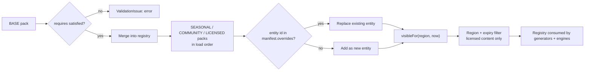

# Creator Football — Content Schema

The authoritative type definitions live in `packages/engine/src/content/schema.ts`
(`BUILT`, frozen). This document explains what each entity is *for*, how packs compose,
what validation must catch, and how to author one.

**The premise:** all game content — players, clubs, creators, managers, sponsors,
facilities, objectives, store offers, commentary, social and media templates, the name bank
and the season configuration — is data loaded through **one** schema. The fictional base
pack, a future community pack and a future licensed pack are the same shape. Only
`manifest.kind`, `manifest.identityKind` and `manifest.rights` differ.

That single fact is what makes licensing an *additive load* rather than a rewrite.

---

## 1. Pack structure

```ts
interface ContentPack {
  manifest: ContentPackManifest;
  data: ContentPackData;
}

interface ContentPackManifest {
  id: string;                   // stable, slug-shaped (see slugify())
  version: string;              // semver of the content, not the schema
  schemaVersion: number;        // must equal CONTENT_PACK_VERSION (currently 1)
  kind: 'BASE' | 'COMMUNITY' | 'LICENSED' | 'SEASONAL';
  name; description; provider;
  identityKind: IdentityKind;   // FICTIONAL | COMMUNITY_CREATED | LICENSED_CREATOR | LICENSED_FOOTBALLER
  rights?: RightsMetadata;      // REQUIRED when identityKind is licensed
  requires: readonly string[];  // pack ids that must already be loaded
  overrides: readonly string[]; // entity ids this pack REPLACES rather than adds
  regions: readonly string[];   // ISO-3166 alpha-2; empty = worldwide
  createdAt: number;
}
```

### 1.1 Pack kinds

| Kind | Identity | Ships in base game | Rights required | Typical contents |
|---|---|---|---|---|
| `BASE` | `FICTIONAL` | Yes — exactly one | No | The complete world: 12 clubs, players, creators, managers, sponsors, facilities, objectives, offers, all templates, name bank, season config |
| `SEASONAL` | `FICTIONAL` | Optional | No | Event content, extra objectives, cosmetics, a rotating offer set |
| `COMMUNITY` | `COMMUNITY_CREATED` | No | No | User-authored clubs, players, creators |
| `LICENSED` | `LICENSED_CREATOR` / `LICENSED_FOOTBALLER` | **Never** | **Yes** | Real identities, gated by region and expiry |

**Rule L0 (the one that matters):** the `BASE` pack must be **complete and enjoyable on its
own**. Every other pack is strictly additive. See `LICENSING_ARCHITECTURE.md`.

---

## 2. Entity types

### 2.1 `NameBankDef`

The generator's vocabulary. One per pack; the registry merges banks across packs.

```ts
interface NameBankDef {
  firstNames: { value: string; weight?: number; region?: string }[];
  lastNames:  { value: string; weight?: number; region?: string }[];
  clubPrefixes: string[]; clubSuffixes: string[];
  cities: string[]; handles: string[];
  nationalities: { code: string; name: string; weight: number }[];
}
```

Base-pack volume requirements (contract §Workstream B): **220+ first names, 220+ surnames,
60+ cities, 40+ club prefixes and suffixes, 80+ social handles, 25 nationalities with
weights.**

**Hard rule:** nationalities are **invented nations with plausible demonyms**. Real-world
country names must not appear. `code` is a 2-3 letter invented code, not ISO-3166 — that
namespace belongs to `RightsMetadata.regions` and `GameSettings.region`, and conflating them
would let a licensing region filter accidentally match a nationality.

### 2.2 `ClubTemplate`

```ts
{ id, name, shortName, abbreviation, city, founded, philosophy, fanCulture,
  reputation, strength, budget, stadiumName, stadiumCapacity,
  visual: { primary, secondary, accent, badgeShape, badgeMotif, style, kitPattern },
  aiProfileId, motto, rivalOf?: string[] }
```

| Field | Constraint | Feeds |
|---|---|---|
| `philosophy` | One of `CLUB_PHILOSOPHIES` (8) | AI behaviour, transfer bias, fan expectation |
| `fanCulture` | One of `FanCulture` (6) | Fan response curves |
| `reputation` | 0-100 | Sponsor tier, player interest, `BIG_CLUB_TAX` |
| `strength` | 0-100 | Target mean overall for the generated squad |
| `budget` | Cash | `Ledger.open()` |
| `visual.*` | Hex + enum values from `ClubVisualIdentity` | Badge and kit rendering |
| `aiProfileId` | Must match an `AI_PROFILES` id | `aiClubTurn` |
| `rivalOf` | Club template ids | `seedRivalries` → `Fixture.isDerby` |

**The 12 base clubs must be genuinely distinct** across all of: name, city, colours (each
visually separable), badge shape + motif, philosophy, fan culture, reputation, strength,
budget, stadium, motto, AI profile and 1-2 declared rivals. Strength must spread so the
league has a clear favourite, a mid pack and strugglers.

### 2.3 `PlayerTemplate`

Named, hand-authored players. Most players are *generated*; templates exist for players who
must be specific (a creator who is also a footballer, a club's designated star).

```ts
{ id, firstName, lastName, age, nationality, position, secondaryPositions?,
  footedness?, height?, attributes, mental?, traitIds?, potential,
  clubTemplateId?, creatorTemplateId?, portraitSeed? }
```

Constraints: `position` ∈ `POSITIONS`; every `attributes` key ∈ `ATTRIBUTE_KEYS`, value
1-99; `potential` ≥ `overallFor(attributes, position)`; every `traitIds` entry must exist in
`TRAITS` **and** satisfy that trait's `positions` restriction.

### 2.4 `CreatorTemplate`

```ts
{ id, handle, displayName, roles, tier, followers, attributes,
  style: { tone, platforms, postingFrequency },
  clubTemplateId?, playerTemplateId?, bio, avatarSeed? }
```

Constraints: `followers` must fall inside `TIER_REACH[tier]`; `roles` ⊆ `CREATOR_ROLES`;
`tone` ∈ the six `CreatorContentStyle` tones; `bio` is required and must establish a
personality, not restate the stats.

Base pack: **28 creators spanning all five tiers and all six tones.** Some are players, some
managers, some pure media. *"They must feel like people, not stat blocks."*

### 2.5 `ManagerTemplate`

```ts
{ id, name, archetypeId, attributes?, bio, mediaStyle, socialPersonality,
  appearance?, creatorTemplateId?, selectable }
```

`selectable: true` marks the 10 pre-made managers the player may choose at onboarding.
`archetypeId` must match one of the 8 `MANAGER_ARCHETYPES`. If `attributes` is omitted, the
generator derives them from the archetype's modifiers around a 50 baseline.

### 2.6 `SponsorTemplate`

```ts
{ id, name, sector, tier, slots, baseValue, accent,
  requiresReputation, requiresFollowers?, blurb }
```

`slots` ⊆ `SHIRT | SLEEVE | STADIUM | TRAINING | CREATOR`. The two `requires*` fields are the
progression gate: a `GLOBAL`-tier sponsor should be unreachable in season 1, and reaching it
should feel like a milestone. Base pack: **20 sponsors across tiers and slots.**

### 2.7 `FacilityDef`

The most structurally interesting entity, because it is the main data-driven bridge between
content and systems.

```ts
{ id, name, description, icon, maxLevel,
  upgradeCosts: number[],      // cost of level n -> n+1, indexed from 0
  upgradeCycles: number[],     // how long it takes
  upkeepPerCycle: number[],    // ongoing cost at each level
  levelEffects: string[],      // one human sentence per level
  effects: Record<string, number[]>,   // MACHINE-READABLE: system key -> value per level
  category: 'PERFORMANCE' | 'DEVELOPMENT' | 'COMMERCIAL' | 'FAN' }
```

The 14 recognised effect keys — note they are named after **systems**, not buildings, which
is what lets two facilities contribute to the same effect:

```
trainingGain     injuryRecovery   injuryResistance  youthQuality
scoutSpeed       scoutAccuracy    tacticalInsight   mediaDamping
creatorReach     merchMultiplier  matchdayRevenue   fanSentimentGain
stadiumCapacity  atmosphere
```

Base pack: **11 facilities** (stadium, training centre, medical, academy, scouting,
analytics, media dept, creator studio, merchandising, fan zone, recovery), each with 5
levels.

Array-length rule: `upgradeCosts`, `upgradeCycles` and every `effects` array must have
length `maxLevel` (or `maxLevel + 1` for `upkeepPerCycle` and `effects`, covering level 0).
**This is the single most common authoring error and must be a hard validation error.**

### 2.8 `ObjectiveTemplate`

```ts
{ id, title, description, kind, target: number | { min, max },
  rewards: { kind, amount, ref?, label }[],
  durationCycles: number | null, source, importance,
  requires?: Record<string, number|string>, weight }
```

`source` ∈ `SEASON | DYNAMIC | SPONSOR | BOARD | FANS`. `reward.kind` ∈ the `RewardGrant`
kinds (`CASH`, `PREMIUM`, `RULE_CARD`, `SCOUT_CREDIT`, `COSMETIC`, `FACILITY_CREDIT`,
`REPUTATION`). A range `target` lets the roller scale difficulty to the club's situation.
`requires` gates when the objective may be offered at all. Base pack: **40+ templates.**

### 2.9 `StoreOfferDef`

See `ECONOMY.md` §8. Base pack: **24 offers on a four-week rotation.** Validation must
enforce the anti-pay-to-win rules as hard errors (§4.3).

### 2.10 `CommentaryLine`

```ts
{ id, eventType, text, tone, conditions?, weight }
```

Tokens: `{player}`, `{club}`, `{opponent}`, `{minute}`, `{score}`, `{assist}`, `{creator}`.
Tones: `NEUTRAL | HYPE | CRITICAL | DRAMATIC | WRY`. `eventType` must be a `MatchEventType`.

Base pack: **200+ lines** across event types and tones. *"They must sound like a broadcast,
be varied, and never name a real person or club."*

### 2.11 `SocialTemplate` and `MediaTemplate`

```ts
SocialTemplate { id, trigger, authorKind, text, sentiment, weight, conditions?, tags? }
MediaTemplate  { id, trigger, headline, body, outlets, importance, sentiment, weight, conditions? }
```

`authorKind` maps to `SocialPost['kind']` (`FAN`, `CREATOR`, `MEDIA`, `CLUB`, `PLAYER`,
`RIVAL`, `SPONSOR`, `LEAK`). `trigger` must be a trigger the world engine actually publishes
(§3.2). Base pack: **120+ social, 60+ media.**

### 2.12 `SeasonConfigDef`

```ts
{ clubCount, rounds, matchMinutes, halves, squadSize, playersOnPitch,
  benchSize, substitutions, playoffSpots, relegationSpots,
  prizeMoney: number[], startingBudget, startingWageBudget }
```

Base pack values: 12 clubs, 2 rounds (22 matches), 30 minutes, 2 halves, squad 18, 7 on the
pitch, bench 7, 5 subs.

**Open issue:** `relegationSpots` has no destination in a single-tier launch. See
`PRODUCT_REQUIREMENTS.md` Q3.

---

## 3. Composition and overrides

### 3.1 Load order



### 3.2 Merge rules

| Situation | Behaviour |
|---|---|
| New id | **Added** |
| Duplicate id, listed in `overrides` | **Replaced** by the later pack |
| Duplicate id, **not** listed in `overrides` | **`ValidationIssue` of severity `error`**; the later entity is rejected. Silent shadowing is the worst possible behaviour — it makes a pack's effect depend on load order |
| `requires` unsatisfied | Load fails with an `error` |
| `schemaVersion` ≠ `CONTENT_PACK_VERSION` | Load fails with an `error` |
| `NameBankDef` | **Concatenated**, never replaced, unless the pack overrides the whole bank |
| `SeasonConfigDef` | **Last writer wins**, and only a `BASE` or `SEASONAL` pack may supply one |
| Template collections (commentary, social, media) | Concatenated; more content simply widens the pool |

`unload(packId)` removes the pack's entities and restores anything it overrode. This must be
safe mid-save, because it is exactly what happens when a licence lapses.

### 3.3 Region and time filtering

```ts
registry.visibleFor(region: string, now: number): ContentRegistry
```

Returns a filtered view. Fictional content is always visible. Licensed content passes only
if `isRenderable(identity, region, now)` — active status, not expired, and in-region. See
`LICENSING_ARCHITECTURE.md` §4.

**This is a view, not a mutation.** The underlying registry keeps everything, so a licence
that becomes valid again (renewal, region rollout) restores content without a reload.

---

## 4. Validation

`validatePack(pack): ValidationIssue[]` where
`ValidationIssue = { path: string; message: string; severity: 'error' | 'warning' }`.

`error` blocks the load. `warning` loads but is surfaced in the pack list and fails CI for
the base pack.

### 4.1 Structural (errors)

| Check |
|---|
| `schemaVersion === CONTENT_PACK_VERSION` |
| `manifest.id` is a valid slug and unique among loaded packs |
| Every `requires` id is loaded |
| Every enum value is a member of its enum (`position`, `philosophy`, `fanCulture`, `tone`, `tier`, `role`, `badgeShape`, `badgeMotif`, `kitPattern`, `slot`, `category`, `treatment`, `source`) |
| Every cross-reference resolves: `clubTemplateId`, `playerTemplateId`, `creatorTemplateId`, `archetypeId`, `aiProfileId`, `traitIds`, `rivalOf`, reward `ref` |
| No duplicate ids within the pack |
| Duplicate ids across packs are declared in `overrides` |
| Facility array lengths match `maxLevel` |
| Every numeric field is finite and within its documented range |
| Attribute keys ∈ `ATTRIBUTE_KEYS`; mental keys ∈ `MENTAL_KEYS`; creator keys ∈ `CREATOR_ATTRIBUTE_KEYS`; manager keys ∈ `MANAGER_ATTRIBUTE_KEYS` |
| Every facility `effects` key ∈ the 14 recognised keys |
| `commentary.eventType` ∈ `MATCH_EVENT_TYPES` |
| `socialTemplate.authorKind` ∈ `SocialPost['kind']` |
| Every template token is in the published token set for its kind |
| Every template `conditions` key is in the published `HookFacts` vocabulary |
| `followers` ∈ `TIER_REACH[tier]` |
| `potential >= overallFor(attributes, position)` |
| Every trait's `positions` restriction is satisfied by the player it is assigned to |
| `identityKind` licensed ⟹ `manifest.rights` present and complete |

### 4.2 Content-quality (warnings)

| Check | Threshold |
|---|---|
| Commentary lines per `eventType` | ≥ 3 for common types (`GOAL`, `SHOT`, `SAVE`, `FOUL`, `TACKLE`) |
| Social templates per trigger | ≥ 4 |
| Media templates per trigger | ≥ 2 |
| Name-bank size | 220+ first, 220+ last |
| Colour separability | Any two clubs' `visual.primary` within a small perceptual distance |
| Strength spread | Base pack should span a wide range, not cluster |
| Duplicate template text | Two templates with identical `text` |
| Unreferenced entity | A `PlayerTemplate` with a `clubTemplateId` no club claims |
| Objective reachability | A `target` unreachable given `SeasonConfigDef` (e.g. "win 25 matches" in a 22-match season) |

### 4.3 Legal and monetisation (errors — CI-enforced)

| Check | Why |
|---|---|
| **Denylist scan** over every string field: real league names, real club names, real creator handles, real footballer names, real sponsor brands, real broadcaster names, trademarked rule names | `LICENSING_ARCHITECTURE.md` §6. Seeded from the research dossier's §5 and §8.3 |
| Nationality names must not match any real country name or demonym | Rule from contract §Workstream B |
| A `BASE` pack must have `identityKind: 'FICTIONAL'` for every entity | Rule L0 |
| No `StoreOfferDef.contents` entry has `kind: 'RULE_CARD'` | `ECONOMY.md` §8.4 rule 2 |
| No offer grants `CASH` | `ECONOMY.md` invariant I4 |
| No offer's contents are randomised | `ECONOMY.md` §8.4 rule 5 |
| Every licensed entity has a `LicensedEntityBinding` fallback | `LICENSING_ARCHITECTURE.md` §5 |

---

## 5. Worked example: authoring a new pack

A small `SEASONAL` pack adding one club, one creator, one sponsor and some reactive content.

### 5.1 Directory

```
packages/engine/src/content/packs/winter-showcase/
├── index.ts        # assembles and exports the ContentPack
├── clubs.ts
├── creators.ts
├── sponsors.ts
├── objectives.ts
└── templates.ts    # social + media
```

### 5.2 Manifest

```ts
export const WINTER_SHOWCASE: ContentPack = {
  manifest: {
    id: 'winter-showcase',
    version: '1.0.0',
    schemaVersion: CONTENT_PACK_VERSION,   // 1
    kind: 'SEASONAL',
    name: 'Winter Showcase',
    description: 'A one-off invitational club and the creator who runs it.',
    provider: 'Creator Football',
    identityKind: 'FICTIONAL',
    requires: ['base'],        // needs the base pack's name bank and facilities
    overrides: [],             // adds only; replaces nothing
    regions: [],               // worldwide
    createdAt: 1755600000000,
  },
  data: { clubs: [...], creators: [...], sponsors: [...], objectives: [...],
          socialTemplates: [...], mediaTemplates: [...] },
};
```

### 5.3 A club

```ts
export const FROSTGATE: ClubTemplate = {
  id: 'club_frostgate',
  name: 'Frostgate Athletic',
  shortName: 'Frostgate',
  abbreviation: 'FGA',
  city: 'Varnholt',                 // from the base name bank's invented cities
  founded: 2019,
  philosophy: 'ENTERTAINERS',       // must be in CLUB_PHILOSOPHIES
  fanCulture: 'ONLINE_NATIVE',      // must be in FanCulture
  reputation: 42,
  strength: 61,                     // target mean overall for the generated squad
  budget: 4_200_000,
  stadiumName: 'The Glasshouse',
  stadiumCapacity: 6_800,
  visual: {
    primary: '#3fd2f2', secondary: '#0b1620', accent: '#f4f6f8',
    badgeShape: 'HEX', badgeMotif: 'TOWER', style: 'MODERN', kitPattern: 'SASH',
  },
  aiProfileId: 'showtime',          // must match an AI_PROFILES id
  motto: 'Cold ground, warm welcome.',
  rivalOf: ['club_ashvale'],        // must resolve to a loaded club template
};
```

### 5.4 A creator, bound to that club

```ts
export const MIRA_KELVE: CreatorTemplate = {
  id: 'creator_mira_kelve',
  handle: '@miraonice',                       // from the base handle bank, or new
  displayName: 'Mira Kelve',
  roles: ['CLUB_PERSONALITY', 'PUNDIT'],      // ⊆ CREATOR_ROLES
  tier: 'RISING',
  followers: 210_000,                          // MUST be inside TIER_REACH.RISING = [50_000, 400_000]
  attributes: {
    audience: 58, engagement: 74, charisma: 69, controversy: 31, brandValue: 47,
    loyalty: 66, leadership: 52, entertainment: 71, mediaAbility: 63,
    fanConversion: 55, commercialAppeal: 49,
  },                                           // every key ∈ CREATOR_ATTRIBUTE_KEYS, 1-99
  style: { tone: 'WHOLESOME', platforms: ['STREAM', 'SHORTFORM'], postingFrequency: 4 },
  clubTemplateId: 'club_frostgate',
  bio: 'Turned a rained-off five-a-side stream into the loudest terrace in the league.',
  avatarSeed: 'mira-kelve-01',
};
```

### 5.5 A sponsor with a real gate

```ts
export const NORTHLINE_ENERGY: SponsorTemplate = {
  id: 'sponsor_northline',
  name: 'Northline Energy',
  sector: 'UTILITIES',
  tier: 2,
  slots: ['SLEEVE', 'STADIUM'],
  baseValue: 180_000,
  accent: '#3fd2f2',
  requiresReputation: 45,          // unreachable for a season-1 minnow — deliberate
  requiresFollowers: 150_000,
  blurb: 'Keeps the lights on. Wants their name on the ones above the pitch.',
};
```

### 5.6 Reactive content

```ts
export const WINTER_SOCIAL: SocialTemplate[] = [
  {
    id: 'soc_winter_upset',
    trigger: 'MATCH_WON',
    authorKind: 'FAN',
    text: 'we beat {opponent} in that. in THAT. {club} till i die',
    sentiment: 0.8,
    weight: 3,
    conditions: { derby: false, margin_gte: 2, importance_gte: 3 },
    tags: ['result', 'upset'],
  },
];
```

Two things this example gets right, and that the validator enforces:
- Every token (`{opponent}`, `{club}`) is published for the `MATCH_WON` trigger. A template
  needing a token the hook does not supply is **never rendered** (`renderTemplate` returns
  `null`) — one fewer line beats a line reading `"we beat  in that"`.
- Every condition key (`derby`, `margin`, `importance`) is in the published `HookFacts`
  vocabulary. An unknown fact key **never matches**, so a mis-keyed template silently never
  fires — which is why the validator must catch it at authoring time, not at runtime.

### 5.7 Loading and verifying

```ts
const registry = new ContentRegistry();
const baseIssues   = registry.load(BASE_PACK);
const winterIssues = registry.load(WINTER_SHOWCASE);

const errors = [...baseIssues, ...winterIssues].filter(i => i.severity === 'error');
if (errors.length) throw new Error(errors.map(e => `${e.path}: ${e.message}`).join('\n'));

// Region + expiry aware view — a no-op for fictional content, load-bearing for licensed
const visible = registry.visibleFor(settings.region, now);
const clubs = visible.clubs();   // 13 now
```

### 5.8 Authoring checklist

- [ ] `schemaVersion` equals `CONTENT_PACK_VERSION`
- [ ] `id` is a unique slug; `requires` names every pack depended on
- [ ] Anything replacing an existing entity is listed in `overrides`
- [ ] Every enum value is a real member of its enum
- [ ] Every cross-reference resolves within the loaded set
- [ ] `followers` is inside its tier band; `potential` ≥ computed overall; trait positions satisfied
- [ ] Facility arrays match `maxLevel`
- [ ] Every template token is published for its trigger; every condition key is in `HookFacts`
- [ ] Enough variants: ≥3 commentary lines per common event, ≥4 social per trigger
- [ ] Club colours are visually separable from the existing 12
- [ ] **Zero real names** — clubs, leagues, people, sponsors, broadcasters, trademarked rule names, or near-misses of any of them
- [ ] Nationalities are invented, with plausible demonyms, and do not collide with ISO-3166 region codes
- [ ] Offers grant no `CASH`, no `RULE_CARD`, nothing randomised
- [ ] `validatePack()` returns zero errors and zero warnings
