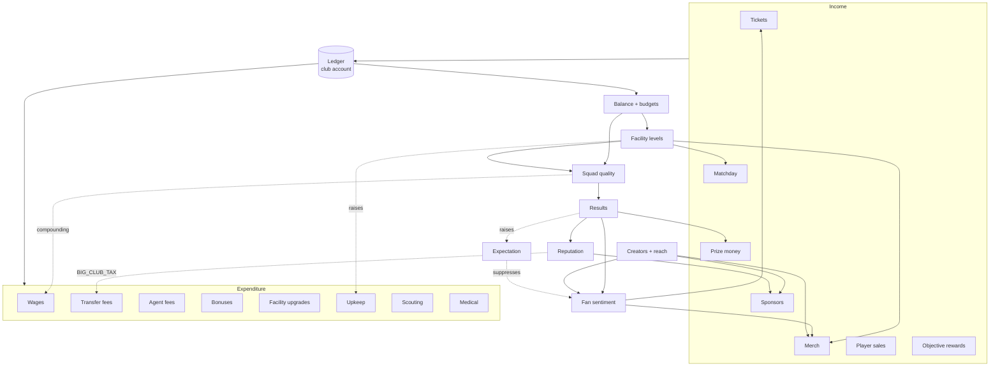

# Creator Football — Economy

Grounded in `packages/engine/src/economy/ledger.ts` (`BUILT`, frozen),
`packages/engine/src/transfers/balance.ts` (`BUILT`), `content/schema.ts` and the
Workstream C contract. Everything marked `CONTRACTED` has a frozen signature and an
implementation in flight; `SPEC` is designed here only.

---

## 1. Currencies

| Currency | Earned by | Spent on | Purchasable | Ledger enum |
|---|---|---|---|---|
| **CASH** | Matchday, sponsorship, merchandise, prize money, player sales, objective rewards, grants | Transfers, wages, facilities, upkeep, scouting, medical, agent fees, bonuses | **No** | `'CASH'` |
| **PREMIUM** | Objective rewards, season milestones, legacy achievements | Cosmetics, convenience, content packs, scout credits | Business decision — see `PRODUCT_REQUIREMENTS.md` Q4 | `'PREMIUM'` |

**The hard separation:** `PREMIUM` never converts to `CASH`. There is no exchange rate, no
"buy transfer budget", no "instant facility upgrade for gems". If premium could buy cash, it
could buy players, and that is pay-to-win with extra steps. The `Ledger` supports both
currencies on the same account precisely so this can be audited: any transaction with
`currency: 'PREMIUM'` whose destination effect is a squad or budget improvement is an
invariant violation.

Money is displayed via `formatMoney()`, which lives in the engine *"so every surface
agrees"*. It currently hardcodes `£` and `en-GB` — a localisation debt logged in
`RISKS.md` R15.

---

## 2. The ledger

### 2.1 Design

```ts
type LedgerAccount =
  | { kind: 'club';  clubId: ClubId }        // tracked balance
  | { kind: 'world'; label: string };        // infinite source/sink outside the club system

interface Transaction {
  id: TransactionId; kind: TransactionKind; currency: Currency;
  amount: number;                 // ALWAYS POSITIVE — direction is from/to, never sign
  from: LedgerAccount; to: LedgerAccount;
  cycle: number; season: number; at: number;
  memo: string;                   // mandatory, human-readable
  metadata?: Record<string, string|number|boolean>;
  idempotencyKey?: string;        // set where a transaction must never apply twice
}
```

**The rule, from the source:** *"No module may mutate a balance directly. Every movement of
value is a recorded transaction with a source, a destination and a reason."*

Six properties that follow, and why each is worth the constraint:

| Property | Mechanism | Why |
|---|---|---|
| Direction is structural | Positive `amount` + `from`/`to` | Removes an entire class of sign bugs. You cannot accidentally credit a debit |
| Rejects, does not throw | Returns `Result<Transaction, LedgerError>` | The UI says "you can't afford this" without exception handling |
| Idempotent where it matters | `idempotencyKey` + an `appliedKeys` set | A double-claimed reward returns `{ code: 'DUPLICATE' }`, structurally |
| Self-explaining | Mandatory `memo` | "Where did my money go?" is answerable from data, not from guesswork |
| Auditable | `verify()` | Non-finite balances, duplicate ids, negative amounts |
| Restorable | `snapshot()` / `restore()` including id counters and applied keys | Save/load never loses idempotency guarantees |

### 2.2 Transaction kinds

20 kinds, covering every route value can take:

| Group | Kinds |
|---|---|
| **Income** | `MATCH_REVENUE`, `TICKET_REVENUE`, `MERCH_REVENUE`, `SPONSOR_REVENUE`, `PRIZE_MONEY`, `TRANSFER_IN`, `OBJECTIVE_REWARD`, `GRANT` |
| **Expenditure** | `TRANSFER_OUT`, `WAGES`, `FACILITY_UPGRADE`, `FACILITY_UPKEEP`, `SCOUTING`, `MEDICAL`, `AGENT_FEE`, `SIGNING_BONUS`, `PERFORMANCE_BONUS`, `PENALTY` |
| **Meta** | `STORE_PURCHASE`, `ADJUSTMENT` |

`ADJUSTMENT` is the escape hatch and should be treated as a smell: every use of it in a
released build is a bug that a proper kind would have described.

### 2.3 Overdraft policy

`post()` rejects with `INSUFFICIENT_FUNDS` when a club account cannot cover the amount,
unless `opts.allowOverdraft` is set. Two callers legitimately need it:

- `open()` — seeding the opening balance from `worldAccount('genesis')`.
- **Wages** `SPEC` — an unpayable wage bill must not silently fail. It must post with
  `allowOverdraft: true`, drive the balance negative, and emit `BALANCE_LOW`, so the
  consequence is a *crisis the player must solve* rather than a silent no-op. **This is
  load-bearing:** `debit()` defaults to `allowOverdraft: false`, so a caller that ignores
  the returned `Result` will leave wages unpaid and the wage-reconciliation invariant will
  fire. Every economy caller must handle the `Result`.

### 2.4 Bounded tails

| Store | Bound | Consequence |
|---|---|---|
| `Ledger.transactions` (memory) | 4,000 entries | `all()` and `summaryFor()` see a window, not a dynasty |
| `LedgerSnapshot.transactions` (save) | last 1,200 | A loaded save has less history than the session that wrote it |
| `Ledger.appliedKeys` | **unbounded** | Save size grows monotonically with claimed rewards |
| `EventBus` journal | 5,000 events | Anything needing full history must roll up into `LegacyState` |

`SPEC`: a **season roll-up** at `SEASON_COMPLETED` that archives the season's transactions
into a `SeasonSummary` financial digest and expires `appliedKeys` scoped to closed seasons.
Logged in `RISKS.md` R13.

---

## 3. Income sources

| # | Source | Kind | Driven by | Cadence | Status |
|---|---|---|---|---|---|
| I1 | Ticket sales | `TICKET_REVENUE` | `attendanceFor()` × `ClubFinance.ticketPrice`; attendance from fan sentiment, fixture importance, stadium capacity, atmosphere | Per home match | CONTRACTED |
| I2 | Matchday ancillary | `MATCH_REVENUE` | Attendance × facility `matchdayRevenue` (stadium, fan zone) | Per home match | CONTRACTED |
| I3 | Merchandise | `MERCH_REVENUE` | Fan base × `ClubFinance.merchPrice` × facility `merchMultiplier` × Σ player `commercialValue` × creator `commercialAppeal` | Per cycle | CONTRACTED |
| I4 | Sponsorship | `SPONSOR_REVENUE` | Active `SponsorDeal.valuePerCycle`, gated by `requiresReputation` and `requiresFollowers` | Per cycle | CONTRACTED |
| I5 | Sponsor signing fee | `SPONSOR_REVENUE` | `SponsorOffer.signingFee` | On signing | CONTRACTED |
| I6 | Sponsor bonus | `SPONSOR_REVENUE` | `SponsorDeal.bonusCondition` met | On trigger | CONTRACTED |
| I7 | Prize money | `PRIZE_MONEY` | `Competition.prizeMoney[position]` | End of season | CONTRACTED |
| I8 | Player sales | `TRANSFER_IN` | Negotiated fee | On completion | CONTRACTED |
| I9 | Objective rewards | `OBJECTIVE_REWARD` | `RewardGrant` of kind `CASH`/`PREMIUM`, **idempotency key mandatory** | On claim | CONTRACTED |
| I10 | Board grant | `GRANT` | Season-start budget, promotion, board confidence | Season start | SPEC |
| I11 | Opening balance | `GRANT` | `SeasonConfigDef.startingBudget` via `Ledger.open()` | New game | BUILT |
| I12 | Store purchase | `STORE_PURCHASE` | Real-money IAP crediting `PREMIUM` or content | On purchase | CONTRACTED |

**The premise, restated:** the research shows real creator leagues derive ~85-90% of revenue
from sponsorship, and that sponsorship scales with *audience*, not with gate. Our income mix
should reflect that — I3+I4+I5+I6 (audience-driven) should out-earn I1+I2 (gate-driven) for
a club that invests in creators, and the reverse for a club that invests in the stadium.
**Both must be viable strategies.**

---

## 4. Expenditure

| # | Sink | Kind | Driven by | Cadence | Status |
|---|---|---|---|---|---|
| E1 | Player wages | `WAGES` | Σ `Contract.wage` | Per cycle | CONTRACTED |
| E2 | Transfer fees | `TRANSFER_OUT` | Negotiated fee | On completion | CONTRACTED |
| E3 | Signing bonuses | `SIGNING_BONUS` | `NegotiationTerms.signingBonus`; default `SIGNING_BONUS_WEEKS: 8` × weekly wage | On signing | CONTRACTED |
| E4 | Agent fees | `AGENT_FEE` | `AGENT_FEE_SHARE: 0.06` of fee (min £25K), × `AGENT_RIVAL_GREED: 0.5` when rivals circle | On completion | CONTRACTED |
| E5 | Performance bonuses | `PERFORMANCE_BONUS` | `ContractBonuses` — appearance 0.12×wage, goal 0.35×, clean sheet 0.22×, season 6×, trophy 12× | On trigger | CONTRACTED |
| E6 | Facility upgrades | `FACILITY_UPGRADE` | `FacilityDef.upgradeCosts[level]` | On upgrade | CONTRACTED |
| E7 | Facility upkeep | `FACILITY_UPKEEP` | Σ `FacilityDef.upkeepPerCycle[level]` | Per cycle | CONTRACTED |
| E8 | Scouting | `SCOUTING` | `SCOUTING_BALANCE.DEPTH_COST` — £12K / £45K / £140K | On assignment | CONTRACTED |
| E9 | Medical | `MEDICAL` | Injury severity × recovery speed chosen | On injury / per cycle | SPEC |
| E10 | Penalties | `PENALTY` | Disciplinary, sponsor breach, board sanction | On trigger | SPEC |

### 4.1 The wage ratchet

`WAGE_BALANCE.WAGE_PER_OVERALL: 1.088` compounds per point of overall above average, against
a base of £9,000/week at league average. The comment says why: *"wages inflate faster than
fees at the top."* A squad that improves gets structurally more expensive to keep, which is
the primary brake on Loop 1 (`GAME_SYSTEMS.md` §16).

Renewal pressure closes the loop from the other side: at
`RENEWAL_TRIGGER_RATIO: 1.22` — performing 22% above his current wage percentile — a player
demands a rise. Refusing costs `RENEWAL_REFUSAL_MORALE: 9`; a second refusal costs
`RENEWAL_REFUSAL_LOYALTY: 6`, which eventually loses you the player entirely. **You cannot
freeze your wage bill and keep your best players.**

---

## 5. Economic invariants

These must hold at every cycle boundary. `auditEconomy(state, ledger)` (`CONTRACTED`)
returns `InvariantViolation[]`; `Ledger.verify()` (`BUILT`) already covers I1, I2 and I6.

| # | Invariant | Detection | Severity |
|---|---|---|---|
| **I1** | Every balance is finite | `Ledger.verify()` | Fatal |
| **I2** | Every transaction amount is ≥ 0 and finite | `Ledger.verify()` | Fatal |
| **I3** | No club has a negative `CASH` balance except through an explicitly overdraft-flagged wage or penalty posting | `auditEconomy` | Fatal |
| **I4** | `PREMIUM` never converts to `CASH`, directly or through a reward chain | `auditEconomy` | Fatal — this is the pay-to-win firewall |
| **I5** | Σ `Contract.wage` for a club's squad equals the `WAGES` posted for that club that cycle | `auditEconomy` | Fatal — catches unpaid wages from an ignored `Result` |
| **I6** | No transaction id appears twice | `Ledger.verify()` | Fatal |
| **I7** | No `idempotencyKey` is applied twice | `Ledger.post()` returns `DUPLICATE` | Fatal |
| **I8** | Every `Objective` with `status: 'CLAIMED'` has exactly one matching `OBJECTIVE_REWARD` transaction | `auditEconomy` | Fatal |
| **I9** | A player belongs to exactly one club's squad | `validateState()` (`BUILT`) — *"the single most damaging corruption we can ship, because it silently duplicates value"* | Fatal |
| **I10** | Every `TRANSFER_OUT` from club A has a matching `TRANSFER_IN` to club B for the same fee, cycle and player | `auditEconomy` | Fatal |
| **I11** | League-wide total `CASH` grows no faster than the anti-inflation ceiling over 100 seasons | Audit harness | Warning → gate |
| **I12** | No club's balance exceeds `MAX_VALUE × 5` (a runaway detector) | `auditEconomy` | Warning |
| **I13** | Every facility level in `Club.facilityLevels` is within `[0, FacilityDef.maxLevel]` | `auditEconomy` | Fatal |
| **I14** | Every active `Contract` references a player that exists and is in the club's squad | `validateState()` extension | Fatal |
| **I15** | Wage bill ≤ some multiple of income for AI clubs, or they must sell | `worldTick` | Warning — an AI club that ignores this bankrupts the league |

Fatal violations fail the phase gate. `setInvariantMode('collect')` is the production mode —
*"in production they report rather than crash, because losing a save is worse than a wrong
number"* — but note the default mode in `core/invariant.ts` is `'throw'`, so **the host must
call `setInvariantMode('collect')` at startup in production builds**. Logged in `RISKS.md`
R12.

---

## 6. Anti-inflation brakes

An economy that only grows produces a save where money stops meaning anything by season 5.
Seven brakes, most already expressed in the balance tables.

| # | Brake | Mechanism | Where |
|---|---|---|---|
| **B1** | **Compounding wages** | `WAGE_PER_OVERALL: 1.088` per point; a better squad is disproportionately more expensive to run | `WAGE_BALANCE` |
| **B2** | **The big-club tax** | `BIG_CLUB_TAX: 0.32` — a buyer whose reputation exceeds the seller's pays 32% more. Success makes buying harder | `TRANSFER_BALANCE` |
| **B3** | **Expectation inflation** | `FanState.expectation` rises with success; the same result earns less sentiment, therefore less attendance growth, next season | `FanState` |
| **B4** | **Facility upkeep** | `upkeepPerCycle[]` rises with level. A fully upgraded club has a permanent, large fixed cost | `FacilityDef` |
| **B5** | **Age decay** | `DECLINE_PER_YEAR: 0.105` past 28, steeper past 32, floor `0.12`. Squad value evaporates if not refreshed. **The single largest sink in the game** | `TRANSFER_BALANCE` |
| **B6** | **Hard ceilings** | `MAX_VALUE: 240,000,000`, `MAX_WAGE: 900,000` — *"so a runaway save cannot produce nonsense numbers"* | `TRANSFER_BALANCE`, `WAGE_BALANCE` |
| **B7** | **Contract expiry cliff** | `CONTRACT_EXPIRING_MULT: 0.22` — a player at 0 weeks is worth 22% of value. Failing to renew destroys asset value | `TRANSFER_BALANCE` |

`SPEC` — two more that should exist and do not yet:

| # | Brake | Rationale |
|---|---|---|
| **B8** | **AI clubs must also inflate** | If only the player's wage bill compounds, the player is uniquely punished. `worldTick` must apply the same wage and fee pressure to AI clubs, and AI clubs in distress must sell |
| **B9** | **A shrink path** | The research is explicit that real creator leagues *contract*: a founding market closed, a broadcaster walked, a club requested relegation. Falling sentiment → falling attendance → sponsor loss (`SPONSOR_LOST`) → forced sales must be a reachable state, not a theoretical one |

### 6.1 The inflation test

The audit harness (`TEST_PLAN.md` §4) runs 100 seasons and asserts:

| Quantity | Season 1 → Season 100 | Gate |
|---|---|---|
| League-wide total `CASH` | Bounded growth | < 3× |
| Median player `marketValue` | Bounded growth | < 2.5× |
| Median wage | Bounded growth | < 2.5× |
| Top club's balance / bottom club's balance | Bounded spread | < 12× |
| Mean squad `overall` | Roughly flat | ±4 points |
| Mean squad age | Roughly flat | ±2 years — a monotonic rise means no regeneration (`ASSUMPTIONS.md` A15) |

---

## 7. Balance targets

Reference scale, derived from the balance constants already in the code plus the research
dossier's ballpark figures. These are *targets for the audit harness to validate*, not
authored constants — where a target and a constant disagree, the constant wins and the
target is corrected.

### 7.1 Player scale

| Quantity | Value | Source |
|---|---|---|
| Base value at league average overall | £1,200,000 | `BASE_VALUE_AT_AVERAGE` |
| Value multiplier per overall point | ×1.118 (compounding) | `VALUE_PER_OVERALL` |
| Minimum value | £25,000 | `MIN_VALUE` — *"nobody is free"* |
| Maximum value | £240,000,000 | `MAX_VALUE` |
| Base wage at league average | £9,000/week | `BASE_WAGE_AT_AVERAGE` |
| Wage multiplier per overall point | ×1.088 | `WAGE_PER_OVERALL` |
| Minimum / maximum wage | £900 / £900,000 | `MIN_WAGE` / `MAX_WAGE` |
| Peak ability window | 24-28 | `AGE_PEAK_START` / `AGE_PEAK_END` |
| Peak earning age | 27 | `PEAK_EARNING_AGE` |

**Worked example.** A 26-year-old rated 10 points above league average, no notable traits,
three years left on his deal:
- value ≈ £1.2M × 1.118^10 ≈ **£3.5M** before form, scarcity, demand and reputation.
- wage ≈ £9,000 × 1.088^10 ≈ **£20,600/week**.
- A 20-point gap (a genuine star) ≈ £1.2M × 1.118^20 ≈ **£10.2M** and ≈ £47,000/week. The
  compounding is what makes the top of the market feel like a different world.

### 7.2 Club scale (targets)

| Quantity | Target range | Notes |
|---|---|---|
| Starting budget | `SeasonConfigDef.startingBudget` | Content-authored; should be ~2-4 weeks of wage bill for a mid club |
| Wage bill per cycle, mid club | 55-70% of cycle income | Above 80% is a distress signal |
| Matchday revenue per home match | Scales with capacity × sentiment × ticket price | Research anchors: a hyper-successful creator club at 13.5K capacity earned ~£4.6-5.0M/yr matchday; a non-league creator club averaged 216 attendance |
| Sponsorship, top tier | Should be the largest single line for a `CREATOR_FIRST` club | Research: ~85-90% of creator-league revenue is sponsorship |
| Facility upgrade, level 1→2 | 1-2 cycles of income | Must be reachable in season 1 |
| Facility upgrade, level 4→5 | 8-15 cycles of income | Must be a multi-season goal |
| Scouting spend, active player | 3-8% of cycle income | £12K/£45K/£140K by depth |

### 7.3 Season-one shape (the tuning target)

The most important balance statement in the document. A player of median skill, in a
mid-table club, should experience season 1 as:

| | Target |
|---|---|
| Net transfer spend | Slightly negative — they can afford 1-2 signings, not a rebuild |
| Cash at season end | Positive but not comfortable |
| Facilities upgraded | 1-2 levels total, across at most 2 facilities |
| Sponsors | 1 upgrade in tier |
| Squad overall change | +2 to +4 |
| Feeling | "I could have done better with the money" — never "I could not afford anything" and never "money was never a constraint" |

---

## 8. Monetisation architecture

### 8.1 Offers are data

```ts
interface StoreOfferDef {
  sku; name; description;
  priceMinor: number; currency: string;         // real money, in minor units
  contents: { kind; amount; ref?; label }[];    // what you get
  startCycle | null; endCycle | null;           // availability window
  purchaseLimit | null; discountPercent;
  eligibility?: Record<string, number|string>;  // gating conditions
  treatment: 'STANDARD' | 'FEATURED' | 'LIMITED';
  accent: string; rotationWeek?: number;
}
```

Consequences:
- The store can be retuned without a client update once remote content is possible.
- An offer is reviewable as a **diff**, and a bad offer is revertible as a diff.
- The same schema serves the base pack, a seasonal pack and a promotional pack.
- The audit harness can enumerate every offer and assert that none of them grants a
  competitive-advantage content kind.

### 8.2 The four-week rotation

24 offer definitions on a four-week rotation via `rotationWeek`. Six offers visible at a
time, one `FEATURED`, at most one `LIMITED`.

Design intent: **curation, not pressure.** The rotation exists so the store is worth looking
at, not so the player fears missing out. Concretely:
- No countdown timer occupies more than a small corner of an offer card.
- `LIMITED` treatment is capped at one visible offer.
- Nothing that affects gameplay is ever exclusive to a rotation window. If a content pack is
  in a rotation, it returns.
- The store is not surfaced during the first ten minutes (`PRODUCT_REQUIREMENTS.md` §5).

### 8.3 What may be sold

| Category | Examples | Allowed |
|---|---|---|
| **Cosmetic** | Kit patterns, badge motifs, stadium dressing, manager appearance options, UI accents, portrait styles | Yes |
| **Convenience** | Scout credits (buys *time*, not *accuracy*), extra save slots, a fast-forward option, additional cosmetic slots | Yes, with care |
| **Content** | Additional club packs, additional creator packs, seasonal content, alternative competitions | Yes |
| **Premium currency** | `PREMIUM` bundles, if a paid SKU exists at all | Business decision (Q4) |
| **Competitive advantage** | Better players, transfer budget, attribute boosts, rule cards, guaranteed objectives, sim outcome influence | **Never** |

The contract states it: *"Cosmetics, convenience and content only — nothing that sells
competitive advantage outright."*

### 8.4 The anti-pay-to-win stance, stated as testable rules

1. **No purchasable `CASH`.** Invariant I4.
2. **No purchasable rule cards.** Rule cards affect a match. They are objective rewards only
   (`PRODUCT_REQUIREMENTS.md` Q10). Testable: no `StoreOfferDef.contents` entry has
   `kind: 'RULE_CARD'`.
3. **No purchasable scouting *accuracy*.** `SCOUT_CREDIT` buys throughput, not confidence.
   Testable: scout credits map to assignment slots, never to `DEPTH_CONFIDENCE`.
4. **No purchasable players, attributes or potential.** Testable: no offer content kind
   touches `Player`.
4a. **The audience/support modifier is capped at ~6 percentage points of win probability.**
   This is the one mechanism by which club reach influences a match outcome, and reach is
   the club attribute a creator signing raises fastest — so its cap is a monetisation
   boundary, not only a balance one. **Currently measuring 9.6pp and failing its test**
   (`GAME_SYSTEMS.md` §9.5, `PRODUCT_REQUIREMENTS.md` Q13).
5. **No loot boxes, no randomised paid rewards.** Testable: every `StoreOfferDef.contents`
   is a deterministic list.
6. **No energy, no timers, no wait-to-play.** `GameClock` is a cycle counter by design.
7. **The full game is completable without any purchase beyond the premium price.** Testable
   in the audit harness: a 10-season run with zero store purchases must be able to win the
   league and max at least two facilities.

Rules 2-5 and 7 are enforceable as automated checks over the content pack, and belong in the
content-validation suite (`TEST_PLAN.md` §3).

### 8.5 Purchase flow and the ledger

Every purchase posts a `STORE_PURCHASE` transaction with an idempotency key derived from the
platform receipt id. This makes the two hard cases correct by construction:

- **Double delivery.** A retried receipt validation returns `{ code: 'DUPLICATE' }` and does
  not grant twice.
- **Restore purchases.** Replaying the receipt set is safe, because every key has already
  been applied.

Real-money amounts are recorded in `metadata` (`priceMinor`, `currency`, `sku`), never in
`amount` — `amount` is the in-game value granted. Mixing real currency into the in-game
balance would corrupt every invariant in §5.

---

## 9. The economy in one diagram



Every income arrow has an expenditure arrow that grows with it. That is the whole design.
