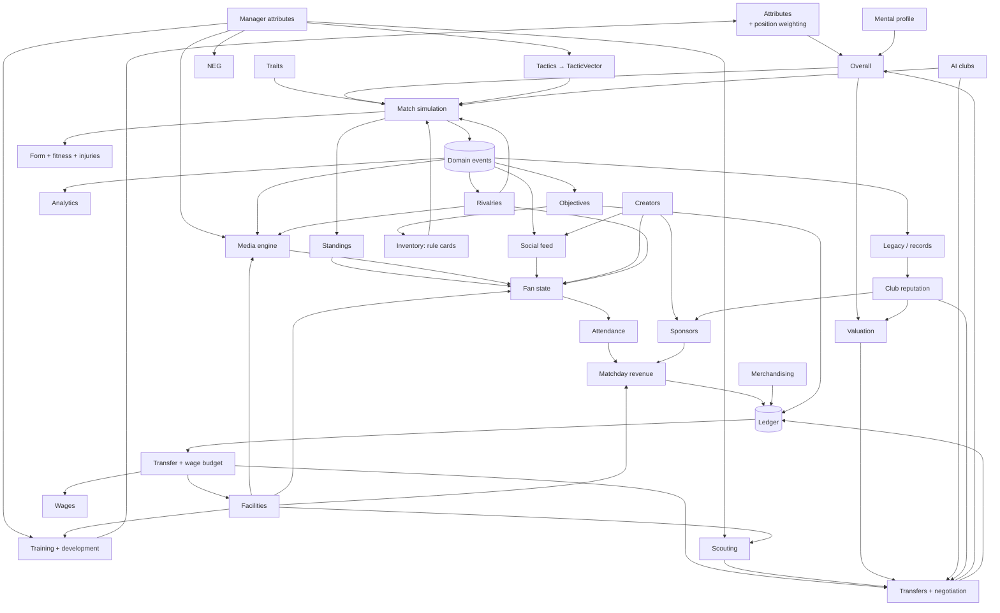
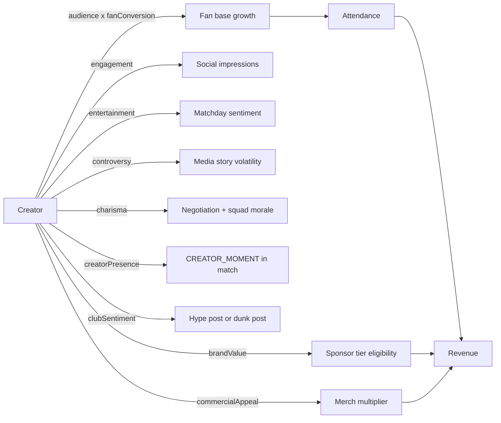
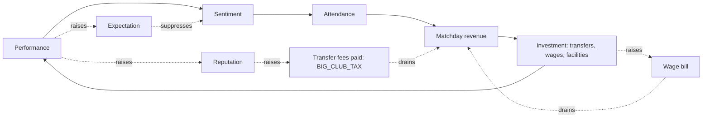
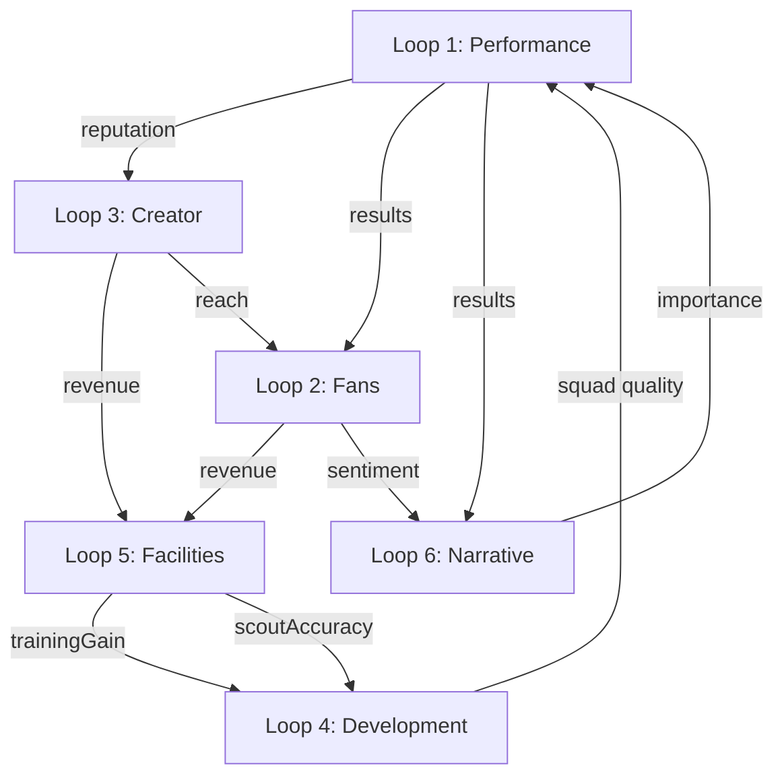

# Creator Football — Game Systems

How every system works, and — the point of this document — **how each system feeds every
other one**. If you read one thing here, read §1 (the dependency map) and §14 (the closed
loops).

Status markers: `BUILT` (in the repo now), `CONTRACTED` (signature frozen, implementation in
flight), `SPEC` (designed here only).

---

## 1. Dependency map



### 1.1 Feed matrix

Rows produce, columns consume. `x` = a direct read; `→` = via domain events.

| produces ↓ / consumes → | Match | Fans | Economy | Transfers | Training | Media | Social | Rivalry | Objectives | Legacy |
|---|---|---|---|---|---|---|---|---|---|---|
| **Attributes** | x | | | x | x | | | | | |
| **Mental** | x | | | x | x | | | | | |
| **Traits** | x | x | x | x | x | | | | | |
| **Tactics** | x | | | | | | | | | |
| **Manager** | x | | | x | x | x | | | | x |
| **Creators** | x | x | x | | | x | x | | x | |
| **Match result** | | → | → | → | → | → | → | → | → | → |
| **Fans** | x | | x | x | | → | → | | x | |
| **Economy** | | | | x | x | | | | x | |
| **Facilities** | x | x | x | x | x | x | | | | |
| **Rivalries** | x | x | | | | x | x | | x | |
| **Reputation** | | x | x | x | | x | | | | x |
| **Objectives** | x | | x | | | | | | | x |
| **Legacy** | | x | | | | x | x | | x | |

The two cells that carry the most product weight: **Creators → Economy** (audience becomes
sponsorship, which is the premise) and **Match result → everything** (one event stream
drives six consumers, which is what makes the world feel like it remembers).

---

## 2. Attributes and position weighting `BUILT`

**17 technical/physical attributes**, 1-99 (`players/attributes.ts`). The design rule stated
in the file: *"every attribute here is read by at least one simulation subsystem. We do not
ship decorative numbers."*

```
pace, acceleration, shooting, finishing, passing, vision, dribbling, technique,
crossing, defending, positioning, physical, strength, stamina, decisionMaking,
composure, reflexes
```

### 2.1 How position weighting works

`POSITION_WEIGHTS` maps each of the 10 positions to a partial weight table. Weights are
normalised at read time via `weightedMean`, so they need not sum to anything.

```ts
overallFor(attributes, position) =
  clamp(round(weightedMean(entries(POSITION_WEIGHTS[position]).map(...))), 1, 99)
```

This is what makes a 78-rated centre back a genuinely different object from a 78-rated
winger, rather than the same number twice:

| Position | Top three weights | What that means in the sim |
|---|---|---|
| `GK` | reflexes 5, positioning 3, composure 2 | A keeper's `reflexes` is the single largest term in `saveChance` |
| `CB` | defending 5, positioning 4, strength 3 | Pace is weighted 1.5 — a slow, positionally excellent CB is viable |
| `LB`/`RB` | defending 3.2, pace 3, stamina 3 | Stamina weighted equal to pace: full-backs pay the fatigue bill of a wide system |
| `CDM` | defending 4, positioning 3.5, passing 3 | Passing weighted as highly as defending — a destroyer who cannot pass is not a good CDM |
| `CM` | passing 4, vision 3.5, stamina 3.2 | |
| `CAM` | vision 4.2, passing 3.8, technique 3.5 | Shooting only 2.5: a ten creates before it finishes |
| `LW`/`RW` | pace 4, dribbling 4, acceleration 3.8 | Finishing only 2.2 |
| `ST` | finishing 5, shooting 4, composure 3 | Composure ranks above pace |

### 2.2 Consequences elsewhere

- **Playing out of position.** `POSITION_FAMILIARITY` gives a 0-1 coefficient for every
  natural→playing pair, defaulting to 0.45 for unlisted pairs. A CB at LB is 0.75; a CB at
  ST is 0.45. The design rule: *"Playing out of position is allowed, but it costs
  effectiveness — a real trade-off rather than a blocked UI action."*
- **Auto-selection.** `slotFit(player, slot) = overall × min(1, familiarity + secondaryBonus)
  × fitnessFactor × formFactor`. Overall alone would put a striker at centre back.
- **Card design.** `keyAttributes(attrs, position, 3)` returns the three attributes with the
  highest `value × weight` product — the UI shows 3 numbers, not 17 (`ASSUMPTIONS.md` A18).
- **Valuation.** `marketValue` compounds on overall (`VALUE_PER_OVERALL: 1.118` per point),
  so position weighting propagates directly into price.

### 2.3 Mental attributes `BUILT`

Ten mental attributes (`players/mental.ts`), each annotated in the source with its
consumer. This table *is* the contract — if a system stops reading one, the attribute is
deleted rather than left as UI decoration.

| Key | Read by |
|---|---|
| `confidence` | match sim: shot conversion, duel win rate |
| `morale` | training gains, transfer willingness, form drift |
| `discipline` | foul/card probability |
| `leadership` | team morale spread, comeback modifier |
| `ambition` | contract demands, transfer requests |
| `consistency` | per-match form variance |
| `pressureHandling` | big-match and late-game modifiers |
| `professionalism` | development rate, injury recovery, morale decay |
| `loyalty` | contract renewal, resisting rival bids |
| `temperament` | reaction to being benched/substituted |

`VOLATILE_MENTAL = ['confidence', 'morale']` — only these two move week to week. The other
eight are personality constants. **This distinction is what stops the mental model from
becoming a second attribute grind.**

---

## 3. Traits and their simulation hooks `BUILT`

22 traits, each resolving to one or more of 23 `TRAIT_MODIFIER_KEYS`. The rule: *"There are
no flavour-only traits: if a trait has no modifier, it does not ship."*

### 3.1 The modifier keys, by consuming system

| System | Keys |
|---|---|
| Match — attack | `shotConversion`, `creativity`, `aerialThreat`, `counterThreat`, `dribbleSuccess`, `duelWin` |
| Match — build-up | `passAccuracy`, `pressResistance` |
| Match — defence | `tackleSuccess`, `saveChance` |
| Match — conditional | `bigMatchBonus`, `lateGameBonus` |
| Match — cost | `staminaDrain`, `injuryRisk`, `cardRisk` (lower is better on all three) |
| Training | `developmentRate`, `injuryRisk` |
| World / squad | `moraleResilience`, `teammateMorale`, `chemistry` |
| Fans | `fanAppeal` |
| Economy | `commercialValue` |
| Transfers | `marketValue`, `wageDemand` |

### 3.2 Conditional traits

Seven conditions: `BIG_MATCH` (importance ≥ 4), `LOSING`, `LATE_GAME` (after 75% elapsed),
`DERBY`, `HOME`, `YOUNG` (age ≤ 21), `VETERAN` (age ≥ 31).

```ts
traitModifier(traitIds, key, activeConditions) // conditional traits contribute 0 unless satisfied
traitMultiplier(...) = max(0.2, 1 + traitModifier(...))  // floored: a stack of negatives cannot invert an effect
```

> *"Conditional traits contribute nothing when their condition is absent — which is what
> makes 'Clutch' feel like a moment rather than a permanent stat bump."*

### 3.3 Traits that deliberately cost something

The trait list is a set of trade-offs, not a set of buffs. `kind` is one of
`positive` / `mixed` / `negative`.

| Trait | Gives | Costs |
|---|---|---|
| `hot_head` | duelWin +0.08, tackleSuccess +0.05 | **cardRisk +0.45** |
| `showman` | fanAppeal +0.30, commercialValue +0.25, dribbleSuccess +0.08 | passAccuracy −0.05 |
| `selfish` | shotConversion +0.07 | creativity −0.15, chemistry −0.15 |
| `veteran` | pressResistance +0.12, teammateMorale +0.12 | staminaDrain +0.18, developmentRate −0.40 |
| `late_bloomer` | developmentRate +0.35 | marketValue −0.08 (the market has not noticed yet) |
| `wonderkid` | developmentRate +0.50, marketValue +0.40 | wageDemand +0.15 |
| `sweeper_keeper` | passAccuracy +0.12, pressResistance +0.10 | saveChance −0.03 |
| `injury_prone` | — | **injuryRisk +0.60**, marketValue −0.15 |
| `mercenary` | moraleResilience +0.10 | wageDemand +0.30, chemistry −0.10 |
| `glass_confidence` | — | moraleResilience −0.35, shotConversion −0.03 |

### 3.4 Cross-system reach

`showman` is the clearest example of a trait that crosses every boundary in the game: it
raises `fanAppeal` (→ fan sentiment → attendance → matchday revenue), raises
`commercialValue` (→ merch multiplier → economy), raises `dribbleSuccess` (→ match), and
lowers `passAccuracy` (→ match). One trait touches four systems, in both directions. That
is the pattern the whole trait table follows.

---

## 4. Creators as first-class entities `BUILT` (model) / `CONTRACTED` (systems)

A creator is **not** a player with a follower count. It is a separate entity with its own
attribute space feeding a disjoint set of systems.

### 4.1 The model

| Field | Purpose |
|---|---|
| `roles: CreatorRole[]` | `PLAYER`, `MANAGER`, `INFLUENCER`, `CLUB_PERSONALITY`, `PUNDIT`, `OWNER` — held simultaneously |
| `tier: CreatorTier` | `LOCAL` → `RISING` → `ESTABLISHED` → `MAJOR` → `GLOBAL`; `TIER_REACH` bands from 5K to 60M followers |
| `attributes: CreatorAttributes` | 11 keys, each annotated with its consumer |
| `style: CreatorContentStyle` | `tone` (6 values), `platforms`, `postingFrequency` |
| `clubSentiment: -100..100` | Whether they hype the club or dunk on it |
| `playerId: PlayerId \| null` | Set when the creator is also a squad member |
| `dealWeeksRemaining` | Association expiry — creators are not permanent |
| `bio` | One line establishing a personality. Non-optional in practice |

### 4.2 Creator attributes and what reads them

| Key | Consumer |
|---|---|
| `audience` | fans: baseline reach, drives social impressions |
| `engagement` | social: reply/like rate → conversion to club followers |
| `charisma` | negotiation, media handling, squad morale |
| `controversy` | media: story volatility — **high = more reach AND more risk** |
| `brandValue` | economy: sponsor tier unlocked |
| `loyalty` | world: resistance to poaching by rival clubs |
| `leadership` | squad: morale spread when embedded in a team |
| `entertainment` | fans: matchday sentiment gain from creator moments |
| `mediaAbility` | media: how well press conferences land |
| `fanConversion` | fans: % of audience that becomes actual club support |
| `commercialAppeal` | economy: merch multiplier |

```ts
creatorReach(c) = round(c.followers × (0.4 + (c.attributes.engagement / 100) × 1.2))
```

A creator with 1M followers and engagement 20 reaches 640K; with engagement 90, 1.48M. **A
smaller, more engaged creator can out-reach a bigger, flatter one** — which makes tier a
starting point rather than a verdict, and makes creator scouting a real decision.

### 4.3 How creators feed other systems



**The creator loop is the club's second economy.** A conventional football club grows by
winning; a creator club can also grow by being *interesting*. That is the design premise the
research supports (audience → sponsorship, not gate → revenue), and it is why `brandValue`
gates sponsor tiers rather than merely multiplying them.

`MatchTeam.creatorPresence` (0-1) drives `CREATOR_MOMENT` event frequency inside the match,
which is the one place the creator layer touches the pitch — and it produces *content*, not
a goal-probability bonus. Creators must never buy competitive advantage; that would be
pay-to-win by another route (`PRODUCT_REQUIREMENTS.md` MN4).

---

## 5. Managers `BUILT` (model) / `CONTRACTED` (systems)

Ten attributes, each with a named consumer. Eight archetypes, each with real strengths **and
real weaknesses** — the `ManagerArchetype` type requires a `strength` and a `weakness`
string, stated plainly in the UI.

| Attribute | Consumer |
|---|---|
| `tacticalKnowledge` | match sim: scales the *magnitude* of every tactic delta (`toTacticVector` gain); AI decision quality |
| `motivation` | match sim: half-time swing, morale recovery |
| `playerDevelopment` | training: gain multiplier |
| `mediaHandling` | media: story sentiment damping |
| `negotiation` | transfers: fee and wage leverage (`NEGOTIATION_LEVERAGE: 0.14`) |
| `scouting` | scouting: report confidence per cycle (`MANAGER_SCOUTING_SWING: 0.3`) |
| `discipline` | squad: card rate and professionalism drift |
| `riskTolerance` | AI: aggression of auto-tactics |
| `adaptability` | match sim: benefit from in-match tactical changes |
| `brandBuilding` | economy: sponsor and fan growth |

Archetypes: Tactician, Motivator, Showman, Data Nerd, Gambler, Disciplinarian, People's
Manager, Entrepreneur. *"There is no strictly-best pick, which is the point."*

The manager is the player's avatar in the systems layer: they do not appear on the pitch,
but they scale six other systems. This is what makes the opening choice at minute 0:25 of
onboarding a *real* choice rather than a portrait picker.

---

## 6. Clubs `BUILT` (model)

A club is the aggregation point for every other system.

| Component | Feeds |
|---|---|
| `visual: ClubVisualIdentity` | Rendering only — 3 colours, badge shape, badge motif, style, kit pattern |
| `philosophy: ClubPhilosophy` | AI behaviour, transfer preference, youth vs. spend bias, fan expectation |
| `fanCulture: FanCulture` | How fans react to the same result (`ULTRAS` punish, `FAMILY` forgive, `ONLINE_NATIVE` amplify) |
| `reputation: 0-100` | Gates player interest, sponsor tier, media attention, the `BIG_CLUB_TAX` in transfers |
| `stadium` | capacity, quality, atmosphere, pitchQuality → attendance ceiling and home advantage |
| `fans: FanState` | The fan loop (§8) |
| `finance: ClubFinance` | Budgets, ticket/merch price, debt; a *snapshot* — the Ledger remains the source of truth |
| `facilityLevels` | Effects into training, scouting, medical, media, commercial, fan systems (§10) |
| `aiProfileId` | Non-player clubs' strategy |
| `seasonRecord` / `allTimeRecord` | Standings, legacy, board expectation |

Eight philosophies: `YOUTH_ACADEMY`, `BIG_SPENDERS`, `DATA_DRIVEN`, `CREATOR_FIRST`,
`DEFENSIVE_ROCK`, `LOCAL_ROOTS`, `ENTERTAINERS`, `VETERAN_CORE`. *"Philosophies create
genuine trade-offs; they are not cosmetic labels."* Each maps to an AI profile of the same
family, which is how the world reads as twelve different clubs rather than twelve colour
swatches (`RISKS.md` R10).

---

## 7. Tactics as trade-offs `BUILT`

The most fully realised expression of the game's design philosophy. `tactics/vector.ts`
states the rule and then enforces it in data:

> *"Every setting pushes at least two opposing terms. There is no instruction here that is
> strictly better than its neighbours."*
> *"The comment above each table names the trade-off in words; the table itself is the same
> statement in numbers, and the two must never disagree."*

### 7.1 The 12-dimension TacticVector

| Field | Neutral | Meaning |
|---|---|---|
| `aggression` | 0.5 | How far up the pitch the team defends |
| `attackVolume` | 1.0 | Chance-creation volume multiplier |
| `defensiveSolidity` | 1.0 | Defensive solidity multiplier |
| `spaceBehind` | 0.5 | Space conceded in behind (higher = worse) |
| `fatigueRate` | 1.0 | Fatigue accumulation multiplier |
| `possessionBias` | 0.5 | Share of possession this shape wants |
| `pressRecovery` | 0.5 | Turnover generation in the opponent half |
| `counterWeight` | 0.5 | Weight given to transitions |
| `chanceQuality` | 0.5 | Quality-vs-quantity trade (1 = fewer, better) |
| `foulRate` | 1.0 | Foul propensity |
| `widthBias` | 0 | −1 central … +1 wide |
| `volatility` | 1.0 | Variance multiplier |

### 7.2 Eleven settings, every one a trade

| Setting | Buys | Pays |
|---|---|---|
| `tempo: FRANTIC` | attackVolume +0.18, volatility +0.22 | chanceQuality −0.14, possession −0.12, **fatigue +0.20**, fouls +0.06 |
| `tempo: PATIENT` | possession +0.10, chanceQuality +0.10, fatigue −0.05 | attackVolume −0.10, counterWeight −0.10 |
| `press: HIGH_PRESS` | pressRecovery +0.30, aggression +0.26, attackVolume +0.09 | **spaceBehind +0.19, fatigue +0.24**, fouls +0.11, solidity −0.09 |
| `press: LOW_BLOCK` | solidity +0.17, spaceBehind −0.15, fatigue −0.12, counter +0.09 | pressRecovery −0.26, possession −0.12, attackVolume −0.08 |
| `line: HIGH` | possession +0.10, pressRecovery +0.13, attackVolume +0.06 | **spaceBehind +0.21**, solidity −0.07 |
| `width: WIDE` | attackVolume +0.08 | chanceQuality −0.07, solidity −0.06, fatigue +0.07 |
| `passing: SHORT` | possession +0.15, chanceQuality +0.09 | counterWeight −0.13, volatility +0.05 |
| `buildUp: FROM_THE_BACK` | possession +0.11, chanceQuality +0.06 | **volatility +0.11**, solidity −0.05 |
| `focus: LEFT/RIGHT` | attackVolume +0.05 | chanceQuality −0.04, readable shape |
| `marking: MAN` | pressRecovery +0.13 | fouls +0.11, spaceBehind +0.08, fatigue +0.08 |
| `risk: RECKLESS` | attackVolume +0.25 | solidity −0.23, volatility +0.30, spaceBehind +0.15 |
| `counter: ALWAYS` | counterWeight +0.24 | chanceQuality −0.07, possession −0.11, fatigue +0.09 |
| `subStrategy: AGGRESSIVE` | fatigue −0.06 | volatility +0.05, chanceQuality −0.02 (an unsettled team) |

### 7.3 The two context terms

```ts
gain    = 0.82 + 0.36 × clamp01(managerTactical / 100)
quality = clamp01(squadQuality / 100)
```

- **`managerTactical` scales every delta's magnitude** — a good coach gets more from the
  same instruction. Critically, *it never flips a sign*, so a better manager can never turn
  a downside into an upside.
- **`squadQuality` gates the physically demanding instructions:**
  ```ts
  demand      = max(0, aggression − 0.5) + max(0, fatigueRate − 1)
  pressRecovery ×= 0.78 + 0.44 × quality
  fatigueRate   ×= 1 + 0.35 × demand × (1 − quality)
  ```
  A weak squad asked to press high pays the full fatigue bill and collects a fraction of the
  turnovers. **This is the mechanical reason underdogs sit deep** — an emergent behaviour
  from a five-line rule, not a hard-coded AI decision.

### 7.4 One channel for every modifier

`applyVectorModifiers(vector, modifiers)` applies a bag of named deltas and re-clamps. Live
decisions (`DecisionOption.modifiers`), special rules (`SpecialRuleDefinition.modifiers` and
`opponentModifiers`) and AI adjustments all use it. Consequence: **adding a new special rule
or decision type requires no change to the match simulator.**

---

## 8. Fans and the fan loop `BUILT` (model) / `CONTRACTED` (behaviour)

```ts
interface FanState {
  sentiment; trust; excitement; loyalty;   // 0-100 opinion axes
  base;                                     // absolute supporter count
  expectation;                              // gap between what fans expect and what they get
  lastAttendance; seasonTicketHolders; onlineFollowers;
}
```

`sentiment` is described in the source as *"the single number the player watches most
closely"*.

### 8.1 The loop, and why it cannot run away



Three brakes, all already expressed somewhere in the code or the balance tables:

1. **Expectation tracks performance.** `FanState.expectation` is the gap between what fans
   expect and what they get. Winning raises expectation, so the same result earns less
   sentiment next season.
2. **Wages compound.** `WAGE_PER_OVERALL: 1.088` compounds per point of overall — wages
   inflate *faster* than fees at the top (`VALUE_PER_OVERALL: 1.118` on a much larger base,
   but paid once). A squad that gets better gets structurally more expensive to keep.
3. **Reputation is taxed.** `BIG_CLUB_TAX: 0.32` — a buyer whose reputation exceeds the
   seller's pays a 32% premium. Success makes buying harder.

The research dossier's fragility signals (a real creator league closed a market and lost a
broadcaster; a real creator club requested relegation) are the reason the loop must be able
to run *backwards*: falling sentiment → falling attendance → falling revenue → forced sales.

### 8.2 Fan culture modulates the same inputs

`FanCulture` (`ULTRAS`, `FAMILY`, `ONLINE_NATIVE`, `TRADITIONAL`, `BANDWAGON`, `DIEHARD`)
changes the response curve, not the inputs. `ULTRAS` swing hard on derby results;
`ONLINE_NATIVE` respond disproportionately to creator reach; `BANDWAGON` have low `loyalty`
so the base shrinks fast in a bad run; `DIEHARD` hold attendance through anything. This is
what stops twelve clubs from feeling like one club with twelve palettes.

---

## 9. The match, end to end `CONTRACTED` (types `BUILT`)

### 9.1 Structure

- **Tick** ≈ 6 seconds of match time. A 30-minute match is ~300 ticks.
- **Phases:** `BUILD_UP` → `PROGRESSION` → `FINAL_THIRD` → `SHOT` / turnover, plus
  `TRANSITION`, `PRESS`, `SET_PIECE`, `RESTART`, `CELEBRATION`, `STOPPAGE`.
- **Chance quality is continuous xG**, not a coin flip. `MatchEvent.xg` is present on
  `SHOT`, `GOAL`, `MISS`, `SAVE`, `CHANCE_CREATED`.
- **Goal counts are negative binomial, not Poisson.** Poisson forces variance = mean, which
  real football violates in every league tested. The dispersion parameter is an exposed
  tunable, because it is the dial controlling how often blowouts happen — a *design* choice
  as much as a realism one. Score correlation between the two sides is modelled (comebacks
  are real). The Dixon-Coles low-score correction is **not** ported: it exists to fix
  0-0/1-1 frequency at λ≈1.4 per team and stops earning its complexity at λ≈3.5.
- **Fatigue accrues per tick** from `TacticVector.fatigueRate` × player `stamina` ×
  `traitMultiplier(..., 'staminaDrain')`, and degrades *effective* attributes. This is what
  makes a high press cost something.
- **Momentum is derived**, a summary of recent xG, possession and events. It is explicitly
  **not rubber-banding**: it may add at most a small, documented amount to goal probability.
  `MatchResult.momentumTimeline` samples it per minute for the post-match chart.

### 9.2 The output surface

| Output | Consumer |
|---|---|
| `MatchEvent[]` | Renderer, commentary, stats, key-moment reel, promotion to domain events |
| `PitchFrame` per tick | Animated pitch: ball position, holder, 14 player positions + `state` + `stamina`, `phase` |
| `DecisionPrompt` | The live-decision UI |
| `MatchResult` | Everything downstream: standings, form, injuries, ratings, legacy, media, social |

`matches/events.ts` states the rule that makes this work:

> *"No renderer may invent an event, and no system may learn about a match by any other
> route."*

### 9.3 Live decisions

Fourteen triggers (`UNDER_PRESSURE`, `STRIKER_ISOLATED`, `LOSING_MIDFIELD`, `CHASING_GAME`,
`PROTECTING_LEAD`, `MOMENTUM_SWING`, `KEY_PLAYER_TIRED`, `OPPONENT_SHAPE_CHANGE`,
`INJURY_DECISION`, `CARD_RISK`, `SPECIAL_RULE_CHOICE`, `CREATOR_OPPORTUNITY`,
`HALFTIME_TALK`, `SET_PIECE_CALL`).

Each prompt carries a one-sentence `situation` in plain language ("You're getting pinned
back."), 2-3 options, each with:
- `effect: string` — one line of plain language: what this actually does
- `modifiers` — applied to the team's `TacticVector` for `durationMinutes`
- `risk: LOW | MEDIUM | HIGH` — a subtle indicator on the button
- a `timeoutSeconds` and a `defaultOptionId`, so an inattentive player is never blocked

`DecisionOutcome.evaluation` is filled in post-match with `xgDelta`, `xgAgainstDelta` and a
`verdict` of `WORKED` / `NEUTRAL` / `BACKFIRED`. **This is the feedback channel that teaches
the tactical model without a tutorial** — and a distribution dominated by `NEUTRAL` is a
signal that the options are not real trade-offs (`ASSUMPTIONS.md` A7).

### 9.4 Special rules

Ten rule ids (`DOUBLE_GOAL`, `POWER_PLAY`, `LAST_STAND`, `LOCKDOWN`, `ALL_IN`,
`CREATOR_MOMENT`, `NUMBERS_GAME`, `LONG_RANGE`, `CAPTAINS_CALL`, `SUDDEN_SPARK`).

Design constraints in the type itself:
- `counterplay: string` is **required and always populated** — *"A rule that cannot be
  played against is a bug."*
- `opponentModifiers` — *"the counterplay in numbers"*.
- `beneficiary`: `HOLDER` | `BOTH` | `TRAILING`.
- `earliestPhase` / `latestPhase` as fractions of match length — rules cannot fire at
  arbitrary moments.
- `ActiveSpecialRule.reason` — *"shown to the player so it never feels arbitrary"*.

**Clock-anchored windows.** The contract now specifies that each half has a guaranteed
swing window in its closing minutes during which the active rule applies — **two windows per
match**. This makes rules part of the competition's identity rather than a random event, and
gives the player two predictable high-tension beats to plan for.

That guarantee has a direct simulation consequence: the match is **two goal regimes, not
one**. Normal play (~24 of 30 minutes) should sit near 0.16-0.18 goals/minute; rule-window
play (~6 of 30 minutes) is designed to be 2-4× denser. Rule-window goals must be generated
by a **separate additive process**, never folded into the base rate — the two regimes have
different variance and different correlation with the base process, and validating only the
blended total will hide a badly tuned window. See `TEST_PLAN.md` §4.1a.

> **Unresolved conflict.** `generateFixtures()` sets `enabledSpecialRules: []` on any week
> not listed in `FixtureGenOptions.specialRuleWeeks`, so under the current code most matches
> have no rules at all — which contradicts "two guaranteed windows per match". Either every
> fixture carries rules (and scarcity comes from *which* rule fires, not *whether* one does),
> or the guarantee is conditional on a rule week and the blended goal target only applies to
> those weeks. **This blocks the Phase 2 gate.** Tracked as `PRODUCT_REQUIREMENTS.md` Q11.

Rule cards (`RuleCard` in `InventoryState`) are earned through objectives and rewards —
**not bought** (`PRODUCT_REQUIREMENTS.md` Q10).

### 9.5 Home advantage is zero by default

Creator leagues play every match at a single neutral venue on a shared matchday, so there is
no home advantage to model. `MatchSetup.homeAdvantage` (0-1) and `MatchSetup.neutralVenue`
exist, and the default is **0**.

That leaves the structural slot free for something more interesting: an **audience/support
modifier** driven by the club's in-game reach — an original mechanic occupying the position
home advantage occupies in a conventional football sim. It must be calibrated to no more
than the real-world home effect (~6 percentage points of win probability), so it stays a
nudge rather than a determinant. This is the one place where the creator economy touches the
outcome of a match, and it is capped precisely because of that.

### 9.6 Draws are a design problem to *create*, not to handle

At an 11-a-side goal rate (λ≈1.47 per team) draws are ~24.5% of matches and the problem is
resolving them. At our rate (λ≈3.5 per team) draws thin out sharply, 0-0 becomes rare, and
the modal scoreline moves into the 3-3 / 4-3 region.

Every real creator league found in the research nonetheless ships an explicit tie-break —
a midfield shootout, a golden goal, penalties. That is not decoration: at high λ a league
still produces enough draws to be unsatisfying for an entertainment product, and the leagues
resolve them theatrically. Our engine should support the same for any fixture that must
produce a winner. `SPEC` — tracked as `PRODUCT_REQUIREMENTS.md` Q12.

---

## 10. Facilities `CONTRACTED`

Eleven facilities × five levels, each with `upgradeCosts[]`, `upgradeCycles[]`,
`upkeepPerCycle[]`, human-readable `levelEffects[]` and a machine-readable `effects` map of
`system key → value per level`.

| Facility | Primary effect keys |
|---|---|
| Stadium | `stadiumCapacity`, `matchdayRevenue`, `atmosphere` |
| Training centre | `trainingGain` |
| Medical | `injuryRecovery`, `injuryResistance` |
| Academy | `youthQuality` |
| Scouting | `scoutSpeed`, `scoutAccuracy` |
| Analytics | `tacticalInsight` |
| Media dept | `mediaDamping` |
| Creator studio | `creatorReach` |
| Merchandising | `merchMultiplier` |
| Fan zone | `fanSentimentGain` |
| Recovery | `injuryRecovery`, `injuryResistance` |

`facilityEffect(club, key, registry)` is the single read point. Facilities are the main
long-horizon money sink and the main reason to keep playing past a title: they take
`upgradeCycles` to complete, so the player always has something maturing
(`PRODUCT_REQUIREMENTS.md` §6).

**Every facility feeds at least one other system**, which is why the effect keys are named
after systems rather than after buildings. Nothing in the game reads "training centre
level"; things read `trainingGain`.

---

## 11. Transfers, valuation and scouting `CONTRACTED` (balance `BUILT`)

### 11.1 Valuation

`marketValue(p, ctx)` compounds from a base of £1.2M at league average:

| Term | Constant | Effect |
|---|---|---|
| Overall | `VALUE_PER_OVERALL: 1.118` | Compounding, not linear — *"the gap between an 80 and an 86 must feel enormous, because that is the gap that decides titles"* |
| Age | peak 24-28; `DECLINE_PER_YEAR: 0.105`, steeper past 32 | Floor `AGE_MULT_FLOOR: 0.12` — nobody is worthless |
| Potential | `+0.024/point`, capped at `+1.15`, irrelevant past 30 | *"A 16-year-old with a 95 ceiling is expensive, not priceless"* |
| Form | `FORM_SWING: 0.3`, trusted after 6 appearances | *"the market overreacting"* |
| Scarcity | `SCARCITY_SWING: 0.35` | Position scarcity is priced |
| Demand | `+0.07/suitor`, cap `0.35` | Rival interest raises the price |
| Contract | `CONTRACT_EXPIRING_MULT: 0.22` at 0 weeks | The "he can leave for nothing" cliff |
| Injury | `−0.02/week`, cap `0.35` | |
| Reputation | `REPUTATION_SWING: 0.25` | Fame is worth real money |
| Traits | `marketValue` modifier | `wonderkid` +0.40, `injury_prone` −0.15 |

`askingPrice` layers seller psychology on top: `ROLE_PREMIUM` (a `STAR` costs 1.9×),
`IRREPLACEABLE_PREMIUM` (+0.30 if he is clearly the best at the club),
`SELLER_WEALTH_PREMIUM` / `SELLER_DISTRESS_DISCOUNT` (a broke seller deals),
`BIG_CLUB_TAX` (+0.32 when the buyer outranks the seller), `NEGOTIATION_LEVERAGE` (−0.14
for a strong negotiator), floored at `ASKING_FLOOR_MULT: 0.6` of market value.

### 11.2 Negotiation as a system, not a button

Stages: `OPENING` → `CLUB_TALKS` → `PLAYER_TALKS` → `AGENT_TALKS` → `AGREED` / `FAILED` /
`HIJACKED`.

Both sides carry **patience** that burns per round (`PATIENCE_PER_ROUND: 6`) and per
lowball (`CLUB_PATIENCE_PER_10_PERCENT_SHORT: 16`), with an insult threshold below 55% of
asking that costs **double** patience. Neither side caves at once
(`CLUB_CONCESSION_RATE: 0.35`, `PLAYER_CONCESSION_RATE: 0.28`).

The player's willingness is a weighted score that must sum to 1:
`wage 0.34, role 0.22, clubReputation 0.18, leaguePosition 0.10, charisma 0.08, ambitionFit 0.08`.
**Money is only a third of it** — which is what makes a smaller club able to sign someone by
offering a `STAR` role, and what makes league position matter in February.

Two mandated failure modes:
- **Hijack:** `HIJACK_BASE_CHANCE: 0.04` + `0.05/suitor` + `0.02/round`, capped at 0.40,
  with the hijacker bidding `+12%` over your standing offer. **Dithering is punished.**
- **Lost interest:** below patience 40, a `0.22` per-round chance the player walks.

Agents take `AGENT_FEE_SHARE: 0.06` (min £25K), inflated by `AGENT_RIVAL_GREED: 0.5` when
rivals circle. `LOYALTY_REFUSAL_THRESHOLD: 82` — a very loyal player will not discuss
leaving mid-contract at all.

### 11.3 Progressive scouting

```ts
knowledgeRange(player, attributeKey) -> [low, high]
```

At confidence 0 the band is ±18 points; it narrows with exponent 1.6 (*"early scouting pays
off fast, then tapers"*) and collapses to the exact value at confidence 0.995.

| Depth | Cycles (at facility 0) | Confidence | Cost | Exact reveals |
|---|---|---|---|---|
| `BASIC` | 1 | 0.30 | £12,000 | 2 attributes |
| `DETAILED` | 3 | 0.60 | £45,000 | 5 attributes |
| `DEEP` | 6 | 0.95 | £140,000 | 12 attributes |

Confidence decays at `0.004/cycle` — *"a two-season-old report is not current"*. Capacity is
`BASE_CAPACITY: 2` plus `scoutSpeed` from the scouting facility; accuracy is modulated by
the manager's `scouting` (`MANAGER_SCOUTING_SWING: 0.3`).

**This is the game's information economy.** Scouting is the only way to convert money into
*knowledge*, and knowledge is what makes a cheap signing possible. It is also the mechanism
that makes the `late_bloomer` trait (developmentRate +0.35, marketValue −0.08) into an
exploitable edge rather than a footnote.

---

## 12. Training and development `CONTRACTED`

- **Programs, not sliders.** A small set of `TRAINING_PROGRAMS`, each with a stated
  trade-off. Fitness work costs technical growth.
- **Intensity** (`LIGHT` / `NORMAL` / `HARD`) trades growth against injury risk, modulated
  by `traitMultiplier(..., 'injuryRisk')` and the medical facility's `injuryResistance`.
- **Development inputs:** age, potential headroom, facility `trainingGain`, minutes played,
  `mental.professionalism`, manager `playerDevelopment`, and
  `traitModifier(..., 'developmentRate')`.

The minutes-played input is the crucial cross-system link: it ties development to
`Contract.role` and `rolePromiseDelta()`. Promising a prospect `STARTER` minutes and then
benching him costs morale *and* stunts development *and* eventually costs loyalty. One
decision, three consequences, in three different systems.

---

## 13. Objectives, progression and legacy `CONTRACTED`

Five sources: `SEASON`, `DYNAMIC`, `SPONSOR`, `BOARD`, `FANS`. 40+ templates, each with a
`target` that may be a range, `rewards`, `durationCycles`, `importance`, `weight` and a
`requires` gate so objectives *"react to game state and must never be trivially or impossibly
set"*.

Reward kinds: `CASH`, `PREMIUM`, `RULE_CARD`, `SCOUT_CREDIT`, `COSMETIC`, `FACILITY_CREDIT`,
`REPUTATION`.

`claimObjective(state, ledger, id, ctx)` must post through the `Ledger` with an
`idempotencyKey`, which is what makes a double claim structurally impossible rather than
merely unlikely.

### 13.1 Four progression layers

| Layer | Horizon | Carrier |
|---|---|---|
| Match | one match | `MatchResult` — rating, MOTM, key moment |
| Season | 22 matches | `ObjectiveState`, `SeasonSummary`, table position |
| Club | multi-season | reputation, `facilityLevels`, fan base, sponsor tier |
| Dynasty | the save | `LegacyState` — trophies, records, legends, milestones |

`LegacyState` is also the answer to the bounded event journal (`ARCHITECTURE.md` §4.4): the
journal is a rolling tail, so anything that must survive forever is rolled up into
`LegacyState.records`, `legends` and `seasonSummaries`.

---

## 14. Rivalries `CONTRACTED`

`Rivalry` carries `intensity: 0-100`, an `origin` string, a head-to-head record, a list of
dated `incidents` with severity, and `lastMeetingCycle`.

Rivalry is unusually well connected — it feeds five systems at once:

| Feeds | How |
|---|---|
| Fixtures | `isDerby` set at generation; derby fixtures get `importance += 2` |
| Match sim | `MatchSetup.rivalryIntensity` and `isDerby`; activates the `DERBY` trait condition, which is what makes `big_game` players show up |
| Fans | Derby results swing sentiment disproportionately, especially for `ULTRAS` |
| Media | Higher story volume and importance |
| Social | Rival creators dunk; `SocialPost.kind === 'RIVAL'` |

Rivalries both *ship seeded* (from `ClubTemplate.rivalOf`) and *form emergently*
(`RIVALRY_CREATED` event). An emergent rivalry is the clearest possible proof that the world
is reacting to the player rather than replaying a script.

---

## 15. AI clubs `CONTRACTED`

Eight strategy profiles matching the eight club philosophies: Youth Factory, Big Spenders,
Analytics, Creator Club, Defensive Specialists, Local Underdog, Showtime, Veteran Core.

`aiClubTurn(state, clubId, rng, ctx)` returns `AiActions`; transfer behaviour must reflect
**finances, squad needs, philosophy and league position** — all four, or clubs become
interchangeable.

> *"The world must evolve whether or not the player acts."*

This is the single requirement that separates a living world from a backdrop. An AI club
that only reacts to the player is a mirror; an AI club with its own plan is a rival.

---

## 16. The closed loops

Every system in this game sits inside at least one feedback loop. These are the six that
matter, with their brakes.

### Loop 1 — Performance
`squad quality → results → table position → reputation → better players available → squad quality`
**Brake:** `BIG_CLUB_TAX` (+32% on fees when you outrank the seller), compounding wages
(`WAGE_PER_OVERALL: 1.088`).

### Loop 2 — Fans
`results → sentiment → attendance → matchday revenue → investment → results`
**Brake:** `FanState.expectation` rises with success, so identical results earn less
sentiment over time.

### Loop 3 — Creator
`creator signings → audience → social impressions → fan base + brandValue → sponsor tier → revenue → more creator signings`
**Brake:** `dealWeeksRemaining` (deals expire), creator `loyalty` vs. rival poaching, and
`controversy` (more reach *and* more risk).

### Loop 4 — Development
`minutes played → development → overall → market value → sale profit → reinvestment → better squad`
**Brake:** minutes are finite (7 on the pitch), `rolePromiseDelta` punishes over-promising,
`potential` is a hard ceiling, and age decay is `−10.5%/year` past 28.

### Loop 5 — Facilities
`revenue → facility upgrade → trainingGain / scoutAccuracy / merchMultiplier → better squad or more revenue → revenue`
**Brake:** `upkeepPerCycle` rises with level — a facility you cannot afford to run is a
liability, and `upgradeCycles` means the payoff is always delayed.

### Loop 6 — Narrative
`match events → media + social → fan sentiment + rivalry intensity → match importance → bigger events`
**Brake:** manager `mediaHandling` and the media-department facility's `mediaDamping`; the
journal's `REPEAT_PENALTY` keeps the volume from becoming noise.



**A new engineer's mental model, in one paragraph:** a match produces events; events produce
narrative and objectives; narrative and results move fans; fans and creators produce money;
money buys players, facilities and knowledge; players, facilities and knowledge produce
better matches. Every arrow has a counter-arrow, so no loop runs away. The `Ledger` is the
only place value moves, the `EventBus` is the only place systems learn about each other, and
the `Rng` is the only place chance enters. Change one of those three and you have changed
the whole game.
