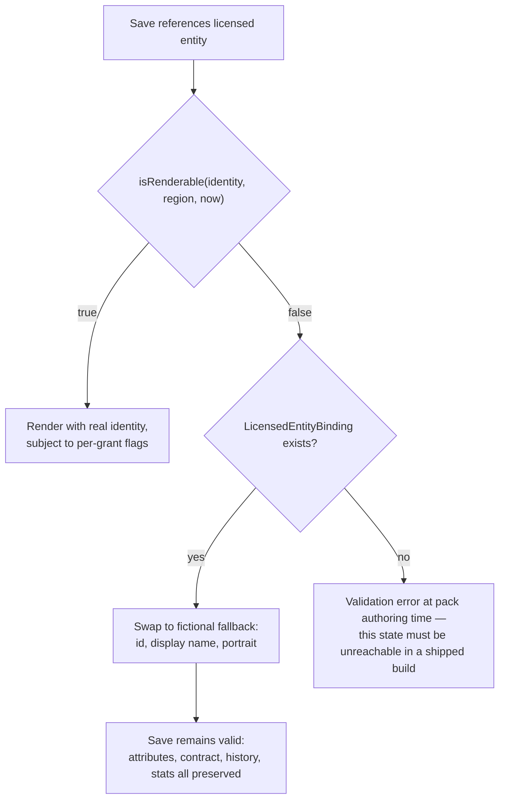

# Creator Football — Licensing Architecture

Grounded in `packages/engine/src/licensing/identity.ts` (`BUILT`, frozen),
`content/schema.ts` (`BUILT`, frozen) and the research dossier's §8 guardrails.

**The thesis in one sentence:** the base game contains no real identity of any kind, and the
architecture is built so that adding one later is a *data load*, while adding one by accident
is *structurally difficult*.

---

## 1. The principle

Rules and formats of a game are **not** protectable expression. Names, logos, crests, kit
designs, team identities, personal likenesses, voices, handles, catchphrases, broadcast
branding and the specific written text of a rulebook **are** protectable — via copyright,
trade mark, passing off, and personality/NIL rights, which are strong in the UK, Germany,
Spain and most US states.

We take the first category. We take **nothing** from the second.

Applied to the code, that becomes a single architectural rule, stated in
`licensing/identity.ts`:

> **"Nothing in the game's logic may branch on a specific real name. Logic branches on
> `IdentityKind` and on rights metadata only."**

---

## 2. The four identity kinds

```ts
type IdentityKind =
  | 'FICTIONAL'            // invented by us; always renderable
  | 'COMMUNITY_CREATED'    // authored by a player or the community
  | 'LICENSED_CREATOR'     // a real creator, under an executed agreement
  | 'LICENSED_FOOTBALLER'; // a real footballer, under an executed agreement

const isLicensed = (k) => k === 'LICENSED_CREATOR' || k === 'LICENSED_FOOTBALLER';
```

| Kind | May appear in base game | Rights required | Region-gated | Expires | Fallback required |
|---|---|---|---|---|---|
| `FICTIONAL` | **Yes** — this is the entire base game | No | No | No | n/a |
| `COMMUNITY_CREATED` | No — user-supplied only | No (but see §6.3 moderation) | No | No | No |
| `LICENSED_CREATOR` | **Never** | Yes | Yes | Yes | **Yes** |
| `LICENSED_FOOTBALLER` | **Never** | Yes | Yes | Yes | **Yes** |

`IdentityKind` is carried on the entities themselves — `Player.identityKind`,
`Creator.identityKind`, `Manager.identityKind` — and on the pack manifest. Every entity in
the game knows what it is.

**Why two licensed kinds rather than one.** Creator rights and footballer rights are
different contracts with different rights-holders, different grant sets (a footballer's club
or league may hold kit and imagery rights the individual does not) and different expiry
cadences. Distinguishing them at the type level means a query like "show me everything that
lapses if the creator agency deal ends" is a filter, not an audit.

---

## 3. Rights metadata

```ts
interface RightsMetadata {
  licenseId: LicenseId;
  status: 'ACTIVE' | 'PENDING' | 'EXPIRED' | 'REVOKED' | 'REGION_BLOCKED';
  regions: readonly string[];     // ISO-3166 alpha-2; EMPTY MEANS WORLDWIDE
  expiresAt?: number;             // epoch ms; undefined means perpetual
  provider: string;               // who supplied it — for takedown and attribution
  grants: {
    name: boolean;                // may we use the name at all
    likeness: boolean;            // portrait, avatar, 3D
    voice: boolean;               // audio, commentary lines naming them
    logo: boolean;                // their brand mark
    merchandising: boolean;       // in-game merch, cosmetics bearing the identity
  };
  attribution?: string;
}
```

### 3.1 Why `grants` is granular

A licence is rarely all-or-nothing. Real agreements routinely permit a name but not a
likeness, or a likeness but not merchandising, or everything except voice. Encoding this as
five booleans means the *rendering* layer can honour a partial licence without any content
duplication: the same entity renders with a real name and a generic silhouette when
`grants.name && !grants.likeness`.

The comment in the source is the enforcement rule: **"What the licence actually permits.
Enforced at render and simulation time."** Not at load time — at *use* time. A grant that is
only checked once, at load, becomes stale the moment a status changes mid-session.

### 3.2 `status` semantics

| Status | Renderable | Meaning |
|---|---|---|
| `ACTIVE` | Yes, if in-region and unexpired | Executed and live |
| `PENDING` | **No** | Agreed but not yet effective. Ships dark |
| `EXPIRED` | **No** | Term ended. Degrades to fallback |
| `REVOKED` | **No** | Terminated, possibly urgently. Degrades to fallback |
| `REGION_BLOCKED` | **No** | Rights exist but not for this territory |

`PENDING` matters operationally: it lets a pack ship in a release *before* the contract's
effective date, and switch on by data (a status flip or a `startsAt`-style gate) rather than
by a client update.

---

## 4. Region and expiry gating

One pure function is the entire gate:

```ts
export function isRenderable(identity: Identity, region: string, now: number): boolean {
  if (!isLicensed(identity.kind)) return true;          // fictional is always fine
  const rights = identity.rights;
  if (!rights) return false;                            // licensed without rights = invisible
  if (rights.status !== 'ACTIVE') return false;
  if (rights.expiresAt !== undefined && rights.expiresAt <= now) return false;
  if (rights.regions.length > 0 && !rights.regions.includes(region)) return false;
  return true;
}
```

Four properties worth naming:

1. **Fail closed.** A licensed entity with missing or malformed rights is `false`. The only
   way to be visible is to prove you may be.
2. **Pure and testable.** No I/O, no clock, no globals. `now` and `region` are parameters, so
   the audit harness can test "what does this pack look like in DE on 1 Jan 2027?" without a
   time machine.
3. **Empty `regions` means worldwide** — the permissive default, but only reachable when the
   rights record explicitly says so.
4. **Fictional short-circuits first.** The base game never pays a rights check.

`region` comes from `GameSettings.region`, which is player/device state, not simulation
state. `ContentRegistry.visibleFor(region, now)` returns a filtered *view*, not a mutation —
so a licence that becomes valid again (renewal, region rollout, a `PENDING` flipping to
`ACTIVE`) restores the content without a reload.

### 4.1 Where the check must happen

| Layer | Check | Consequence of skipping |
|---|---|---|
| Content load | `visibleFor(region, now)` filters the registry | Lapsed content enters generation |
| Entity render | `isRenderable` + the relevant `grants.*` flag | A name or face appears without the right to show it |
| Commentary / social / media | `grants.name` before a template naming the entity is selected | A generated line names someone we may not name |
| Voice / audio | `grants.voice` | Same, for audio |
| Cosmetics / store | `grants.merchandising` | Selling an identity we may not sell |
| Save load | Re-evaluate; a save written while a licence was live may load after it lapsed | The most likely real-world failure mode |

**The save-load row is the one that gets missed.** A dynasty running for months will outlive
licence terms. See §5.

---

## 5. Graceful degradation

```ts
interface LicensedEntityBinding {
  licensedId: string;
  fallbackId: string;
  fallbackDisplayName: string;
}
```

> **"Every licensed entity must declare a fictional stand-in used when rights lapse."**

### 5.1 The mechanism



**The critical property: identity is separable from simulation state.** A `Player` carries
`identityKind`, `firstName`, `lastName`, `displayName`, `portraitSeed` — and, separately,
attributes, mental profile, traits, contract, form and history. Swapping the identity fields
for the fallback's changes *who the player appears to be* and changes nothing about *what the
player is worth or has done*.

So when a licence lapses mid-dynasty:
- The player stays in the squad.
- Their contract, wage, appearances, goals and season history are untouched.
- The transfer they were involved in is still in `CompletedTransfer`.
- The `LegacyState` record they set is still held — under the fallback name.
- Nothing in the ledger changes.

The save does not corrupt. That is the entire design goal, stated in the source: *"A pack
that expires degrades gracefully — the entity is swapped for its fictional fallback rather
than corrupting the save."*

### 5.2 Partial degradation

Because `grants` is granular, degradation is not binary:

| Grants | Rendering |
|---|---|
| `name: true, likeness: false` | Real name, generated portrait from `portraitSeed` |
| `name: false, likeness: true` | Fallback name, real likeness — rarely useful, but expressible |
| `voice: false` | Real name and face; commentary that would speak their name selects a non-naming variant |
| `merchandising: false` | Appears in-game, cannot appear on a cosmetic or in the store |
| All false / status not `ACTIVE` | Full fallback |

### 5.3 What the player is told

`SPEC` — undesigned, and flagged as `PRODUCT_REQUIREMENTS.md` Q9. The mechanism works; the
message does not exist. The stance should be: **honest, once, non-blocking.** A single
notice on first load after a lapse ("Some licensed content is no longer available in your
region. Affected players now appear under their original names; your squad and history are
unchanged."), never a modal that blocks play, and never silence.

---

## 6. Legal guardrails

### 6.1 What the base game must never contain

Drawn from the research dossier §8.3. This list is the seed for an automated denylist
(§6.4).

| Category | Prohibition |
|---|---|
| **League names and marks** | Any real creator-league or football-league name or mark — as a name, subtitle, mode name, in marketing, in store metadata, or in ASO keywords |
| **Team names, crests, kits** | Any real club identity from any real creator league or professional league, and any visually confusable derivative |
| **Real people** | Any real creator, footballer, pundit, owner or manager. No likeness, no photo, no 3D scan, no voice, no name, no handle, no signature phrase, no recognisable caricature, and **no "legally distinct" near-miss** |
| **Trademarked rule names** | The proprietary names real leagues use for their special-rule mechanics. Assume each is claimed; invent our own vocabulary |
| **Rulebook text** | No copy-paste and no close paraphrase of any rulebook prose. Every rule expressed in our own words |
| **Broadcast identity** | No broadcaster or platform branding, no lookalike overlays, no reproduction of any real broadcast graphics package |
| **Real clubs and competitions** | No professional league or federation marks, no real club crests, no real stadium names, no recognisable stadium architecture |
| **Sponsor brands** | No real sponsor marks anywhere — kit, stadium, store, UI |
| **Real player databases** | No scraped real-player attribute data. Our players are generated |

### 6.2 What is safe, and is deliberately borrowed

Mechanics and formats, expressed in our own vocabulary: short matches (~30 minutes, two
halves); small-sided play; timed special-rule windows; a weighted deck of one-shot
rule-modifier effects; generic sporting rule concepts (double-scoring period, temporary
numeric advantage, shot clock, star-player multiplier); a draft from a scouted rated pool;
squad rules with fixed and rotating wildcard slots; creator-as-owner-manager as a premise;
matchday as a block of fixtures on a fixed weekly slot; split seasons with a league stage
then playoffs; audience-as-resource economics; multiple broadcast presentation packages; one
bounded decision per session; separating simulation from renderer.

**Format is free. Expression is not.**

### 6.3 Why the architecture makes accidental infringement structurally difficult

This is the part that matters, because "be careful" is not an architecture.

| # | Mechanism | Why it prevents accidents |
|---|---|---|
| **G1** | **No code reads a name for behaviour.** Logic branches on `IdentityKind` and `RightsMetadata` only | There is no code path where a real name could be special-cased, because names are never inputs to logic. A developer *cannot* write `if (player.name === '…')` and have it do anything the system respects |
| **G2** | **All content is data, behind one schema** | Content cannot be smuggled in as code. Adding an entity means adding a row that `validatePack()` inspects |
| **G3** | **The base pack must be `FICTIONAL` end to end** | A validation error, not a review comment. A licensed entity in a `BASE` pack fails the load |
| **G4** | **Licensed entities cannot exist without rights** | `isRenderable` returns `false` for a licensed identity with no `rights`. Forgetting the metadata makes the entity invisible, not visible-and-illegal. **Fail closed** |
| **G5** | **Every licensed entity requires a fallback binding** | Validation error at authoring time. There is no state where a lapse has nowhere to degrade to |
| **G6** | **Region and expiry are parameters, not ambient state** | The rules are testable. "What does this look like in DE next year?" is a unit test |
| **G7** | **Generated identities come from an original component set** | Names, badges, kits and portraits are procedurally assembled from parts we authored. No component may be traced from or recoloured from a real mark |
| **G8** | **Invented nationalities, not real countries** | Removes an entire surface of accidental real-world reference, and keeps the nationality namespace disjoint from the ISO-3166 region namespace used by rights |
| **G9** | **A CI denylist over content data** | §6.4 |
| **G10** | **Design docs may reference real leagues; shipped content may not** | This document set benchmarks openly. The boundary is the pack |

The single most important of these is **G1**. Everything else is a check that can be
forgotten. G1 is a property of the system: the game does not know what anyone is called, in
the sense that no behaviour depends on it.

### 6.4 The CI denylist

`SPEC` — required before the base pack ships.

- A denylist of real league names, club names, creator names and handles, footballer names,
  sponsor brands, broadcaster names and trademarked rule names, seeded from the research
  dossier's §5 and §8.3.
- Run over **every string field of every content pack**, case-insensitively, with basic
  normalisation (whitespace, punctuation, leetspeak) to catch near-misses.
- Also run over: asset filenames, analytics event names, string tables, and — per the
  dossier's guardrail — git branch names.
- A hit is a **build failure**, not a warning.
- The denylist itself lives outside the shipped bundle. It is a build-time artefact; shipping
  a list of names we must not use would be its own small embarrassment.

### 6.5 The original-vocabulary layer

Before implementation, every borrowed *mechanic* is mapped to an original *name*, and only
the original name ships. Applied in the code already: our ten special rules are
`DOUBLE_GOAL`, `POWER_PLAY`, `LAST_STAND`, `LOCKDOWN`, `ALL_IN`, `CREATOR_MOMENT`,
`NUMBERS_GAME`, `LONG_RANGE`, `CAPTAINS_CALL`, `SUDDEN_SPARK` — generic descriptive terms,
none of them a real league's proprietary mechanic name.

The rule: **a competitor's term must never reach a string table, an asset filename, a
database column, an analytics event, or a git branch name.**

---

## 7. Adding a licensed pack, end to end

`V2` — the mechanism exists; no licensed pack does.

```mermaid
sequenceDiagram
  participant Legal
  participant Content
  participant Registry
  participant Game

  Legal->>Content: Executed agreement:<br/>grants, regions, term, provider
  Content->>Content: Author pack (kind: LICENSED, identityKind: LICENSED_*)
  Content->>Content: Author RightsMetadata per entity
  Content->>Content: Author LicensedEntityBinding per entity (fictional fallback)
  Content->>Registry: validatePack() — errors block
  Registry->>Registry: load(pack) — additive; overrides declared
  Game->>Registry: visibleFor(settings.region, now)
  Registry-->>Game: filtered view
  Game->>Game: render, checking grants.* at every use site
  Note over Game: On expiry/revocation: isRenderable false<br/>→ swap to fallback<br/>→ save unchanged
```

Checklist for a licensed pack:

- [ ] Executed agreement exists, per individual and per league
- [ ] `manifest.kind === 'LICENSED'`, `identityKind` set to the correct licensed kind
- [ ] `RightsMetadata` complete: `licenseId`, `status`, `regions`, `expiresAt`, `provider`, all five `grants`
- [ ] `provider` accurately names the rights supplier (needed for takedown)
- [ ] `attribution` populated where the agreement requires it
- [ ] Every entity has a `LicensedEntityBinding` to a fictional fallback that already exists
- [ ] The pack is strictly additive — the base game plays identically without it
- [ ] `validatePack()` returns zero errors
- [ ] Expiry behaviour tested: set `now` past `expiresAt` and confirm fallback rendering and an intact save
- [ ] Region behaviour tested: a region outside `regions` renders the fallback
- [ ] Per-grant behaviour tested: each of the five flags off, independently
- [ ] Takedown drill rehearsed: flip `status` to `REVOKED` and confirm the content disappears without a client update

---

## 8. Operational commitments

| Commitment | Mechanism |
|---|---|
| We can remove a licensed identity within one data update | `status: 'REVOKED'` + `visibleFor` filtering; no client release needed if packs are remotely updatable |
| We can prove what a licence permitted | `RightsMetadata.grants` is data, versioned with the pack |
| We can prove where content came from | `manifest.provider` and per-entity `rights.provider` |
| We can answer "what lapses next quarter?" | A query over `expiresAt` across loaded packs |
| A lapse never costs a player their save | `LicensedEntityBinding` + identity/simulation separation (§5.1) |
| The base game is never at risk from a licensing dispute | The base pack is 100% fictional and complete on its own (rule L0) |
