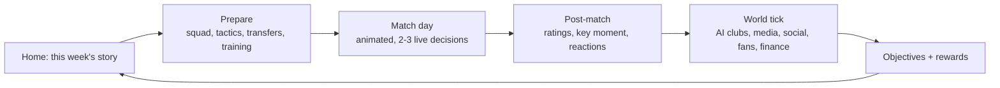

# Creator Football — Product Requirements

**Status:** working PRD, v0.1. Written against the code in this repo as of the date of the
last commit and against `docs/INTEGRATION_CONTRACT.md`, which is the authority on module
boundaries.

**Status legend used throughout this document set**

| Marker | Meaning |
|---|---|
| `BUILT` | Code for this exists in `packages/engine/src` or `apps/game/src` today |
| `CONTRACTED` | Signature is frozen in `INTEGRATION_CONTRACT.md`; implementation is in flight in a parallel workstream |
| `SPEC` | Designed in this document set, not yet contracted or built |
| `V2` | Deliberately out of scope for launch; the architecture must not block it |

---

## 1. The product

Creator Football is a premium, iPhone-first (Android-compatible) football-management game
built around a compressed, high-energy short-format league. The player takes over a club in
a twelve-team creator league, recruits footballers *and* creators, makes a handful of
high-stakes decisions during a live animated match, runs the business, and builds a dynasty
across seasons.

The design thesis, in one line: **deep systems underneath, few decisions on the surface.**
Football Manager's simulation honesty, Online Soccer Manager's session length, EA FC's
presentation, none of their spreadsheets.

### 1.1 Player fantasy

> *"I built this club. I picked these people. That result was mine."*

Three fantasies stacked, in priority order:

1. **Authorship.** The squad, the shape, the identity and the trajectory are the player's
   choices, and the world visibly reacts to them (media, social, fans, rivals).
2. **Being in the moment.** Match day is watched, not skipped. The player's two or three
   live decisions are the difference between a point and three.
3. **Legacy.** Seasons accumulate. Records, legends, trophies and rivalries persist in
   `LegacyState`, and a fifth-season save reads visibly differently from a first-season one.

Explicitly *not* the fantasy: being a spreadsheet operator, being a tycoon, or being a
gacha collector.

### 1.2 Target audience

| Segment | Share of target | What they want | What loses them |
|---|---|---|---|
| **Primary — the lapsed manager fan** (22-38, played FM/OSM, has a commute and 15 minutes) | ~50% | Real decisions, no 90-minute setup, a match worth watching | Menu depth for its own sake; a sim they cannot influence |
| **Secondary — the creator-football viewer** (16-28, watches short-format creator leagues) | ~30% | Personality, chaos, special-rule moments, social feed | A dry ledger sim; content that feels generated |
| **Tertiary — the premium mobile player** (25-45, buys games, hates F2P timers) | ~20% | Craft, polish, a fair economy, no energy gates | Any hint of pay-to-win; timers that gate play |

The three segments overlap on one requirement: **a session must be finishable in 10-15
minutes and must feel like it moved the story forward.**

### 1.3 Positioning

|  | Football Manager | OSM | EA FC (Ultimate Team) | **Creator Football** |
|---|---|---|---|---|
| Session length | 1-3h | 2-5 min | 20-40 min | 10-15 min |
| Match agency | Continuous micromanagement | None | Full control (arcade) | 2-3 live decisions |
| Depth | Extreme | Minimal | Moderate | **Deep model, shallow surface** |
| Monetisation | Premium | Ads + IAP | Loot-driven | **Premium + cosmetic/convenience IAP** |
| Identity | Licensed real world | Licensed real world | Licensed real world | **Original fictional universe, licensing as an additive pack** |

---

## 2. The core loop

One iteration of this loop is one **cycle**. `GameClock.cycle` (`core/clock.ts`, `BUILT`) is
a monotonic counter, not wall-clock time:

> "The world advances when the player completes a match cycle, never because real days
> elapsed — this is the central anti-pattern we are avoiding from live-service managers."

That comment is a product requirement, not an implementation note. **There are no energy
timers, no wait-to-continue gates, and no real-time-decay mechanics anywhere in the game.**

### 2.1 Loop timings (target)

| Beat | Target duration | Skippable | Notes |
|---|---|---|---|
| Home / story digest | 20-45s | n/a | Leads with `positionContext()` — "one win from first" |
| Prepare | 1-6 min | yes (auto-pick exists via `autoLineup`) | Depth is opt-in |
| Match | 90-150s at NORMAL speed | yes (`finish()` → "simulate rest") | `GameSettings.matchSpeed` offers SLOW/NORMAL/FAST/INSTANT |
| Post-match | 45-90s | partially | Key moment is a hero beat and is never skipped by default |
| World + objectives | 20-40s | yes | Runs while post-match is being read |

**Total target session: 10-15 minutes for one cycle; a player who wants to can do a cycle in
under 4 minutes.**

---

## 3. Season structure

Frozen by `SeasonConfigDef` in the content contract and by `core/clock.ts`:

| Parameter | Value | Source |
|---|---|---|
| Clubs | 12 | `SeasonConfigDef.clubCount`, contract §Workstream B |
| Rounds | 2 (double round robin) | `SeasonConfigDef.rounds` |
| Matches per club per season | 22 | derived; `verifyFixtures()` asserts it |
| Match length | 30 minutes, 2 halves | `SeasonConfigDef.matchMinutes/halves` |
| On the pitch | 7 (1 GK + 6 outfield) | `SeasonConfigDef.playersOnPitch`; `formationsFor(7)` |
| Squad / bench / subs | 18 / 7 / 5 | `SeasonConfigDef` |
| Playoffs | Top `playoffSpots` seeds, knockout | `generatePlayoffFixtures()` (`BUILT`) |
| Tiers at launch | 1 | See §9 non-goals and `ASSUMPTIONS.md` A4 |

### 3.1 The narrative calendar

The season is experienced as **named phases**, not week numbers. `phaseForWeek()` (`BUILT`)
distributes twelve `SeasonPhase` values proportionally, so the beats land in the same
dramatic places whether a season is 22 weeks or 10.

| Phase | Fraction of season | What it means to the player |
|---|---|---|
| `PRE_SEASON` | week 0 | Squad build, objectives roll, board expectations set |
| `OPENING_FIXTURES` | ≤ 0.14 | Low stakes, learn the squad |
| `RIVALRY_WEEK` | ≤ 0.22 | First derby; importance +2 on derby fixtures |
| `TRANSFER_WINDOW` | ≤ 0.34 | The window is a *phase*, not an always-on menu |
| `CREATOR_EVENT` | ≤ 0.42 | Creator signings, reach spikes, sponsor offers refresh |
| `MID_SEASON_PUSH` | ≤ 0.60 | The grind; form and fatigue bite |
| `DERBY_WEEK` | ≤ 0.68 | Second derby, higher intensity than the first |
| `PLAYOFF_PUSH` | ≤ 0.85 | Table pressure; objective failure risk |
| `FINAL_WEEK` | < 1.0 | Every fixture importance +1 |
| `PLAYOFFS` / `CHAMPIONSHIP` | end | Knockout bracket |
| `LEGACY` | post-season | Season summary, records, legends, retirements |

**Special rules only fire in designated weeks** (`FixtureGenOptions.specialRuleWeeks`,
`BUILT`). This is a deliberate scarcity mechanic — see `GAME_SYSTEMS.md` §9 and `RISKS.md`
R8.

---

## 4. Feature requirements by system

Priorities: **P0** ships or we do not ship. **P1** ships at launch unless a gate slips.
**P2** is post-launch or first content update.

### 4.1 Match (P0)

| # | Requirement | Priority | Status |
|---|---|---|---|
| M1 | Tick-based possession simulation, ~6s per tick, phase state machine (build-up → progression → final third → shot/turnover) | P0 | CONTRACTED |
| M2 | Continuous xG per chance; goals resolve from xG, never a flat coin flip | P0 | CONTRACTED |
| M3 | Fatigue accrues per tick from tactic vector + stamina + traits and degrades effective attributes | P0 | CONTRACTED |
| M4 | Momentum is a *derived summary* of recent xG/possession/events; it may add at most a small, documented amount to goal probability. Not rubber-banding | P0 | CONTRACTED |
| M5 | ≤ `config.maxDecisions` live decision prompts per match, never within 6 match minutes of each other, 2-3 options each, every option with a real encoded downside | P0 | CONTRACTED (`DecisionPrompt` type `BUILT`) |
| M6 | Animated pitch fed by `PitchFrame` per tick — legible, not a physics sim | P0 | CONTRACTED |
| M7 | Broadcast presentation mode as an alternative to the pitch view (`GameSettings.presentation`) | P1 | SPEC |
| M8 | Commentary generated from a template table; no line repeats within a match while alternatives exist | P0 | CONTRACTED |
| M9 | Player ratings 1.0-10.0 from contributions, not scoreline | P0 | CONTRACTED |
| M10 | Special rules from `enabledSpecialRules` + played rule cards, obeying `earliestPhase`/`latestPhase`, emitting `SPECIAL_RULE_START/END` with a human-readable `reason` | P0 | CONTRACTED (`SpecialRuleDefinition` `BUILT`) |
| M11 | Deterministic: same seed → byte-identical `MatchResult` | P0 | CONTRACTED |
| M12 | In-match substitutions (≤5) and tactical changes | P0 | CONTRACTED |
| M13 | `finish()` to skip to the end without further prompts | P0 | CONTRACTED |
| M14 | Post-match key-moment reel driven by `MatchResult.keyMomentEventId` | P1 | SPEC |

| M15 | Two clock-anchored swing windows per match — one in the closing minutes of each half — during which the active special rule applies | P0 | CONTRACTED |
| M16 | Goal counts modelled as **negative binomial**, not Poisson, with the dispersion parameter exposed as a tunable; score correlation modelled; **no Dixon-Coles low-score correction** at this goal rate | P0 | CONTRACTED |
| M17 | Rule-window goals modelled as a **separate additive process**, never folded into the base rate | P0 | CONTRACTED |
| M18 | Home advantage defaults to **0** (creator leagues play at one neutral venue); the `homeAdvantage` slot is reused as an audience/support modifier capped at ~6 percentage points of win probability | P0 | CONTRACTED |
| M19 | A theatrical tie-break path (shootout / golden goal) for fixtures that must produce a winner | P1 | SPEC |

**Validation targets.** `docs/SIMULATION_REFERENCE_DATA.md` is authoritative. Headline
figures for the default 30-minute short format:

| Metric | Target | Band |
|---|---|---|
| Goals per match (both teams) | 7.0 | 6.0 - 9.0 |
| Goals per minute | 0.233 | 0.20 - 0.30 |
| Normal-play goal rate | 0.16 - 0.18 / min | validate separately |
| Rule-window goal rate | 2-4× normal | validate separately |
| Shots per match (both teams) | ~30 | 24 - 40 |
| Shot conversion | ~23% | 18% - 28% |
| Ball in play | ~90% of clock | 8-14% out of play |
| Yellow cards per match | ~1.0 | 0.5 - 2.0 |
| Red cards per match | ~0.03 | 0.01 - 0.06 (rule-window dismissals counted separately) |
| Injuries per team per match | 0.10 | 0.08 - 0.14 |
| Possession split | 50/50 mean | within 35-65% |
| Heavy-mismatch favourite, single match | 75-85% | **never > 90%** |
| Champion win rate over a season | 60-70% | |
| Bottom side win rate over a season | 5-15% | |

**Do not validate only the blended number.** Normal play and rule-window play are two
different regimes; a blended figure inside the band can hide a badly tuned window.

> **Discrepancy — Workstream A must resolve.** The contract's own summary paragraph still
> quotes shots 8-14 per team, conversion 12-20%, yellows 1-3, reds < 0.12 and injuries
> < 0.15 per match, while naming the reference document authoritative. Those figures are
> internally inconsistent with the contract's own 6-9 goal target: 16-28 total shots at
> 12-20% yields 1.9-5.6 goals, not 6-9. The reference data's ~30 shots at ~23% yields 6.9.
> **Use the reference-data figures.** Recorded as D7 in §11.

### 4.2 Squad (P0)

| # | Requirement | Priority | Status |
|---|---|---|---|
| S1 | 17 technical/physical attributes, position-weighted overall via `overallFor()` | P0 | BUILT |
| S2 | 10 mental attributes, every one consumed by a named system | P0 | BUILT |
| S3 | Traits with simulation hooks only — no flavour-only traits | P0 | BUILT (22 traits) |
| S4 | Position familiarity: out-of-position is allowed and costs effectiveness, never blocked | P0 | BUILT (`familiarity()`) |
| S5 | Formations: four 7-a-side shapes (competitive default) + three 11-a-side | P0 | BUILT |
| S6 | One-tap `autoLineup()` best-fit selection, including captain, set-piece and penalty takers | P0 | BUILT |
| S7 | Squad roles (`STAR`…`PROSPECT`) with minutes promises; breaking a promise costs morale via `rolePromiseDelta()` | P0 | BUILT (type); consumption CONTRACTED |
| S8 | Fitness (match-to-match freshness) distinct from the stamina attribute | P0 | BUILT (type) |
| S9 | Injuries with five severities and week counts | P0 | BUILT (type) |
| S10 | Youth squad and promotion (`YOUTH_PROSPECT_PROMOTED`) | P1 | CONTRACTED |
| S11 | Shirt-number assignment | P2 | SPEC |

### 4.3 Transfers and scouting (P0)

| # | Requirement | Priority | Status |
|---|---|---|---|
| T1 | Negotiation with counter-offers, agent demands, rival bidders, player preference and patience. **Never a one-click buy** | P0 | CONTRACTED |
| T2 | Failure modes must include "the player lost interest" and "a rival hijacked it" | P0 | CONTRACTED (`TRANSFER_HIJACKED` event `BUILT`; `NEGOTIATION_BALANCE` tuning `BUILT`) |
| T3 | Progressive scouting: `knowledgeRange()` returns a wide band at confidence 0, the exact value at 1 | P0 | CONTRACTED (`SCOUTING_BALANCE` `BUILT`) |
| T4 | Market refresh producing free agents, listings and rumours | P0 | CONTRACTED |
| T5 | Every completed transfer posts to the `Ledger` | P0 | CONTRACTED (Ledger `BUILT`) |
| T6 | Release clauses, signing bonuses, appearance/goal bonuses in `NegotiationTerms` | P1 | BUILT (type) |
| T7 | Loans | P2 | V2 |

### 4.4 Training (P0)

| # | Requirement | Priority | Status |
|---|---|---|---|
| TR1 | A small set of programs with trade-offs, **not sliders**. Fitness work costs technical growth | P0 | CONTRACTED |
| TR2 | Intensity (`LIGHT`/`NORMAL`/`HARD`) trades growth against injury risk | P0 | CONTRACTED (type `BUILT`) |
| TR3 | Development depends on age, potential, facility level, minutes played, professionalism and the manager's `playerDevelopment` | P0 | CONTRACTED |
| TR4 | Individual attribute focus per player | P1 | BUILT (type `TrainingState.individualFocus`) |

### 4.5 Fans (P0)

| # | Requirement | Priority | Status |
|---|---|---|---|
| F1 | `FanState` tracks sentiment, trust, excitement, loyalty, base, expectation, season tickets, online followers | P0 | BUILT (type) |
| F2 | The fan loop closes: performance → sentiment → attendance → revenue → investment → performance | P0 | CONTRACTED |
| F3 | Counter-pressures prevent runaway: rising wages, rising expectations, bigger fees | P0 | CONTRACTED; see `ECONOMY.md` §6 |
| F4 | Attendance and matchday revenue derived, never hand-set | P0 | CONTRACTED |
| F5 | Fan culture (`ULTRAS`/`FAMILY`/`ONLINE_NATIVE`/…) changes how fans react to the same result | P1 | BUILT (type); behaviour CONTRACTED |
| F6 | Ticket-price and merch-price levers with a sentiment cost | P1 | BUILT (type `ClubFinance`) |

### 4.6 Media (P1, gates to P0 for launch feel)

| # | Requirement | Priority | Status |
|---|---|---|---|
| MD1 | Stories generated **from domain events only**; a story that does not trace to something that happened is a bug | P0 | CONTRACTED |
| MD2 | Story `importance` 1-5 drives feed weight and layout | P0 | CONTRACTED |
| MD3 | Manager `mediaHandling` damps hostile sentiment | P1 | CONTRACTED |
| MD4 | Emergent detection over history (scoring in three consecutive derbies, keeper clean-sheet runs, a signing flopping) promoted into stories. **No hard-scripted narratives** | P1 | CONTRACTED |
| MD5 | Press conferences as an interactive beat | P2 | SPEC |

### 4.7 Social (P1)

| # | Requirement | Priority | Status |
|---|---|---|---|
| SO1 | Posts generated from domain events; each carries `relatedEventId` where one exists | P0 | CONTRACTED (`SocialPost` `BUILT`) |
| SO2 | Eight author kinds: `FAN`, `CREATOR`, `MEDIA`, `CLUB`, `PLAYER`, `RIVAL`, `SPONSOR`, `LEAK` | P0 | BUILT (type) |
| SO3 | Feed weighting so important posts render larger and chatter stays compact | P0 | CONTRACTED |
| SO4 | Anti-repetition in template selection (`REPEAT_PENALTY = 0.04`) | P0 | BUILT |
| SO5 | Quote-posts (`SocialPost.quoted`) for rival dunks | P1 | BUILT (type) |
| SO6 | Player-authored replies to club decisions (benched star complains) | P1 | CONTRACTED |
| SO7 | Player writes their own posts / replies | P2 | V2 |

### 4.8 Rivalries (P1)

| # | Requirement | Priority | Status |
|---|---|---|---|
| R1 | Seeded from club templates' declared rivals; `isDerby` set on fixtures at generation time | P0 | BUILT (fixtures) / CONTRACTED (seeding) |
| R2 | Intensity 0-100 evolves from results and incidents | P0 | CONTRACTED |
| R3 | Intensity feeds atmosphere, match importance, `BIG_MATCH`/`DERBY` trait conditions, media volume and fan reaction | P0 | CONTRACTED |
| R4 | New rivalries can *form* from repeated needle, not only ship pre-set | P1 | CONTRACTED (`RIVALRY_CREATED` event `BUILT`) |

### 4.9 Creators (P0 — this is the differentiator)

| # | Requirement | Priority | Status |
|---|---|---|---|
| C1 | Creators are first-class entities with their own 11 attributes, not a cosmetic layer on players | P0 | BUILT (type) |
| C2 | A creator can hold multiple roles simultaneously (`PLAYER`, `MANAGER`, `INFLUENCER`, `CLUB_PERSONALITY`, `PUNDIT`, `OWNER`) | P0 | BUILT |
| C3 | Five tiers with follower bands gating sponsor eligibility | P0 | BUILT (`TIER_REACH`) |
| C4 | `clubSentiment` (-100..100) decides whether a creator hypes or dunks on the club | P0 | BUILT (type) |
| C5 | Creator presence drives `CREATOR_MOMENT` frequency in-match (`MatchTeam.creatorPresence`) | P0 | CONTRACTED |
| C6 | Creator deals expire (`dealWeeksRemaining`) and rivals can poach against `loyalty` | P1 | CONTRACTED |
| C7 | 28 named fictional creators across all five tiers and all six tones, each with a personality-bearing bio | P0 | CONTRACTED |

### 4.10 Progression (P0)

Four layers, all of which must be legible on one screen:

| Layer | Unit | Where it lives |
|---|---|---|
| Match | rating, MOTM, key moment | `MatchResult` |
| Season | table position, objectives, trophies | `SeasonSummary`, `ObjectiveState` |
| Club | reputation, facilities, fan base, sponsor tier | `Club`, `facilityLevels` |
| Dynasty | records, legends, milestones, trophy cabinet | `LegacyState` |

| # | Requirement | Priority | Status |
|---|---|---|---|
| P1a | Objectives from five sources (`SEASON`, `DYNAMIC`, `SPONSOR`, `BOARD`, `FANS`), never trivially or impossibly set | P0 | CONTRACTED |
| P1b | Claim is idempotent — a reward can never be claimed twice (`Ledger.idempotencyKey`) | P0 | BUILT (mechanism) / CONTRACTED (use) |
| P1c | Legacy records, legends and milestones survive across seasons | P0 | CONTRACTED |
| P1d | 11 facilities × 5 levels with real costs, upkeep and machine-readable effects | P0 | CONTRACTED |
| P1e | Manager career record and trophies | P1 | BUILT (type) |

### 4.11 Economy (P0)

Full specification in `ECONOMY.md`. Requirements summary:

| # | Requirement | Priority | Status |
|---|---|---|---|
| E1 | Money moves **only** through `Ledger.post/credit/debit` | P0 | BUILT (enforced by convention, not by a lint rule — see `RISKS.md` R14) |
| E2 | Two currencies: `CASH` (earned) and `PREMIUM` (earned or purchased) | P0 | BUILT |
| E3 | 20 transaction kinds covering every income and expenditure route | P0 | BUILT |
| E4 | `auditEconomy()` catches negative balances, double-claimed rewards, wage totals that do not reconcile, non-finite values | P0 | CONTRACTED (`Ledger.verify()` `BUILT`) |
| E5 | The economy must be able to *shrink*, not only grow (research §4.5 fragility signals) | P0 | SPEC → CONTRACTED |

### 4.12 Monetisation (P1)

| # | Requirement | Priority | Status |
|---|---|---|---|
| MN1 | Premium purchase up front; the full game is playable without any further spend | P0 | SPEC |
| MN2 | Offers are **data** (`StoreOfferDef`), never code | P0 | BUILT (schema) |
| MN3 | 24 offer definitions on a four-week rotation (`rotationWeek`) | P1 | CONTRACTED |
| MN4 | Cosmetics, convenience and content only. **Nothing that sells competitive advantage outright** | P0 | Contractual requirement, contract §Workstream B |
| MN5 | No loot boxes, no randomised paid rewards, no energy, no timers | P0 | SPEC |
| MN6 | Every purchase posts a `STORE_PURCHASE` ledger transaction with an idempotency key | P0 | BUILT (mechanism) |

---

## 5. First ten minutes — onboarding beat sheet

The single highest-leverage ten minutes in the product. Design rule: **the player makes a
real decision before they read a single number, and they see a goal inside four minutes.**

| Minute | Beat | What the player does | What the game does under the hood | Emotional target |
|---|---|---|---|---|
| **0:00-0:25** | Cold open | Nothing — watches | Full-bleed hero: a stadium at night, one line of copy, one CTA. No logo parade, no legal wall | "This looks expensive" |
| **0:25-1:10** | Pick your manager | Chooses 1 of 10 pre-made managers, or "make my own" | `PREMADE_MANAGERS` loaded from the base pack; each card states a real strength AND a real weakness | "This is a character, not a slider" |
| **1:10-1:50** | Name and face | Names themselves, taps through 4-5 appearance choices | `ManagerAppearance` written; `GAME_STARTED` event emitted | Ownership |
| **1:50-2:40** | Pick your club | Chooses from 3 of the 12 clubs, surfaced by contrasting difficulty (favourite / mid / underdog), each with philosophy, fan culture, budget and one honest sentence about what will be hard | `clubFromTemplate()`; the other 9 are seeded as AI clubs with their `aiProfileId` | "I chose my own story" |
| **2:40-3:10** | The squad, in three cards | Sees exactly three players: the star, the prospect, the problem | `keyAttributes()` renders 3 attributes per card, not 17 | "I already have favourites" |
| **3:10-3:40** | One tactical decision | Picks one of three shapes, each described in plain language ("Hard to break down, lonely up top") | `formationsFor(7)`; `autoLineup()` fills the rest | Agency without homework |
| **3:40-6:30** | **First match** | Watches; makes exactly **two** live decisions | `MatchSimulator` with `maxDecisions: 2`, importance 3, no special rules. Match seeded so the first 6 minutes contain at least one shot and one chance for the player's side | "I want to see what happens" |
| **6:30-7:20** | The key moment | Watches a replay of one moment, sees their rating | `keyMomentEventId` reel; ratings revealed one by one | Pride or a grudge — either works |
| **7:20-8:00** | The world reacts | Scrolls a feed of 4-6 posts | `generatePosts()` from the match events; at least one post names a player the game showed them at 2:40 | "The world noticed" |
| **8:00-8:40** | Your first objective | Accepts one board objective and one fan objective | `rollObjectives()` scoped to a beatable target given their club | A reason to come back |
| **8:40-9:20** | One thing to fix | Sees a single prompt: a listed player who fits their weakest position | `refreshMarket()` pre-seeded with one credible target inside budget | A pull into the next system |
| **9:20-10:00** | The table | Sees the league table and `positionContext()` — "one win from fourth" | `computeStandings()` | A concrete next goal |

**Onboarding hard rules**

- No tutorial modal ever blocks a tap. Teaching happens by doing.
- No number is shown before minute 2:40, and never more than three at once before minute 7.
- The first match is *never* lost by a scripted margin, and is never scripted to be won.
  It is a real simulation with a seed chosen for eventfulness, not for outcome.
- The transfer market, training, facilities, sponsors and the store are all **locked until
  after the first match completes**. See `ANALYTICS.md` §3 for the funnel this protects.

---

## 6. Retention design

Retention comes from the loop, not from bribes. Four mechanisms, in order of expected impact:

1. **The unfinished story.** Every session ends inside a `SeasonPhase` with a named next
   beat ("Derby Week"), an unresolved objective, and at least one live negotiation or
   scouting report in progress. Nothing ends on a clean slate.
2. **Compounding investment.** Facilities take `upgradeCycles` to complete. Scouting
   reports take 1-6 cycles by depth. Development is per-cycle. The player always has
   something maturing.
3. **Rivalry cadence.** Two derby phases per season with escalating intensity, seeded so
   the player's club is in at least one of them.
4. **Season reset with a ratchet.** A new season resets the table but not the club: the
   squad, facilities, reputation, fan base and `LegacyState` carry.

**Explicitly rejected retention mechanics:** daily login rewards, energy, timed loot,
streak-loss punishment, FOMO-limited gameplay content, push notifications about
"your players are unhappy".

### 6.1 Session pacing targets

| Metric | Target |
|---|---|
| Sessions per DAU per day | 1.4-2.2 |
| Median session length | 11-14 min |
| Cycles completed per session | 1.0-1.6 |
| Share of matches watched rather than skipped | > 65% at D1, > 45% at D30 |

---

## 7. Success metrics

### 7.1 Launch gate metrics (must hold to ship)

| Metric | Gate |
|---|---|
| Crash-free sessions | ≥ 99.5% |
| Match sim determinism failures | 0 across the audit suite |
| Economy invariant violations | 0 across 100 simulated seasons |
| Cold start to interactive on iPhone 12 | ≤ 2.5s |
| Sustained match-render frame rate on iPhone 12 | ≥ 55 fps |
| Onboarding completion (reach minute 10:00) | ≥ 70% |

### 7.2 Health metrics (post-launch)

| Metric | Target | Warning threshold |
|---|---|---|
| D1 retention | 45% | < 35% |
| D7 retention | 22% | < 15% |
| D30 retention | 10% | < 6% |
| Median seasons completed per retained player | ≥ 2.5 by D30 | < 1.5 |
| First-match completion rate | ≥ 88% | < 80% |
| First-transfer completion (within 3 sessions) | ≥ 55% | < 40% |
| Share of sessions with ≥ 1 live decision made | ≥ 80% | < 60% |
| Refund rate | < 3% | > 6% |
| Review sentiment mentioning "pay to win" | ~0 | any sustained cluster |

Full event taxonomy and funnel definitions in `ANALYTICS.md`.

---

## 8. Prioritised feature list

### P0 — no ship without these

| Feature | System | Status |
|---|---|---|
| Deterministic tick-based match simulator with xG and fatigue | Match | CONTRACTED |
| Live decisions (≤3/match, real trade-offs) | Match | CONTRACTED |
| Animated pitch renderer from `PitchFrame` | Match/UI | CONTRACTED |
| Commentary generation | Match | CONTRACTED |
| Base content pack: 12 clubs, 28 creators, 10 managers, 8 archetypes, name bank | Content | CONTRACTED |
| Player/squad/club generation with distribution guarantees | Content | CONTRACTED |
| Fixture generation, standings, playoffs | League | BUILT |
| Transfers with negotiation, hijacks, agents | Squad | CONTRACTED |
| Progressive scouting | Squad | CONTRACTED |
| Training with trade-offs, development | Squad | CONTRACTED |
| Fan loop with brakes | Club | CONTRACTED |
| Ledger-backed economy + audit | Economy | BUILT / CONTRACTED |
| Facilities (11 × 5 levels) | Club | CONTRACTED |
| Sponsors with reputation/follower gates | Economy | CONTRACTED |
| Objectives and rewards, idempotent claims | Progression | CONTRACTED |
| Media + social generated from events | World | CONTRACTED |
| AI clubs that act on strategy profiles | World | CONTRACTED |
| Rivalries with evolving intensity | World | CONTRACTED |
| Save/load with versioning, checksum, backup recovery | Persistence | BUILT |
| Design system: 4 glass levels, motion, haptics, a11y | UI | BUILT (primitives) |
| Onboarding beat sheet as specified | UI | SPEC |
| Content-pack + licensing architecture | Content | BUILT (schema) |

### P1 — ships at launch unless a gate slips

| Feature | System | Notes |
|---|---|---|
| Broadcast presentation mode | Match/UI | Alternative to pitch view |
| Key-moment replay reel | Match/UI | Hero beat |
| Emergent story detection over history | World | The "world remembers" payoff |
| Creator poaching and deal expiry | Creators | Adds pressure to the creator layer |
| Store with 24 rotating offers | Monetisation | Data-driven |
| Youth academy and promotion | Squad | Depends on academy facility |
| Fan culture behavioural differences | Fans | Types exist; behaviour pending |
| Ticket/merch pricing levers | Economy | Sentiment cost required |
| Rivalry formation from needle | World | Beyond seeded rivalries |
| Season summary / legacy screen | Progression | End-of-season payoff |
| Difficulty settings (`CASUAL`/`STANDARD`/`DEMANDING`) | Meta | Type exists |

### P2 — post-launch

| Feature | Notes |
|---|---|
| Press conferences as an interactive beat | Media depth |
| Loans and loan-backs | Transfer depth |
| Shirt-number management | Cosmetic depth |
| Custom club creator (badge, kit, name) | Uses existing `ClubVisualIdentity` |
| Second league tier + promotion/relegation | `PROMOTED`/`RELEGATED` events already exist |
| Community content packs | Schema already supports `COMMUNITY` |
| Licensed content pack | Schema already supports `LICENSED`; commercial gate, not technical |
| Cup competition | `CompetitionFormat` already has `CUP` |
| iPad-optimised two-column layouts | `useBreakpoint()` exists |

---

## 9. Non-goals

Stated so they are argued once, not every sprint.

| Non-goal | Why |
|---|---|
| **Real players, clubs, leagues or creators in the base game** | Legal exposure and a licensing dependency we cannot control. See `LICENSING_ARCHITECTURE.md` |
| **Multiple league tiers at launch** | 12 clubs × 22 matches is the tested loop. A second tier doubles content cost and halves polish. `Competition.tier` exists so V2 is additive |
| **Real-time multiplayer or PvP** | V1 is single-player. The engine's purity makes a server possible later without a rewrite (`ARCHITECTURE.md` §11) |
| **Full 11-a-side as the default competition** | Short format is the product. 11-a-side formations exist only so no consumer hardcodes a squad of seven |
| **Continuous in-match micromanagement** | Directly contradicts the session-length target and the "few decisions" thesis |
| **Energy, timers, or wait-gates** | `GameClock` is a cycle counter by design |
| **Loot boxes or randomised paid rewards** | Trust is the moat; also increasingly a regulatory liability |
| **Attribute inflation across seasons** | The economy has explicit anti-inflation brakes (`ECONOMY.md` §6) |
| **A player-facing scripting/mod API at launch** | Content packs are data-only. Executable mods are a security and support surface we are not staffing |
| **Localisation beyond English at launch** | The commentary/social/media template volume makes early localisation expensive. `formatMoney()` currently hardcodes `£` — see `RISKS.md` R15 |

---

## 10. Open questions

| # | Question | Owner | Blocking? | Notes |
|---|---|---|---|---|
| Q1 | Is 7-a-side or 6-a-side the better default? | Design | No (7 is implemented) | Research shows the market split: Kings League 7v7, Baller League 6v6. `formationsFor(n)` makes this a content change, not a code change |
| Q2 | Do we ship playoffs at launch, or is the league table the whole season? | Design | Yes, by Phase 5 | `generatePlayoffFixtures()` exists; `playoffSpots` is content-configurable. Playoffs add a climax but can make 22 league matches feel devalued |
| Q3 | What is `relegationSpots` for in a single-tier league? | Design | Yes | The schema and the `RELEGATED` event support it, but there is nowhere to relegate *to*. Either set it to 0 at launch or define a consequence (board pressure, budget cut). **Currently an unresolved discrepancy between schema and scope** |
| Q4 | Premium price point and whether premium currency is purchasable at all | Business | No | `Currency = 'PREMIUM'` exists in the ledger; whether it has a paid SKU is a business decision, not an engine one |
| Q5 | Does the player's manager have an on-pitch creator identity? | Design | No | `Manager.creatorId` exists as an optional link |
| Q6 | How many seasons before the world needs regeneration (retirements, newgens)? | Design | No | No newgen intake system is contracted yet. Without one, the league ages out around season 8-12 |
| Q7 | Do we ship difficulty settings, and do they change the *simulation* or only the *objectives*? | Design | No | Changing the sim risks breaking the balance audit; changing objectives is safer |
| Q8 | Is the social feed a separate tab or interleaved into home? | UX | No | Affects the onboarding beat at 7:20 |
| Q9 | What happens to a save when a licensed pack expires mid-dynasty? | Legal/Eng | No (V2) | `isRenderable()` + `LicensedEntityBinding` define the mechanism; the *player-facing message* is undesigned |
| Q10 | Do rule cards drop from objectives only, or can they be bought? | Design/Business | Yes, before the store lands | Buying rule cards would breach MN4. Current stance: objective rewards only |
| Q11 | Are special-rule swing windows in **every** match, or only in designated rule weeks? | Design | **Yes — blocks Phase 2** | The contract says two guaranteed windows per match; `generateFixtures()` says designated weeks only. This changes the goal-rate model materially, because the blended 6-9 target assumes ~6 of 30 minutes are rule-window play |
| Q12 | What is the tie-break mechanism, and where does it apply? | Design | No | Every real creator league has one, because at this goal rate draws are still frequent enough to be unsatisfying. Playoffs need one; the league stage may not |

---

## 11. Known brief/code discrepancies

Recorded here rather than papered over. Each is also raised in the relevant deep-dive doc.

| # | Discrepancy | Detail |
|---|---|---|
| D1 | Brief says "6 outfield + 1 GK"; research says the market is split 6v6 / 7v7 | Code implements 7-a-side (`playersOnPitch: 7`) with four 7-slot formations. Consistent internally; noted because it is a market bet, not a fact |
| D2 | Single-tier league vs. `relegationSpots`, `PROMOTED`, `RELEGATED` | See Q3 |
| D3 | Root `package.json` defines `audit:*` scripts filtered to `@cf/sim`, but `tools/sim` is an empty directory with no `package.json` | The audit harness is unbuilt. See `TEST_PLAN.md` §7 and `ROADMAP.md` Phase 6 |
| D4 | `pnpm lint` runs `pnpm -r lint`, but no package defines a `lint` script and no ESLint config exists in the repo | The "engine imports nothing platform-specific" rule is currently unenforced. See `RISKS.md` R14 |
| D5 | `core/ids.ts` claims "two runs of the same seed produce byte-identical saves", but `GameState`, `DomainEvent.at` and `GameClock.updatedAt` all carry wall-clock timestamps | Determinism holds for *simulation outcomes*; byte-identity of saves does not hold unless the harness injects a fixed clock. See `ARCHITECTURE.md` §7.3 |
| D6 | `@cf/engine` `build` script is `tsc --noEmit`, so `pnpm build` type-checks the engine rather than emitting it | Fine today because `apps/game` consumes engine *source* via a Vite alias. Becomes wrong the moment anything consumes `@cf/engine` as a compiled package |
| D7 | The contract's Workstream A summary quotes shots/conversion/card/injury bands that cannot produce its own stated goal target, while declaring `SIMULATION_REFERENCE_DATA.md` authoritative | See §4.1. Reference-data figures win: ~30 shots at ~23% conversion, ~1.0 yellow, ~0.03 red, 0.10 injuries per team |
| D8 | `SIMULATION_REFERENCE_DATA.md` tunes for a **6v6** format throughout; the contract and the code implement **7-a-side** (`playersOnPitch: 7`, four 7-slot formations) | The per-minute goal rate is the load-bearing constant and transfers across both; the per-team injury figure does not (it is derived from 6 outfield players × 0.5h). Recompute injury rates for 7 on the pitch, and fix one denominator — player-hours *or* team-pitch-minutes — and use it everywhere |
| D9 | The reference data validates a season at **11 matchdays** (single round robin); the season config is **22** (double round robin) | Season-level win-rate targets (champion 60-70%, bottom 5-15%) still apply; the points spread does not transfer directly |
| D10 | The contract now states special rules give **two guaranteed windows per match**, but `generateFixtures()` sets `enabledSpecialRules: []` on any week not listed in `specialRuleWeeks` — so most matches have no rules at all | Either every fixture carries rules (and scarcity comes from *which* rule, not *whether*), or the "two windows per match" guarantee is conditional on a rule week. **Unresolved; blocks Phase 2 gate.** Tracked as Q11 |
