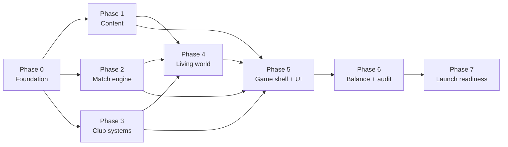

# Creator Football — Roadmap

Phased implementation plan, mapped to **what exists in this repository today** versus what
remains. Every phase has an objective gate; a phase is not complete until every criterion
measurably passes.

---

## Where we are

Phases 1-4 are in flight **in parallel** against the frozen contract in
`docs/INTEGRATION_CONTRACT.md`. Phase 0 is partially complete and has the repository's most
important gap.

### Built today

Most of the engine now exists. The parallel workstreams have landed.

| Area | State |
|---|---|
| Workspace | pnpm 10, Node ≥20, ESM, `strict` + `noUncheckedIndexedAccess`, Vite 7 + React 19 + Tailwind 4, Capacitor config for iOS and Android |
| `core/` | Branded ids, seeded `Rng` with forkable sub-streams, math, `Result`, invariants, the cycle clock with 12 season phases, the typed domain-event spine and `EventBus`, deterministic `IdFactory` |
| `players/` `creators/` `clubs/` `contracts/` | All entity models, 17 attributes with position weighting, 10 mental attributes, 22 traits with 23 modifier keys, 11 creator attributes, 10 manager attributes, squad roles and minutes promises |
| `tactics/` | `TacticSetup` → 12-dimension `TacticVector` across 11 trade-off tables, 7 formations, `autoLineup`, `slotFit` |
| `matches/` | **The simulator, and it works.** `simulator.ts`, `model.ts`, `momentum.ts`, `positioning.ts`, `ratings.ts`, `commentary.ts`, `decisionEngine.ts`, `specialRuleEngine.ts`, `balance.ts`. Determinism, event-stream integrity, impossible-state, aggregate-realism, favourite-vs-underdog, fatigue, live-decision, tie-break and presentation tests all pass |
| `content/` | The full fictional base pack — clubs, players, creators, sponsors, facilities, objectives, offers, commentary, social, media, name bank, season config — plus `loader.ts`, `validate.ts`, four generators, and community/licensed example packs |
| `league/` | Fixture generation, playoffs, standings, verification |
| `economy/` | Ledger, cycle, audit, balance |
| `transfers/` | Valuation, market, negotiation, scouting, balance |
| `training/` `facilities/` `fans/` `sponsors/` | All built with balance tables and tests |
| `media/` `social/` `rivalries/` `simulation/` `progression/` `objectives/` `analytics/` | Media and social engines, rivalries, AI clubs, world tick, cascade, emergent-story detection, objectives, legacy, the analytics sink |
| `persistence/` | Storage port, versioned saves, checksums, backup recovery, migrations |
| `apps/game/design/` | Token layer, motion language, haptics, seeded procedural art, 14 glass primitives, 12 domain components, hero moments, layout, feedback, icons, and a `Gallery` |
| `apps/game/platform/` `state/` | Storage adapter, capability detection, zustand stores |
| Tests | **20 files, 262 tests, 260 passing** |

### Known red

| # | Item | Detail |
|---|---|---|
| 1 | **`pnpm typecheck` fails** | TS6059: `packages/engine/test/save.test.ts` is matched by the `test/**/*` include but sits outside `rootDir: "src"` |
| 2 | **2 tests failing** | The audience/support modifier measures a 9.6pp win-probability swing against its 6pp cap. A special-rule window test passes in isolation and fails in a full run — a test-isolation or shared-state leak, which matters more than usual in a codebase whose central claim is determinism |
| 3 | **`pnpm audit:*` fails** | `tools/sim` has a `package.json`, a `tsconfig.json` and `src/report.ts`, but none of the four entry points its scripts invoke |
| 4 | **`pnpm lint` does nothing** | No ESLint config anywhere; no package defines `lint`. The engine-purity rules are unenforced |
| 5 | **No CI** | `.github/workflows/` is empty. Items 1-3 would have been caught on the first push |

### Not built

The game shell and every screen (`apps/game/src/app` is routes plus a placeholder), the
game orchestrator in `packages/engine/src/game/` beyond `state.ts` and `selectors.ts`,
season-roll orchestration, the match renderer, onboarding, and the native-shell wiring.

Housekeeping: `diag.tmp.ts`, `tuning.tmp.ts`, `tsconfig.check.json` and an empty
`src/fixtures/` directory should not survive to a release.

---

## Phase 0 — Foundation

**Status: partially complete. The remaining items are the repository's highest-priority
work.**

| Item | Status |
|---|---|
| pnpm workspace, TypeScript config, Vite, Tailwind, Capacitor | Done |
| Engine package structure and public `index.ts` | Done |
| Frozen contract types across 11 domains | Done |
| Design token layer | Done |
| Vitest configured (`environment: 'node'`, globals) | Done |
| A storage adapter in `apps/game` | Done (`src/platform/storage.ts`) |
| `tools/sim` as a real package | Partial — package and `report.ts` exist; **all four audit entry points missing** |
| **ESLint config with the four purity rules** | **Missing — `RISKS.md` R14** |
| **A `lint` script in every package** | **Missing — `pnpm lint` currently does nothing** |
| **CI running typecheck + lint + test on every push** | **Missing — `.github/workflows/` is empty** |
| **`pnpm typecheck` green** | **Red — TS6059 rootDir error on `test/save.test.ts`** |
| **`pnpm test` green** | **Red — 2 of 262 failing** |
| `setInvariantMode('collect')` wired at app startup | Missing — default is `'throw'` |

**Gate.** `pnpm install`, `typecheck`, `test`, `build` all pass. ESLint enforces: no React /
DOM / Capacitor / Node built-ins in `packages/engine`; no `Math.random()`; no `Date.now()`;
no `window`/`document`/`localStorage`/`fetch`. CI runs on every push. `pnpm audit:all`
executes (even if it asserts nothing yet).

**Why this is still first.** Most of the engine has now been written against a purity rule
that nothing checks, and two of the four workspace commands are currently red with nothing
to catch them. The retrofit cost has already risen once; it will keep rising. This is
roughly a day of work and it is the highest-leverage day available.

---

## Phase 1 — Content (Workstream B)

**Status: landed, ungated.** The base pack, `loader.ts`, `validate.ts` and all four
generators exist. The gate below has not been measured — no content-validation test suite
runs the volume gates or the 10,000-sample distribution checks, and the legal denylist does
not exist.

| Deliverable | Detail |
|---|---|
| `BASE_PACK` | 12 clubs, 28 creators, 10 selectable managers, 8 archetypes, 20 sponsors, 11 facilities × 5 levels, 40+ objectives, 24 offers, 200+ commentary lines, 120+ social templates, 60+ media templates, name bank (220+/220+/60+/40+/80+/25), season config |
| `ContentRegistry` | `load`, `unload`, `packs`, 12 accessors, `visibleFor(region, now)` |
| `validatePack` | Every check in `CONTENT_SCHEMA.md` §4 |
| Generators | `generatePlayer`, `generateSquad`, `generateCreator`, `clubFromTemplate`, `generateManager`, `MANAGER_ARCHETYPES`, `PREMADE_MANAGERS` |
| Legal denylist | CI check over every string field, asset filename, analytics name, branch name |

**Gate.** `validatePack(BASE_PACK)` returns zero errors and zero warnings. Every volume gate
met. `generatePlayer` hits a target overall within ±3 over 10,000 samples; potential respects
age; traits obey their `positions` and `rarity` constraints. Denylist clean.

---

## Phase 2 — Match engine (Workstream A)

**Status: largely landed, gate not passed.** `simulator.ts` and its nine supporting modules
exist, with a substantial test suite that already asserts determinism, aggregate realism
over 500 matches, the 75-85% heavy-mismatch band, impossible states, decision spacing and
tie-breaks. **Two tests are red** (audience modifier 9.6pp vs a 6pp cap; a special-rule
window test that fails only in a full run). The 1,000-match audit harness that the gate
depends on does not exist.

| Deliverable | Detail |
|---|---|
| `simulateMatch(setup)` | Headless, deterministic full match |
| `MatchSimulator` | Steppable: `step`, `frame`, `pendingDecision`, `resolveDecision`, `applyTacticalChange`, `makeSubstitution`, `playRuleCard`, `result`, `finish`, `score`, `minute`, `momentum` |
| Tick model | ~6s ticks; build-up → progression → final third → shot/turnover |
| xG pipeline | Continuous chance quality; goals resolve from xG |
| Fatigue | Per-tick accrual from tactic vector + stamina + traits, degrading effective attributes |
| Momentum | Derived summary; bounded direct contribution; **not rubber-banding** |
| Live decisions | ≤ `maxDecisions`, ≥6 match minutes apart, 2-3 options, every option with a real downside |
| Special rules | Two clock-anchored swing windows per match (closing minutes of each half); phase windows honoured; `SPECIAL_RULE_START/END` with a human-readable `reason`; rule-window goals as a separate additive process |
| `PitchFrame` | Legible positional output for the renderer |
| `commentary.ts` | Template table; no repeat within a match while alternatives exist |
| Ratings | 1.0-10.0 from contributions, not the scoreline |

**Gate.** All of `TEST_PLAN.md` §4.1 metrics in band over 1,000 matches (goals 6.0-9.0,
conversion 18-28%, ~30 shots, injuries 0.08-0.14 per team); **§4.1a two-regime validation
passes independently before the blend is checked**; §4.1b distribution assertions pass
(overdispersed, exposed dispersion knob, full scoreline matrix, no Dixon-Coles); §4.2
competitive integrity (heavy-mismatch favourite 75-85%, never >90%; home advantage 0;
support modifier ≤6pp); §4.3 determinism; §4.4 impossible states — zero exceptions.

**Blocking question.** `PRODUCT_REQUIREMENTS.md` Q11 — whether special-rule swing windows
occur in every match or only in designated rule weeks — must be resolved before this gate
can be measured, because the blended goal target assumes ~6 of 30 minutes are rule-window
play.

---

## Phase 3 — Club systems (Workstream C)

**Status: landed, ungated.** Every module below exists with balance tables and unit tests.
The gate depends on the 100-season economy audit, which does not exist yet.

| Deliverable | Modules |
|---|---|
| Valuation and wages | `transfers/valuation.ts`, `contracts/wages.ts` |
| Market | `transfers/market.ts` — listings, free agents, rumours |
| Negotiation | `transfers/negotiation.ts`, `contracts/negotiation.ts` — counters, agents, hijacks, patience |
| Scouting | `transfers/scouting.ts` — `knowledgeRange`, assignments |
| Training | `training/training.ts`, `training/development.ts` |
| Facilities | `facilities/facilities.ts` — `facilityEffect`, `upgradeFacility` |
| Fans | `fans/fans.ts` — `updateFanState`, `attendanceFor`, `matchdayRevenue` |
| Sponsors | `sponsors/sponsors.ts` |
| Economy | `economy/cycle.ts`, `economy/audit.ts` |

**Gate.** `ECONOMY.md` invariants E1-E10 and E14 pass over 100 seasons. Scouting bands narrow
correctly from ±18 to exact. Training trade-offs measurable. The fan loop closes **and can
run backwards** (E12). Every money movement posts a `Ledger` transaction with a meaningful
memo.

---

## Phase 4 — Living world (Workstream D)

**Status: landed, ungated.** All modules exist, plus `cascade.ts` and `emergent.ts` with
tests. The gate's 100-season champion-variety assertion depends on the audit harness.

| Deliverable | Modules |
|---|---|
| Media | `media/mediaEngine.ts` |
| Social | `social/socialEngine.ts` — `generatePosts`, `socialReach` |
| Rivalries | `rivalries/rivalries.ts` |
| AI clubs | `simulation/aiClub.ts` — 8 profiles |
| World tick | `simulation/worldTick.ts` |
| Objectives | `progression/objectives.ts` |
| Legacy | `progression/legacy.ts` |
| Analytics | `analytics/analytics.ts` — the pluggable sink |

**Gate.** Integration test IT3 (red-card cascade) passes with full event traceability. Zero
posts or stories without a source event. AI clubs measurably differ by profile (strategy
audit §4.7). Emergent stories detected from history, not scripted. The 100-season audit shows
≥5 distinct champions and no club above 40% of titles.

---

## Phase 5 — Game shell and UI (Workstream G + F)

**Status: design system landed; shell and screens not started.** `apps/game/src/design`
now has 14 glass primitives, 12 domain components, hero moments, layout, feedback, icons
and a `Gallery`, plus a platform storage adapter and zustand stores. `src/app` is routes
and a placeholder. **No screen, no match renderer, no onboarding.** This is now the
critical path.

| Deliverable | Detail |
|---|---|
| Orchestration | `game/` — new game, cycle advance, event routing, save/load wiring |
| League orchestration | Season roll, playoffs, promotion of match results to domain events |
| Component library | Buttons, cards, sheets, list rows, tabs, chips, stat tiles, avatars, badges, feed rows — all against the design system |
| Screens | Onboarding, home, squad, tactics, match, post-match, transfers, scouting, training, facilities, sponsors, finance, feed, media, objectives, legacy, settings, store |
| Match renderer | `PitchFrame`-driven animated pitch + broadcast mode |
| Onboarding | The minute-by-minute beat sheet in `PRODUCT_REQUIREMENTS.md` §5 |
| Native shell | Haptic driver install, storage adapter, splash hide on first real frame, status bar |

**Gate.** Manual UX passes U1-U12 pass on an iPhone 12. Onboarding funnel step 12 ≥70% in
playtest. Sustained ≥55 fps during a match. Cold start ≤2.5s.

---

## Phase 6 — Balance and audit

**Status: scaffolded only.** `tools/sim` is a workspace package with a `report.ts`; none
of the four audit entry points exist, so all four `pnpm audit:*` scripts fail.

| Deliverable | Detail |
|---|---|
| `@cf/sim` harness | A real package with a fixed clock injected, so runs are byte-reproducible |
| `audit:sim` | 1,000 matches — distributions, competitive integrity, determinism, impossible states |
| `audit:economy` | 100 seasons — inflation ceilings, reconciliation, the pay-to-win firewall |
| `audit:invariants` | State legality at every cycle boundary |
| Strategy audits | 8 club strategies × 3 budgets × 8 manager archetypes × 4 tactical approaches |
| Generator audit | 10,000 generated players |
| Balance tuning | Iterate the `balance.ts` tables against the audit output |

**Gate.** Every assertion in `TEST_PLAN.md` §4, §5 and §6 passes. Every strategy is viable
(top 6 at least once in 10 seasons); none is dominant (>50% of runs). E11 (a no-purchase
10-season run can win the league and max two facilities) passes. E13 (insolvency is
reachable) passes.

---

## Phase 7 — Launch readiness

| Deliverable | Detail |
|---|---|
| Store build | App Store and Play Store submissions, screenshots, metadata (denylist-checked) |
| Beta cohort | Crash-free ≥99.5%, funnel instrumented, alerting live |
| Analytics | Sink installed post-consent; funnels and churn indicators wired |
| Store offers | 24 offers on the four-week rotation, monetisation rules CI-enforced |
| Long-save validation | U14 — a 10-season save still feels alive |
| Support runbook | Save recovery, purchase restore, invariant alerts |

**Gate.** Crash-free ≥99.5% for 7 days. Zero P0 analytics alerts for 7 days. U13-U16 pass.
Every P0 feature shipped. Every blocking open question in `PRODUCT_REQUIREMENTS.md` §10
resolved.

---

## Post-launch

| Wave | Contents | Notes |
|---|---|---|
| **1.1 — Depth** | Press conferences, loans, custom club creator, iPad two-column layouts, difficulty tuning | All P2; mostly reads of data that already exists |
| **1.2 — World** | Youth intake / newgens (`RISKS.md` R16), cup competition (`CompetitionFormat.CUP` exists), second tier + promotion/relegation (`PROMOTED`/`RELEGATED` events exist) | Resolves `PRODUCT_REQUIREMENTS.md` Q3 and Q6 |
| **1.3 — Content** | Seasonal packs, community pack support, localisation (move `formatMoney` out of the engine first) | Schema already supports `SEASONAL` and `COMMUNITY` |
| **2.0 — Multiplayer** | Private leagues, asynchronous PvP, online clubs | `ARCHITECTURE.md` §11 — needs accounts, transport and a league-owned clock. **No engine rewrite** |
| **Contingent** | Licensed content pack | A business decision, not an engineering project. `LICENSING_ARCHITECTURE.md` §7 |

---

## Critical path

```mermaid
gantt
  dateFormat X
  axisFormat %s
  section Foundation
  Lint + CI + tools/sim (blocking everything)   :crit, p0, 0, 1
  section Parallel build
  Content pack + generators                     :p1, after p0, 4
  Match simulator + commentary                  :crit, p2, after p0, 5
  Club systems + economy                        :p3, after p0, 5
  Living world                                  :p4, after p1, 4
  section Assembly
  Game shell + UI                               :crit, p5, after p2, 6
  Balance + audit                               :p6, after p5, 3
  Launch readiness                              :p7, after p6, 2
```

The critical path runs **Phase 0 → Phase 2 → Phase 5 → Phase 6 → Phase 7**. Everything else
can slip a little; the match engine and the shell that renders it cannot, because they are
the product.

Phases 1-4 have effectively landed as *code*; none of them has passed its *gate*, because
every gate depends on the audit harness in Phase 6, which is scaffolding. The practical
ordering is therefore now:

1. **Finish Phase 0** — the two red commands, the ESLint purity rules, and CI. A day.
2. **Finish the Phase 6 harness early**, out of order, so Phases 1-4 can actually be gated
   rather than assumed. Their code exists; without the audits, nobody can say whether it is
   balanced.
3. **Then Phase 5**, which is now the genuine critical path: there is a working simulation
   and no game around it.
